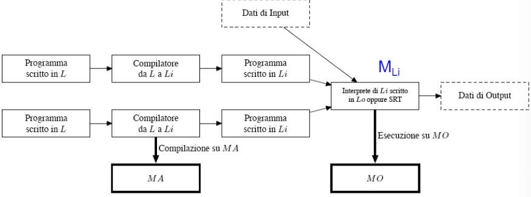

## Macchine Astratte
### Macchina di Von Neumann
Modello astratto di calcolatore comprendente di:
- processore
- memoria interna
- memoria esterna
- interfaccia di I/O
- bus di sistema che collega i precedenti

Il suo interprete, esegue un ciclo:
- fase di istruzione:
    - legge l'istruzione dalla memoria
    - la decodifica
- fase di esecuzione:
    - legge il valore degli operandi
    - esegue l'istruzione
    - memorizza il risultato

Programmi e dati sono indistinguibili, entrambi memorizzati in memoria interna.

**Macchina e Linguaggi:**$\\$
Una macchina corrisponde ad un linguaggio(esiste per eseguire quel linguaggio). $\\$
Un linguaggio può essere eseguito su più macchine.

Una macchina fisica è la realizzazione in fili di un algoritmo(interprete) che sfruttando delle strutture dati esegue programmi scritti in linguaggio macchina.

### Macchina Astratta
Un insieme di strutture dati e algoritmi in grado di memorizzzare ed esguire programmi.

**Interprete:**$\\$
Interpreta le istruzioni ed è composto da:
- operazioni per elaborazione dei dati primitivi
- operazioni per controllo della sequenza di esecuzione
- operazioni per controllo del trasferimento dati
- operazioni per gestione della memoria

**Linguaggio Macchina:**$\\$
Un linguaggio macchina $L_M$ è il linguaggio compreso dall'interprete della macchina astratta $M$.
I programmi scritti in $L_M$ possono essere rappresentati in memoria(rappresentazione interna) o come stringhe di caratteri(rappresentazione esterna).

### Macchina HW(Hardware)
**Linguaggio della macchina HW:**$\\$
Il set di istruzioni è direttamente implementato nella ALU in due modi:
- CISC(Complex Instruction Set Computer): istruzioni complesse
- RISC(Reduced Instruction Set Computer): istruzioni semplici

Una tipica è composta da operandi e codice operativo.
- Rappresentazione interna: sequenza di bit che codifica l'istruzione.
- Rappresentazione esterna: stringa di caratteri che codifica l'istruzione.

**Macchina HW come macchina astratta:**$\\$
L'interprete della macchina HW esegue:
- operazioni primitive: operazioni aritmetiche, logiche, di manipolazione dei bit, lettura e scrittura in memoria
- controllo sequenza: salto condizionato, salto incondizionato, chiamata a subroutine, ritorno da subroutine
- controllo dati: acquisizione e trasferimento dati(archietture a registri, stack, memoria)
- gestione memoria: allocazione e deallocazione della memoria

Il processore convenzionale è una macchina astratta che esegue programmi scritti in linguaggio macchina. Cambia l'architettura, cambia l'interprete, ma non cambia il linguaggio macchina.

### Scatole Cinesi
Alcune macchine hw sono microprogrammate, le istruzioni di $L_MF$ sono realizzate tramite istruzioni di più basso livello($\mu$-istruzioni, $L_MAPF$) e interpretate da un $\mu$-interprete($MAPF$).

Un programma scritto in $L_MF$ viene interpretato da un interprete scritto in $L_MF$ a sua volta eseguito da un $\mu$-interprete di $MAPF$.

### Realizzare una amcchina astratta
- Realizzazione in hardware: 
    - usata per macchine di basso livello
    - massima velocità
    - minima flessibilità
- Emulazione o simulazione via software(strutture dati e algoritmi realizzati mediante microprogrammi che risiedono in una memoria di sola lettura):
    - macchina ospite(fisica) microprogrammata
    - alta velocità
    - buona flessibilità
- Interpretazione o simulazione via software(strutture dati e algoritmi realizzati mediante programmi scritti nel linguaggio della macchina ospite):
    - macchina ospite(fisica) interpretata
    - bassa velocità
    - massima flessibilità

Normalmente si utilizza un misto. $\\$
La possibilità di realizzare una macchina astratta via software rende possibili macchine con un linguaggio più sofisticato e flessibile.

**Gerarchia di macchine astratte:**$\\$
La macchina astratta $M_i$ usa i servizi della macchina astratta $M_{i-1}$(ossia il linguaggio $L_{M_{i-1}}$) per fornire servizi a $M_{i+1}$(quindi fornire un interprete per $L_{M_{i+1}}$). Nasconde quindi i dettagli di $M_{i-1}$.

### Implementare un linguaggio
Scartiamo la soluzione hardware, assimiliamo software e firmware.

*Problema:*$\\$
Implementare un linguaggio $L$(cioè realizzare la macchina astratta $M_L$) su una macchina astratta ospite $Mo_{Lo}$(col suo liguaggio $Lo$).

*Definizione:*$\\$
- $Pr^L$: programma scritto in $L$
- $P^{L}: D \rightarrow D$: funzione parziale sull'insieme dei dati che rappresenta la semantica di $Pr^L$

Due tipi di implementazione:
- **Implementazione interpretativa pura:**$\\$
    - $M_L$ è realizzata da un interprete(scritto in $Lo$) per $L$ su $Mo_{Lo}$
    - *Interprete definizione:* un interprete per il linguaggio $L$, scritto in $Lo$ è un programma che realizza una funzione parziale:
        - $I^{Lo}_{L}: (Prog^L \times D) \rightarrow D$ tale che $I^{Lo}_{L}(Pr^L, Input) = P^{L}(Input)$ (l'interprete calcola la corretta semantica del programma)
- **Implementazione  pura:**$\\$
    - i programmi scritti in $L$ sono tradotti in programmi equivalenti scritti in $Lo$, la traduzione è effettutata da un programma $C^{La}_{L, Lo}$(compilatore da $L$ a $Lo$ scritto in $Lo$)
    - *Compilatore definizione:* un compilatore da $L$ a $Lo$ è un programma che realizza una funzione parziale:
        - $C_{L, Lo}: Prog^L \rightarrow Prog^{Lo}$ tale che $C_{L, Lo}(Pr^L) = Prc^{Lo}$ allora per ogni $Input \in D$ si ha che $Prc^{L}(Input) = Pc^{Lo}(Input)$(il compilatore preserva la semantica dle programma, poichè il programma $Pr^L$ e il programma $Prc^{Lo}$ calcolano la stessa funzione $P^{L} = Pc^{Lo}$)

**Compilazione vs Interpretazione:**$\\$
- Implementazione interpretativa pura:
    - scarsa efficienza della macchina astratta $M_L$: ai tempi di esecuzione si sommano i tempi di decodifica, mentre nell'implementazione compilativa la traduzione viene fatto prima di eseguire). Quindi se un'istruzione viene eseguita più volte, la decodifica viene fatta più volte.
    - buona flessibilità: permette di interagire con l'esecuzione del programma
    - facilmente realizzabile
    - occupa meno memoria
- Implementazione compilativa pura:
    - difficile data la lontanza tra $L$ e $Lo$
    - buona efficienza: la traduzione viene fatta una volta sola
    - scarsa flessibilità
    - perdita di informazioni sulla struttura(astrazione) del programma

Nel caso reale si usa una combinazione delle due: alcune istruzione vengono sempre simulate(interpretate), mentre i programmi vengono tradotti(compilati) in rappresentazione interna o intermedia.$\\$

La differenza tra implementazione di tipo compilativo e interpretativo è data dal fatto che l'interprete $M_{Li}$ nel primo caso è l'inteprete dell macchina ospite $M_{Lo}$ più qualche meccanismo di controllo, mentre nel secondo caso è sostanzialmente diverso da $M_{Lo}$.

*Esempio:*$\\$
- In C si ha un compilatore che traduce il codice in linguaggio macchina e un interprete che esegue il codice per le chiamate a run-time
- In Java si ha un compilatore che traduce il codice in bytecode(alla JVM) e una macchina che esegue l'interprete della JVM

(\\Esempi di Pascal, C, Assembler, Fortran sulle slide)

**Sono sempre realizzabili l'inteprete e il compilatore?**$\\$
- l'interprete esegue $L_{sorg}$ ed scritto in un linguaggio $L_{osp}
- il compilatore traduce $L_{sorg}$ in $L_{dest}$ ed è scritto in un linguaggio $L_{osp}$
- il compilatore preserva la semantica del programma tradotto, quindi l'insieme delle funzioni che $L_{sorg}$ calcola. Quindi è necessario che $L_{dest}$ sia meno espressivo di $L_{sorg}$
- l'interprete deve calcolare la stessa funzione calcolata dal programma scritto in $L_{sorg}$, quindi $L_{sorg}$ e $L_{dest}$ devono essere equivalenti
- tutti i linguaggi di programmazione sequenziali sono Turing-completi, quindi sono equivalenti

### Come generare un compilatore
**Strumenti automatici:**
- Lex: generatore di analizzatori lessicali
- Yacc: generatore di analizzatori sintattici

**Implementazione via kernel:**$\\$
Per implementare $L$ si scrive un interprete $I^H_{L}$ o un compilatore $C^H_{L, Lo}$ in $H$($\subsetneq L$). Si implementa poi un interprete o un compilatore per $H$.

**Implementazione via bootstraping:**$\\$
$I^{Lo}_{P-code}(C^{P-code}_{Pascal, P-code}, C^{Pascal}_{Pascal, Lo}) = C^{P-code}_{Pascal, Lo}$
$\\$
$I^{Lo}_{P-code}(C^{P-code}_{Pascal, Lo}, C^{Pascal}_{Pascal, Lo}) = C^{Lo}_{Pascal, Lo}$