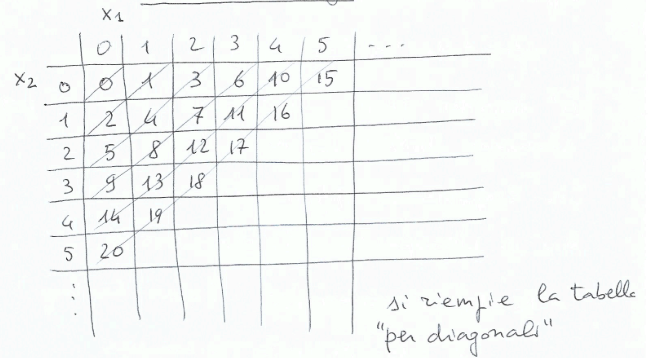

## Descrivere un linguaggio
### Linguaggi
La descrizione di un linguaggio avviene su 3 dimensioni:
- **Sintassi:** regole di formazione, relazione tra segni(quando una frase è corretta)
- **Semantica**: attribuzione di significato, relazione tra segni e significato(che cosa significa una frase)
- **Pragmatica:** uso del linguaggio, relazione tra segni, significato e utenti(che cosa si può fare con una frase)

Per un linguaggio eseguibile, si aggiunge una quarta dimensione:
- **Implementazione:** come eseguire una frase corretta, rispettandone la semantica

### Sintassi
- **Aspetto Lessicale:** 
    - insieme dei simboli che si possono usare. La descrizione avviene tramite dizionari(linguaggi naturali) o strutture più complesse(linguaggi artificiali)
    - *errore:* "canu" vocabolario inesistente
- **Aspetto Grammaticale:** 
    - regole di formazione delle frasi. La descrizione avviene tramite regole grammaticali
    - *errore:* "la cane abbaiano" lessico corretto, ma grammatica scorretta

### Semantica
- **Per il lessico:**
    - dizionari
- **Per le frasi:**
    - a quale lingua appartiene
    - su quale linguaggio basarsi per dare significato(su qualcosa di noto, che non debba a sua volta essere spiegato)

*Esempio:* 
- Frasi corrette in $L_1 \xrightarrow{\text{traduzione}}$ Siginificato espresso in $L_2$
- Frasi corrette in $L \xrightarrow{\text{interpretazione semantica}}$ Funzioni calcolate da input a output

### Pragmatica
- Insieme di regole che guidano l'uso del linguaggio
- *Esempio:* 
    - utilizzare "lei" in un contesto formale
    - evitare di usare "goto" in un programma

### Implementazione
- Eseguire una frase sintatticamente corretta rispettandone la semantica
- *Esempio:* 
    - Ho un programma $P$ scritto in un linguaggio $L_1$, la semantica di $P$ è $f$ insieme di funzioni calcolate. Voglio compilare $P$ in un programma $Q$ scritto in un linguaggio $L_0$ che preserva la semantica $f$ di $P$

### Linguaggi Formali
**Lessico e Frasi di un Linguaggio**
- **Alfabeto:** insieme finito di simboli
- **Lessico:** insieme di sequenze finite costruite sull'alfabeto
- **Frasi:** insieme di sequenze finite costruite sul lessico

*Osservazione:*
Il lessico è un alfabeto di frasi

**Linguaggio Formale**$\\$
- $A$ (alfabeto) è un insieme finito di simboli
- Una *parola* su $A$ è una sequenza finita di simboli di $A$
- Un linguaggio formale $L$ su $A$ è un insieme di parole su $A$

**Definizione di Linguaggio Formale**
Un linguaggio formale $L$ su un alfabeto $A$ è un sottoinsieme di $A^*$, dove $A^* = \bigcup_{n \geq 0} A^n$ dove $A^0 = \{\epsilon\}$ e $A^{n+1} = A^n \cdot A, n \geq 0$ con $A^n \cdot A = \{w \cdot a | w \in A^n, a \in A\}$

**Ossevazione:**$\\$
$A^*$ è un insieme infinito contabile. Dato un ordinamento crescente sui simboli di $A$(es. $a < b < c$), possiamo elencare le parole di $A^*$ con $\{\epsilon, a, b, c, aa, ab, ac, ba, bb, bc, ca, cb, cc, aaa, \ldots\}$

**Dove-Tailing**$\\$
Se $A$ fosse un insieme infinito, $A^*$ sarebbe ancora contabile? Sì, perchè $A$ è in corrispondenza biunivoca con $\mathbb{N}$
- $\mathbb{N} \times \mathbb{N} $ è in corrispondenza biunivoca con $\mathbb{N}$(Dove-tailing)
- $\mathbb{N}^k$ è in corrispondenza biunivoca con $\mathbb{N}$
- $\mathbb{N}^* = \bigcup_{n \geq 0} \mathbb{N}^k$ è in corrispondenza biunivoca con $\mathbb{N}$

*Funzione di codifica:*$\\$
$f^2 : \mathbb{N} \times \mathbb{N} \rightarrow \mathbb{N}$, $f^2(x_1, x_2) = \frac{(x_1 + x_2)(x_1 + x_2 + 1)}{2} + x_2$
*Esempio:*$\\$
$f^2(2, 1) = \frac{3 \cdot 4}{2} + 1 = 7$

*Funzione di decodifica:*$\\$
$f^2_1 : \mathbb{N} \rightarrow \mathbb{N}$, $f^2_2 : \mathbb{N} \rightarrow \mathbb{N}$, $\text{ tali che }$ $f^2_1(f^2(x_1, x_2)) = x_1$ e $f^2_2(f^2(x_1, x_2)) = x_2$

Bisogna trovare:
- $k_x = \text{max}\{i | \frac{i(i+1)}{2} \leq x\}$
- allora $k_x = x_1 + x_2$
- $x_2 = x - \frac{k_x(k_x + 1)}{2}$
- $x_1 = k_x - x_2$

*Esempio:*$\\$
- $f^2_1(7) = 2$
- perchè $k_7 = 3, (\frac{3 \cdot 4}{2} \leq 7)$
- $x_2 = 7 - \frac{3 \cdot 4}{2} = 1$
- $x_1 = 3 - 1 = 2$

### Notazioni e definizioni
- **Concatenazione:** $w = x \cdot y \iff \Bigg\{ \begin{array}{ll} |w| = |x| + |y| \\ w[i] = x[i] \text{ se } i \leq |x| \\ w[|x| + i] = y[i] \text{ se } i \leq |y| \end{array}$
- **Sottostringa:** $v$ è sottostringa di $w$ se $\exists x, y \in A^* \text{ t.c. } w = x \cdot v \cdot y$
    - ogni stringa è sottostringa di se stessa
    - $\epsilon$ è sottostringa di ogni stringa
- **Suffisso:** $v$ è suffisso di $w$ sse $\exists x \in A^* \text{ t.c. } w = x \cdot v$
- **Prefisso:** $v$ è prefisso di $w$ sse $\exists x \in A^* \text{ t.c. } w = v \cdot x$
- **Potenza n-esima:** $w^0 = \epsilon, w^{n+1} = w^n \cdot w, \forall n \geq 0$
- **Linguaggio $L$ su $A$:** $L \subseteq A^*$
    - *Esempio:* $A = \{a\}$
        - $L_1 = \{\epsilon, a, aa, aaa, \ldots\} = \{a^n | n \geq 0\}$
        - $L_2 = \{a, aaa, aaaaa, \ldots\} = \{a^{2n+1} | n \geq 0\}$

### Operazioni sui Linguaggi
- **Complemeto:** $\overline{L} = \{w \in A^* | w \notin L\} = A^* \setminus L$
- **Unione e Intersezione:** 
    - $L_1 \cup L_2 = \{w | w \in L_1 \text{ oppure } w \in L_2\}$
    - $L_1 \cap L_2 = \{w | w \in L_1 \text{ e } w \in L_2\}$
- **Concatenazione:** $L_1 \cdot L_2 = \{w_1 \cdot w_2 | w_1 \in L_1 \text{ e } w_2 \in L_2\}$
    - *Osservazione:* Concatenazione $\neq$ Prodotto cartesiano( $L_1 \times L_2 = \{ (w_1, w_2) | w_1 \in L_1 \text{ e } w_2 \in L_2 \}$ ) poichè valgono le regole della concatenazione: $x(yz) = (xy)z \text{ e } x\epsilon = \epsilon x = x$
    - *Esempio:* $L_1 = \{a, ab\}, L_2 = \{bc, c\}
        - $L_1 \cdot L_2 = \{abc, ac, abbc, abc\}$
        - $L_1 \times L_2 = \{(a, bc), (a, c), (ab, bc), (ab, c)\}$
- **Potenza:** $L^0 = \{\epsilon\}, L^{n+1} = L^n \cdot L, \forall n \geq 0$
- **Chiusura\Stella di Kleene:** 
    - $L^* = \bigcup_{n \geq 0} L^n$
    - $L^+ = \bigcup_{n \geq 1} L^n$ (chiusura positiva)

### Rappresentazione finita di un linguaggio
Se $L$ è infinito come lo rappresentiamo?

2 tecniche:
- **Generativa:** il linguaggio lo esprimiamo come un insieme delle stringhe genrate da una struttura finita detta *Grammatica*
- **Riconoscitiva:** il linguaggio lo esprimiamo come un insieme delle stringhe riconosciute da una struttura finita detta *Automa*

**Osservazione:**$\\$
Non tutti i linguaggi possono essere generati da grammatiche o riconosciuti da automi

*Esempio:*$\\$
- $A^*$ è equipotente a $\mathbb{N}$
- $L \subseteq A^*$ è contabile
- $\mathcal{P}(A^*)$ (insieme delle parti di $A^*$, ossia l'insieme di tutti i linguaggi su $A$) è equipotente a $\mathbb{R}, quindi non è contabile

La dimostrazione si può fare utilizzando la dimostrazione di Cantor, mettendo nelle colonne le stringhe di $A^*$ e nelle righe i linguaggi di $A^*$