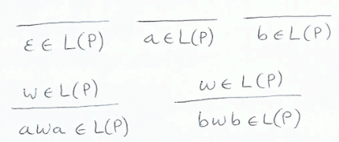
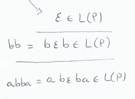
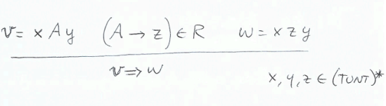
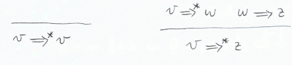
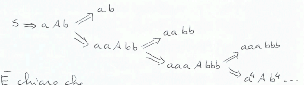

## Definire finitamente un linguaggio
### Backus-Naur Form (BNF):
**Esempio:**$\\$
- $A = \{a, b\}$ e $L = \text{ stringhe palindrome su } A$
- $\langle P \rangle ::= \epsilon | a | b | a \langle P \rangle a | b \langle P \rangle b$

**Come grammatica:**$\\$
$P \rightarrow \epsilon | a | b | aPa | bPb$, dove $P$ è detto *simbolo non terminale* e $\epsilon, a, b$ sono *simboli terminali*

**Come insieme di assiomi e regole di ineferenza:**

**Come derivare una stringa:**
$P \Rightarrow aPa \Rightarrow abPba \Rightarrow abba$, cioè $P \Rightarrow^* abba$

### Grammatiche
Tutte le grammatiche(reglari, libere, dipendenti, monotone, generali) seguono lo stesso pattern differenziandosi solo per ocme solo caratterizzate le produzioni(o regole).

**Definizione:**
Una *Grammatica Libera da contesto* è una quadrupla $G = (NT, T, R, S)$ dove:
- $NT$ è un insieme finito di simboli non terminali
- $T$ è un insieme finito di simboli terminali
- $R$ è un insieme finito di regole di produzione della forma $V \rightarrow w$, dove $V \in NT$ e $w \in (NT \cup T)^*$
- $S \in NT$ è il simbolo iniziale

*Esempio:*$\\$
$G_1 = (\{S, A\}, \{a, b\}, S, R_1)$ con $R_1 = \bigg\{ \begin{array}{ll} S \rightarrow aAb \\ A \rightarrow aAb | \epsilon \end{array}$

**Derivazione:**$\\$
Data $G = (NT, T, R, S)$ libera da contesto, diciamo che $v$ si deriva immediatamente(in un passo) da $w$, scritto $v \Rightarrow w$, se:

Diciamo che da $v$ si deriva $w$, scritto $v \Rightarrow^* w$, se esiste una sequenza dinita di derivazioni $v \Rightarrow w_0 \Rightarrow w_1 \Rightarrow \ldots \Rightarrow w_n = w$, cioè:

Chiamiamo $\Rightarrow^*$ la chiusura riflessiva e transitiva della relazione $\Rightarrow$

*Esempio:*$\\$
- $G_1 = (\{S, A\}, \{a, b\}, S, R_1)$
- $AA \Rightarrow aAbA \Rightarrow abA \Rightarrow abaAb \Rightarrow abab$, cioè $AA \Rightarrow^* abab$

**Linguaggio generato da una grammatica:**$\\$
Dato $G = (NT, T, R, S)$, il linguaggio generato da $G$ è l'insieme $L(G) = \{w \in T^* | S \Rightarrow^* w\}$ (la stringhe devono essere composte solo di temrinali e bisogna partire dal simbolo iniziale S)

**Data $G$ come faccio a determinare $L(G)$? E a verificare se $w \in L(G)$?**$\\$
*Esempio:*$\\$
- $G_1 = (\{S, A\}, \{a, b\}, S, R_1)$

- $L(G_1) = \{a^nb^n | n \geq 0\}$

*Osservazione:*$\\$
Due grammatiche $G$ e $G'$ sono equivalenti se $L(G) = L(G')$

**Dato un linguaggio $L$, come faccio a determinare una grammatica $G$ tale che $L = L(G)$?**$\\$
*Esempio:*$\\$
- $L = \{a^nb^ma^pb^q | n, m, p, q \geq 0, n + m = p + q\}$

$S \rightarrow \epsilon | aSb | aAa | bBb | bCa$ $\\$
$A \rightarrow \epsilon | aAa | bCa$ $\\$
$B \rightarrow \epsilon | bBb | bCa$ $\\$
$C \rightarrow \epsilon | bCa$

**Esercizio:**$\\$
- $L = \{a^nb^mb^na^m | n, m \geq 0\}$

$S \rightarrow$ $\\$

