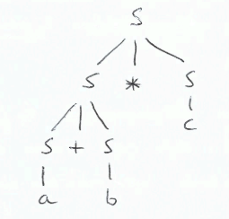
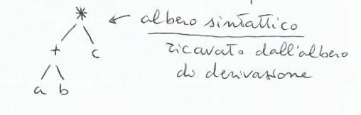
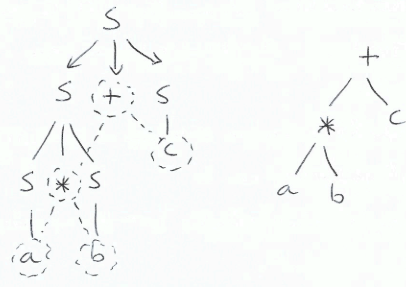
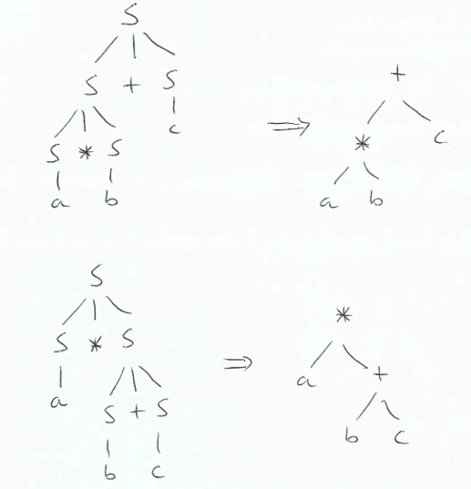
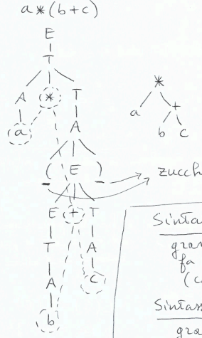
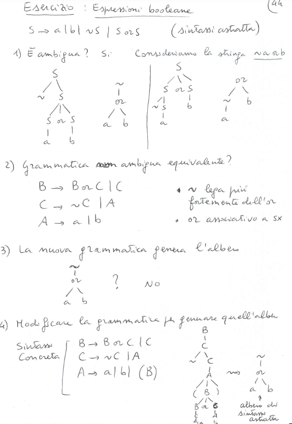

## Derivazioni e Alberi di derivazione
Consideriamo la grammatica: $S \rightarrow a | b | c | S + S | S * S$

Derivazioni:
- *leftmost:* si sostituisce il simbolo non terminale più a sinistra $\\$
$S \Rightarrow S * S \Rightarrow a * S \Rightarrow a * b$
- *rightmost:* si sostituisce il simbolo non terminale più a destra

Albero di derivazione:

- un albero di derivazione riassume tante derivazioni diverse, ma tutte equivalenti(tutte generano lo stesso albero)
- esiste una corrispondenza biunivoca tra derivazione canoniche sinistre(o destre) e alberi di derivazione:
    - dato un albero di derivazione, esiste una sola derivazione leftmost(o rightmost) che lo genera
    - data una derivazione leftmost(o rightmost), ad essa viene associato un solo albero di derivazione
- l'albero di derivazione fornisce informazioni semantiche: quali operandi per quali operatori

**Alberi sintattici da alberi di derivazione**$\\$
Gli alberi sintattici sono alberi di sono temrinali, dove i nodi interni sono etichettati da operatori e le foglie da operandi. 

### Albero di derivazione
**Definizione:** $\\$
Data una grammatica libera $G = (NT, T, S, R)$, un albero di derivazione(o di parsing) è un labero ordinato in cui:
- ogni nodo è etichettato da un simbolo $\in NT \cup T \cup \{ \epsilon \}$
- la radice è etichettata da $S$
- ogni nodo interno è etichettato da un simbolo $\in NT$
- se il nodo $n$ è etichettato da $A \in NT$ e i suoi figli sono nell'ordine $m_1, m_2, ..., m_k$ con etichette $x_1, x_2, ..., x_k \in NT \cup T$, allora $A \rightarrow x_1x_2...x_k \in R$ è una produzione
- se il nodo $n$ ha etichetta $\epsilon$, allora è un nodo foglia, è figlio unico ed è dato da $A \rightarrow \epsilon \in R$ (dove $A$ è l'etichetta del padre di $n$)
- se ogni nodo foglia è etichettato da un simbolo $\in T \cup \{ \epsilon \}$, allora l'albero è detto *derivazione completa*

**Teorema:** $\\$
Una stringa $w \in T^*$ appartiene a $L(G)$ se e solo se esiste un albero di derivazione completo(le cui foglie, lette da sinistra a destra, formano $w$)

### Ambiguità
Considerando la grammatica $S \rightarrow a | b | c | S + S | S * S$, si ha che la stringa $a * b + c$ può essere derivata in due modi diversi.
- $S \Rightarrow S + S \Rightarrow S * S + S \Rightarrow a * S + S \Rightarrow a * b + S \Rightarrow a * b + c$
- $S \Rightarrow S * S \Rightarrow a * S \Rightarrow a * S + S \Rightarrow a * b + S \Rightarrow a * b + c$

Quindi la grammatica è *ambigua*(inutilizzabile per dare semantica a $a * b + c$).

Infatti si possono derivare due diversi alberi sintattici.

**Grammatica Ambigua:** $\\$
*Definizione:* $\\$
Una grammatica libera $G$ è ambigua se $\exists w \in L(G)$ che ammette più alberi di derivazione

*Definizione:*$\\$
Un linguaggio $L$ è ambiguo se tutte le grammatiche $G$, tali che $L(G) = L$ sono ambigue

*Osservazioni:* 
- Esistono gramamtiche che possono essere manipolate in modo da togliere l'ambiguità e generare lo stesso linguaggio
- Esistono grammatiche(patologiche) dalle quali non è possibile rimuovere l'ambiguità e generano linguaggio per forza ambiguo

**Rimuovere l'ambiguità:**$\\$
Data $S \rightarrow a | b | c | S + S | S * S$ ambigua.

I problemi sono :
- precedenza del $*$ rispetto al $+$
- associatività del $+$ e del $*$

Trasformiamo la grammatica in:$\\$
$E \rightarrow E + T | T$ $\\$
$T \rightarrow A * T | A$ $\\$
$A \rightarrow a | b | c | ( E ) $

Abbiamo aggiunto i terminali $($ e $)$ che sono zucchero sintattico ma usati per disambiguare

*Sintassi concreta.* $\\$
Grammatica non ambigua che fa uso di zucchero sintattico

*Sintassi astratta:*$\\$
Grammatica semplice e intuitiva ma ambigua

Da un albero di derivazione di *sintassi concreta* estraiamo un albero sintattico di *sintassi astratta*.

**Esercizio:**
