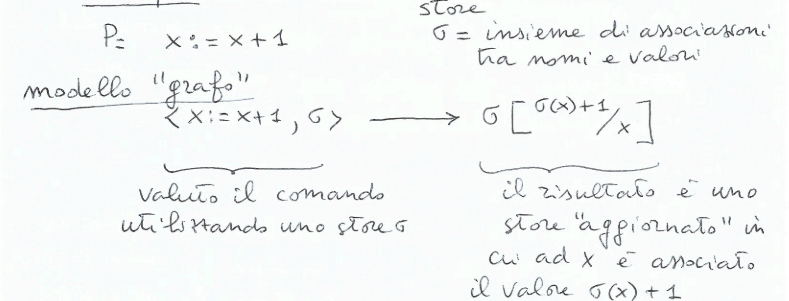
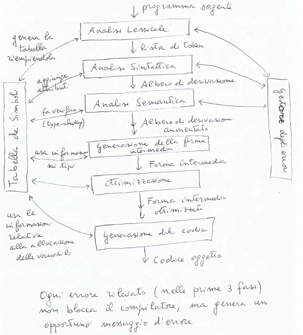
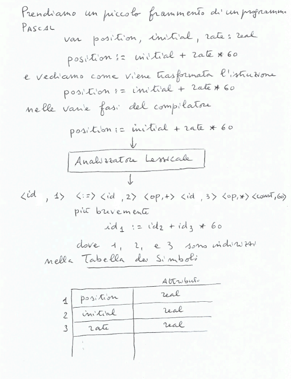
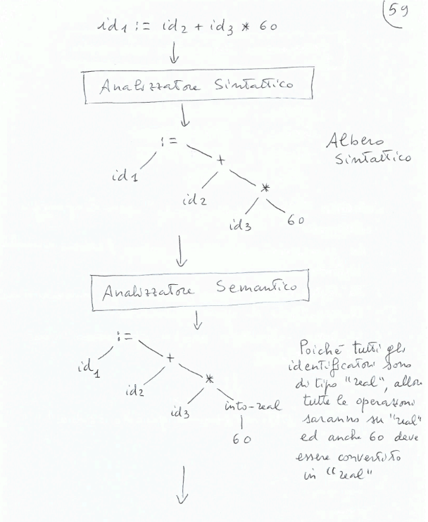
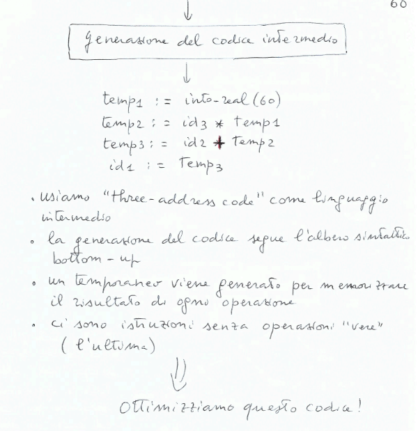
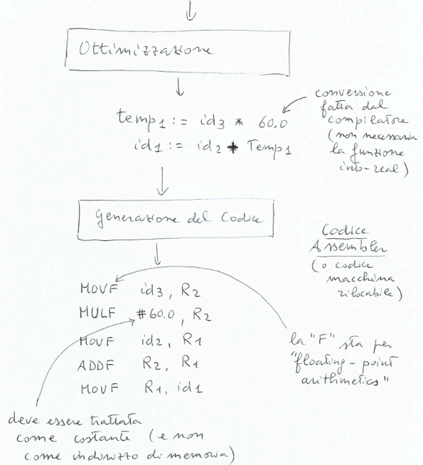

## Vincolo sintattici concettuali(semantica statica)
Ci sono vincoli sintattici non esprimibili tramite una $BNF$ perchè queste non sono in grado di descrivere ivncoli che dipendono dal contesto(esempi: dichiarazione di una variabile prima dell'uso, compatibilità di tipo in un'assegnazione, ecc).

Ci sono de alternative per esprimere questi vincoli:
- usare grammatiche dipendenti dal contesto: poco pratico in quanto la complessità del problema $w \in L(G)$ diventa esponeziale
- usare contorlli ad-hoc nella fase di *Analisi Semantica*

Questi vincoli sarebbero sintattici perchè riguardano la struttura del programma, ma li chiamiamo di *semantica statica* perchè vengono controllati a tempo di compilazione, senza eseguire il programma. Quindi il conmpito di controllo di vincoli di semantica statica(o sintassi concettuale) è di *Analisi Semantica*.

## Analisi Semantica
- *Semantica Statica:* insieme di controlli effettuati sul testo del programma senza eseguirlo(es. type checking)
- *Semantica Dinamica:* rappresentazione formale dell'esecuzione del programma(es. divisione per A, dove A è una variabile che può essere 0)

**Semantica Dinamica** $\\$
Fornisce un modello matematico che descive, indipendentemente dall'architettura, il comportamento del programma. 

*Esempio:* $\\$

*Ricorda:* Un compilatore è corretto se preserva la semantica dinamaica del programma sorgente. Quindi serve avere una semantica per il linguaggio sorgente e una per il linguaggio target.

**Definire la semantica:** $\\$
Due tecniche:
- *Semantica Operazionale:* 
    - si costruisce un automa che mostra l'effetto dell'esecuzione delle varie istruzioni(macchina astratta a stati e transizioni)
    - enfasi su *come* si calcola
- *Semantica Denotazionale:*
    - si associa ad ogni programma una funzione da input a output(incluse strutture ausiliarie di ambiente e memoria)
    - enfasi su *cosa* si calcola(vengono nascosti i passi intermedi del calcolo)

## Pragmatica
Insieme di regole sul modo in cui è meglio usare le istruzioni a disposizione.

## Implementazione
Scrivere un compilatore(o un interprete) per una macchina ospite già realizzata, costruendo una macchina astratta per il linguaggio.

**Correttezza:**$\\$
Se preserva la semantica: programma sorgente e programma target devono calcolare la stessa funzione.

**Costo:**$\\$
Il compilatore è efficiente? Quanto costa eseguire il programma target rispetto a quello sorgente?

## Compilatore
**Struttura:**$\\$

**Fasi:**$\\$
1. **Analisi Lessicale(Scanner):** trasforma il programma nei coponenti sintattici primitivi, i *tokens*(identificatori, numeri, operatori, parentesi, parole riservate, ecc)
    - controlla ch eil lessico si ammissibile
    - riempie parzialmente la tabella dei simboli
    - per realizzare uno scanner dovremo studiar:
        - grammatiche regolari(grammatiche libere le cui produzioni sono della forma $A \rightarrow aB$ o $A \rightarrow a$)
        - espressioni regolari(formalismo che descrive i linguaggi generati dalle grammatiche regolari)
        - automi a stati finiti($DFA$ e $NFA$, strumenti per il ricinoscimento di linguaggi regolari)
2. **Analisi Sintattica(Parser):** trasforma i tokens in un albero di derivazione
    - controlla che le frasi siano sintatticamente corrette
    - per realizzare un parser dovremo studiare:
        - grammatiche libere del contesto
        - automi a pila($PDA$ e $DPDA$)
3. **Analisi Semantica:** esegue controlli di semantica statica per rilevari errori semantici
    - arricchisce l'albero di derivazione generato dal parser con informazioni semantiche sui tipi
    - verifica la correttezza dei tipi
    - genera eventualmente messaggi di errore
4. **Generazione della Forma Intermedia:** genera codice scritto in un linguaggio intermedio, indipendente dall'archietettura, faiclmente traducibile in linguaggio macchina
    - utilizza operazioni elementari("three-address code")
    - nel generare codice intermedio si segue la struttura dell'albero sintattico ricavato dall'albero di derivazione
5. **Ottimizzazione:** trasforma il codice intermedio in codice più efficiente:
    - eliminazione di codice morto
    - espansioni in linea di chiamate a funzioni
    - fattorizzazione di sottoespressioni
    - mettere fuori dai cicli sottoespressioni che non variano
6. **Generazione del Codice:** traduce il codice intermedio in codice macchina per una specifica architettura
    - si occupa anche di assegnaizone ai registri
    - ottimizzazioni specifiche dell'architettura
7. **Tabella dei Simboli:** memorizza le informazioni sui nomi presenti nel programma

**Esempio:**$\\$

