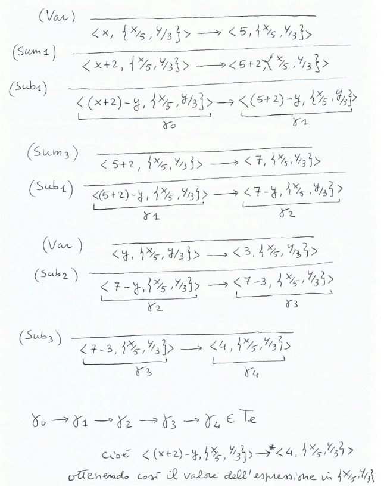
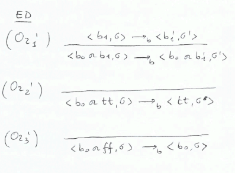
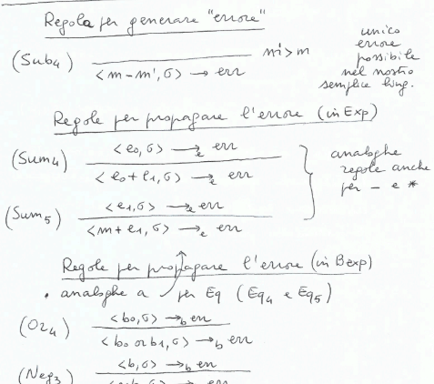

## Semantica Operazionale Strutturata
Un linguaggio è definito tramite una sintassi astratta(semplice, ma ambigua), una stringa viene accoppiata ad un albero sintattico(non ambiguo). 

Un parser mi trasforma un programma scritto in sintassi concreta in un albero sintattico di sintassi astratta, permettendoci più facilmente di fare analisi semantica.ù

## Come dare semantica?
Definiamo per ogni categoria sintattica($EXP, Bexp, Com$) un modello detto *sistema di transizione*.

**Definizione:**$\\$
Un sistema di transizione è una tripla $\langle \Gamma, T, \rightarrow \rangle$ dove:
- $\Gamma$ è un insieme di stati(o configurazioni)
- $T \subseteq \Gamma$ è l'insieme degli stati terminali
- $\rightarrow \subseteq \Gamma \times \Gamma$ è una relazione binaria di transizione

Una computazione a partire dallo stato $\gamma_0$ è una sequenza $\gamma_0 \rightarrow \gamma_1 \rightarrow \ldots$ che può essere finita o infinita.

Con $\rightarrow^*$ indichiamo la chiusura riflessiva e transitiva di $\rightarrow$.

**Problemi:**$\\$
- $\Gamma$ è un insieme infinito contabile quindi necessita di trova una rappresentazione finita attraverso gramamtiche/$BNF$. In sostanza deve coincidere con una delle 3 categorie sintattiche.
- $\rightarrow \subseteq \Gamma \times \Gamma$ è una relazione costituita da infinite coppie $\gamma \rightarrow \gamma'$, quindi necessita di una rappresentazione finita minima di assiomi e regole di inferenza.
- per dare significato alle variabili serve uno store $\sigma : Var \rightarrow \mathbb{N}$, funzione che associa ad ogni variabile un valore $\sigma = \{x_1/n_1, \ldots, x_k/n_k\}$ se supponiamo che $Var = \{x_1, \ldots, x_k\}$, $Store = \{\sigma | \sigma : Var \rightarrow \mathbb{N}\}$

### Semantica delle Espressioni Aritmetiche
**Definizione:**$\\$
$\langle \Gamma_{e}, T_{e}, \rightarrow_{e} \rangle$ dove:
- $\Gamma_{e} = \{ \langle e, \sigma \rangle | e \in Exp, \sigma \in Store \}$
- $T_{e} = \{ \langle n, \sigma \rangle | n \in \mathbb{N}, \sigma \in Store \}$
- la relazione $\rightarrow_{e}$ è definita da un insieme di regole di inferenza e assiomi: 

Fare per esercizio le regole della moltiplicazione(simili a quelle della somma)

*Ossevazioni:*$\\$
- gli assiomi e le regole $SOS$ sono faiclmente implementabili in PROLOG defininendo così un interprete per il linguaggio
- lo store $\sigma$ non viene mai modificato durante la valutazione di un'espressione
- l'assioma $Sub_3$ permette di derivare la transizione $\langle m - m', \sigma \rangle \rightarrow_{e} \langle p, \sigma \rangle$ solo se $m \geq m'$, altrimenti si ha uno stato non terminale di errore
- le regole $Sum_1$ e $Sum_2$ riflettono la regola di valutazione $IS$(Interna Sinistra):
    - prima valutiamo l'argomento più a sinistra($e_0$)
    - poi valutiamo $e_1$ 
    - infine sommiamo i risultati

Alternativa $ID$(Interna Destra):

**Esempio:**$\\$

**Teorema:**$\\$
$\rightarrow_{e}$ è deterministica, ovvero se $\gamma \rightarrow_{e} \gamma'$ e $\gamma \rightarrow_{e} \gamma''$ allora $\gamma' = \gamma''$ per ogni $\gamma, \gamma', \gamma'' \in \Gamma_{e}$

**Dimostrazione per induzione strutturale:**$\\$
Supponiamo di voler dimostrare una certa proprietà $P(e)$ per ogni $e \in Exp$ ($e ::= m | v | e + e | e - e | e * e$)

Se dimostriamo:

Allora concludiamo che $\forall e \in Exp, P(e)$ è vera.

Nel nostro caso $P(e) = \forall \sigma, \gamma', \gamma'' (\langle e, \sigma \rangle \rightarrow_{e} \gamma' \land \langle e, \sigma \rangle \rightarrow_{e} \gamma'' \Rightarrow \gamma' = \gamma'')$

Dimostriamo ora che $P(e)$ è vera per ogni $e \in Exp$ usando l'induzione strutturale.

Poichè $\rightarrow_{e}$ è deterministica, a partire da uno stato $\langle e, \sigma \rangle$ esiste una sola computazione che termina in uno stato $\langle n, \sigma \rangle$, ovvero *$n$ è il valore dell'espressione $e$ nello store $\sigma$*

Possiamo quindi definire una funzione parziale $eval: Exp \times Store \rightarrow \mathbb{N}$ che dia semantica alle espressioni.

**Equivalenza tra espressioni:**$\\$
$e \equiv e'$ se e solo se $\forall \sigma \in Store, eval(e, \sigma) = eval(e', \sigma)$

*Osservazione:*$\\$
- $eval$ è definita con la disciplina di valutazione $IS$
- esistono anche $ES, ED, EP$ che danno valutazioni diverse
- per esempio $IP$(interna parallela) per la somma è $(Sum_1)_{IS} + (Sum_1)_{ID} + (Sum_3)$. Questa relazione è nondeterministica ma confluente, cioè termina in mood univoco

### Semantica delle Espressioni Booleane
**Definizione:**$\\$
$b ::= t | e = e | b \text{ or } b | \sim b$ $\\$
$\langle \Gamma_{b}, T_{b}, \rightarrow_{b} \rangle$ dove:
- $\Gamma_{b} = \{ \langle b, \sigma \rangle | b \in Bexp, \sigma \in Store \}$
- $T_{b} = \{ \langle tt, \sigma \rangle, \langle ff, \sigma \rangle | \sigma \in Store \}$
- la relazione $\rightarrow_{b}$ è definita da un insieme di regole di inferenza e assiomi:

*Osservazioni:*$\\$
- lo store $\sigma$ non viene mai modificato durante la valutazione di un'espressione
- $\rightarrow_{b}$ è deterministica, ovvero se $\gamma \rightarrow_{b} \gamma'$ e $\gamma \rightarrow_{b} \gamma''$ allora $\gamma' = \gamma''$. Per cui si può definire:

- per $b \text{ or } b'$ si può definire una regola di valutazione diversa da $ES$ ad esempio $ED$ o $IS$

*Esercizi:*$\\$

### Semantica dei Comandi
**Definizione:**$\\$
$c ::= \text{skip} | v := e | c; c | \text{if } b \text{ then } c \text{ else } c | \text{while } b \text{ do } c$ $\\$
$\langle \Gamma_{c}, T_{c}, \rightarrow_{c} \rangle$ dove:
- $\Gamma_{c} = \{ \langle c, \sigma \rangle | c \in Com, \sigma \in Store \} \cup \{ \sigma | \sigma \in Store \}$
- $T_{c} = \{ \sigma | \sigma \in Store \}$
- la relazione $\rightarrow_{c}$ è definita da un insieme di regole di inferenza e assiomi:

*Esempi:*$\\$

$\rightarrow_{c}$ è deterministica, ovvero se $\gamma \rightarrow_{c} \gamma'$ e $\gamma \rightarrow_{c} \gamma''$ allora $\gamma' = \gamma''$

Quindi se vogliamo distinguerli dobbimao raffinare la semantica.

### Errori dinamici(a runtime)
$\Gamma' = \Gamma \cup \{ \text{err} \}$ $\\$
$T' = T \cup \{ \text{err} \}$ $\\$

### Nondeterminismo e parallelismo
$c ::= \text{skip} | v := e | \ldots | c \text{ or } c | c \text{ par } c$ $\\$

$\rightarrow_{c}$ non è più deterministica con l'aggiunta di $c \text{ or } c$ e $c \text{ par } c$

**Gestione errore dinamico:**$\\$

