# Capitolo 3
## Analisi Lessicali - Linguaggi regolari
**Analisi Lessicale(Scanner):**$\\$
Riconoscere nella stringa in input simboli che corrispondono a specifiche categorie(identificatori, operatori, costanti, ecc.) e trasformarla in una sequenza di simboli astratti, token.

**Token:**$\\$
Coppia $<nome, valore>$, dove:
- $nome$ rappresenta una categoria sintattica, una classe di token
- $valore$ rappresenta i simboli in ingresso, uno specifico token
- $pattern$ è la descrizione generale della forma dei valori di una classe di token(es.:$(x|y)(x|y|0|1)^*$, espressione regolare)
- $lessema$ è una stringa istanza di un pattern(es.: $x0y1$ per il pattern sopra)

Ad ogni nome di categoria sintattica è associato un pattern che specifica i valori, lessemi, che possono essere presi per quel nome.

## Espressioni Regolari
Fissato un alfabeto $A = \{a_1, a_2, \ldots, a_n\}$, definiamo le espressioni regolari su $A$ come:$\\$
$r::= \emptyset | \epsilon | a | r \cdot r | (r | r) | r^* | (r)$

Assumiamo:
- concatenazione e disgiunzione associano a sinistra
- la precedenza degli operatori è: $^* > \cdot > |$

*Esempio:*$\\$
$b^*a|c$
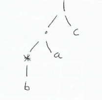

**Linguaggio denotato da una espressione regolare**$\\$
Dato $A$ definiamo la funzione:$\\$
$\mathcal{L} : \text{Exp-Reg} \rightarrow \mathcal{P}(A^*)$ come segue:
- $\mathcal{L}[\emptyset] = \emptyset$ (linguaggio vuoto)
- $\mathcal{L}[\epsilon] = \{\epsilon\}$ (linguaggio contenente la stringa vuota)
- $\mathcal{L}[a] = \{a\}$ (linguaggio contenente la stringa formata da un solo simbolo)
- $\mathcal{L}[r_1 \cdot r_2] = \mathcal{L}[r_1] \cdot \mathcal{L}[r_2]$ (concatenazione)
- $\mathcal{L}[r_1 | r_2] = \mathcal{L}[r_1] \cup \mathcal{L}[r_2]$ (disgiunzione)
- $\mathcal{L}[r^*] = (\mathcal{L}[r])^*$ (chiusura di Kleene)

**Linguaggio regolare**$\\$
*Definizione:*$\\$
Un linguaggio $L \subseteq A^*$ è regolare se e solo se esiste un'espressione regolare $r$ tale che $L = \mathcal{L}[r]$.

*Proposizione:*$\\$
Ogni linguaggio finito è regolare.

*Esempio:*$\\$
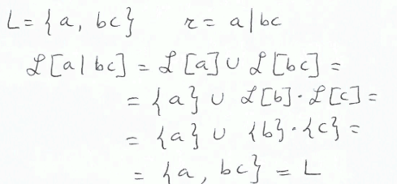

*Operatori ausiliari:*$\\$
- $r^+ = r \cdot r^*$ o $r^* \cdot r$
- $r? = r | \epsilon$
- $[a_1, a_2, \ldots, a_n] = a_1 | a_2 | \ldots | a_n$

**Definizioni regolari**$\\$
Una definizione regolare su $A$ è una lista di definizioni $d_1 := r_1, d_2 := r_2, \ldots, d_n := r_n$ dove $d_i$ sono i simboli nuovi e $r_i$ sono espressioni regolari.sull'alfabeto esteso $A \cup \{d_1, d_2, \ldots, d_n\}$.

*Esempio numeri decimali con segno:*$\\$
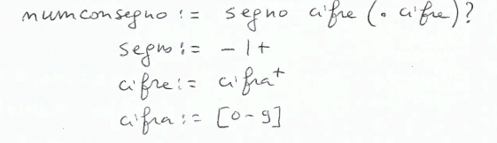

**Equivalenza tra espressioni regolari**$\\$
*Definizione:*$\\$
Due espressioni regolari $r$ e $s$ sono equivalenti se e solo se $\mathcal{L}[r] = \mathcal{L}[s]$(quindi identificano lo stesso linguaggio) e lo denoti con $r \simeq s$.
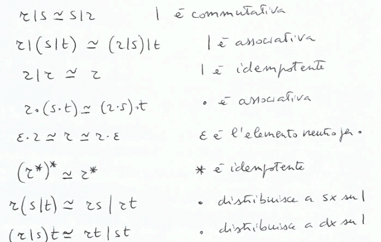

Le espressioni regolari servono a specificare il pattern di una categoria sintattica(la forma dei lessemi). Ma come riconosciamo se una stringa è un lessema di una certa categoria sintattica? Automi a stati finiti.

## Automi a stati finiti
Caratteristiche:
- memoria finita data dal numero di stati $q_0, q_1, \ldots, q_n$
- input: stringa da riconoscere
- output: 1 bit, accettazione o rifiuto
- descrizione iniziale:
    - testina posizionata sul primo carattere della stringa
    - controllo su stato iniziale $q_0$
- funzionamento:
    - legge il simbolo sotto la testina(input)
    - in base allo stato decide:
        - cambiare stato
        - spostare la testina
    - ripete fino a:
        - fine stringa(raggiungimento stato finale)
        - si blocca perchè la coppia stato corrente-input non è definita

**Diagrammi di transizione**$\\$
Rappresentano il funzionamento di un automa finito. Riconoscere una stringa $w$ significa trovare un cammino etichettato $w$ che collega lo stato iniziale a uno stato finale.
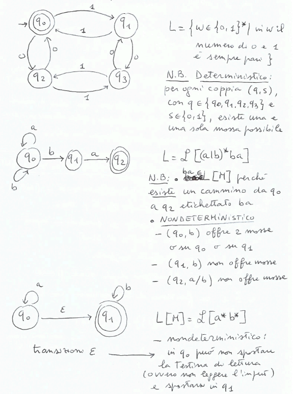

### Automi a stati finiti non deterministici(NFA)
**Definizione:**$\\$
Un automa a stati finiti non deterministico è una quintupla $(\Sigma, Q, \delta, q_0, F)$ dove:
- $\Sigma$ è l'alfabeto finito di input
- $Q$ è l'insieme finito di stati
- $q_0 \in Q$ è lo stato iniziale
- $F \subseteq Q$ è l'insieme degli stati finali
- $\delta: Q \times (\Sigma \cup \{\epsilon\}) \rightarrow \mathcal{P}(Q)$(insieme delle parti di $Q$) è la funzione di transizione($\delta(q, \sigma) = Q' \subseteq Q$, sottoinsieme di stati)

*Esempio:*$\\$
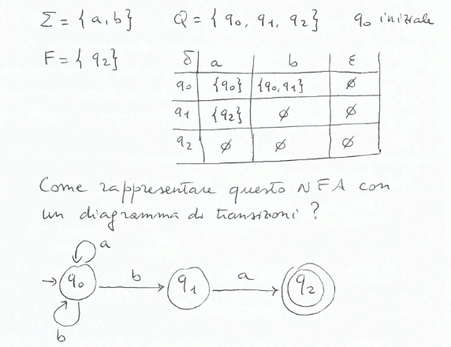

**Linguaggio riconosciuto/accettato**$\\$
*Definizione:*$\\$
Un $NFA$ $N = (\Sigma, Q, \delta, q_0, F)$ accetta una stringa $w = a_1a_2\ldots a_n$ se e solo se nel diagramma di transizioneeiste un cammino da $q_0$ a uno stato in $F$ nel quale la stringa ottenuta concatenando le etichette degli archi percorsi è $w$.

*Formalmente:*$\\$
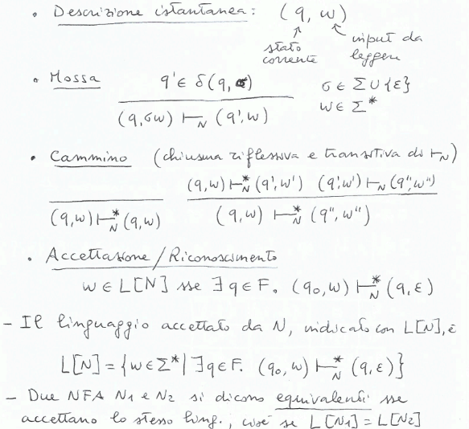

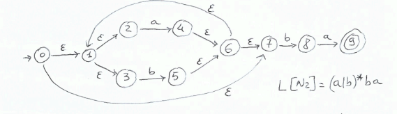

**NFA:**$\\$
Comodi, ma inefficienti. Accettare $w$ significa cercare un cammino accettante in un grafo nondeeterministico. 

**DFA:**$\\$
- $\delta(q, \sigma)$ è sempre un singoletto, una sola mossa possibile
- non ci sono mosse $\epsilon$
- più difficili da definire, ma scansione dell'input lineare($O(n)$)

### Automi a stati finiti deterministici(DFA)
**Definizione:**$\\$
Un automa a stati finiti deterministico è una quintupla $(\Sigma, Q, \delta, q_0, F)$ dove $\delta: Q \times \Sigma \rightarrow Q$ è la funzione di transizione($\delta(q, \sigma) = q'$ unico stato)

*Osservazione:*$\\$
Un DFA è un particolare tipo di NFA tale che:
- $\forall q \in Q, \delta(q, \epsilon) = \emptyset$
- $\forall \sigma \in \Sigma, \forall q \in Q \exists q' \in Q. \delta(q, \sigma) = \{q'\}$

**Proposizione:**$\\$
Per ogni NFA, è possibile costruire un DFA ad esso equivalente

**$\epsilon-closure$ e mosse**$\\$
Sia $q$ uno stato di un NFA, l'$\epsilon-closure(q)$ è l'insieme di stati raggiungibili da $q$ tramite mosse $\epsilon$.
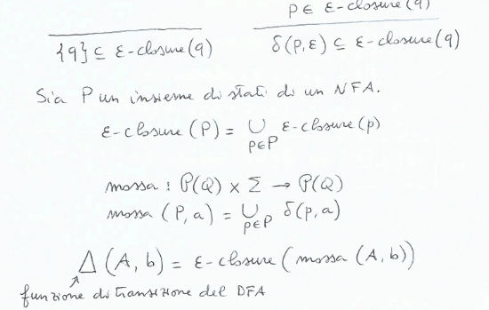

**Algoritmo per calcolare l'$\epsilon-closure$**$\\$
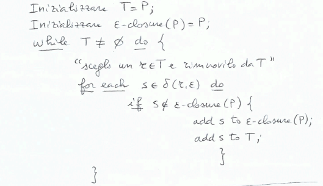

*Osservazione:*$\\$
Usando l'$\epsilon-closure$ possiamo definire il linguaggio riconosciuto da un NFA come:
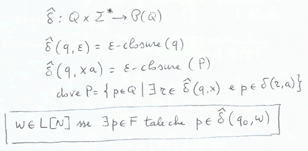

**Costruzione dei sottoinsiemi**$\\$
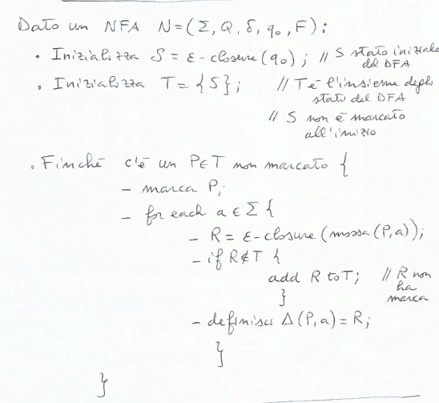

Definiamo un DFA $M_N = (\Sigma, T, \Delta, \epsilon-closure(q_0), \mathcal{F})$ dove $R \in \mathcal{F}$ se e solo se $\exists q \in R. q \in F$.

Nel caso pessimo $T = \mathcal{P}(Q)$, quindi $|T| = 2^{|Q|}$.

*Esempio: DFA da NFA*$\\$
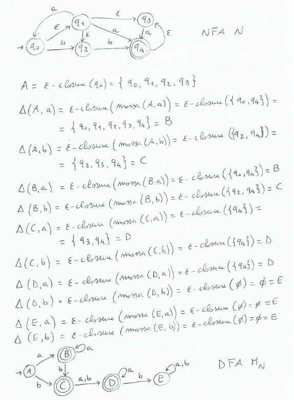

**Equivalenza tra NFA e DFA**$\\$
*Teorema:*$\\$
Sia $N = (\Sigma, Q, \delta, q_0, F)$ un NFA e sia $M_N$ l'automa deterministico costruito per sottoinsiemi. Allora $M_N$ è un DFA tale che $\mathcal{L}[N] = \mathcal{L}[M_N]$.

*Corollario:*$\\$
la classe dei linguaggi riconosciuti da DFA è uguale alla classe dei linguaggi riconosciuti da NFA.

*Dimostrazione:*$\\$
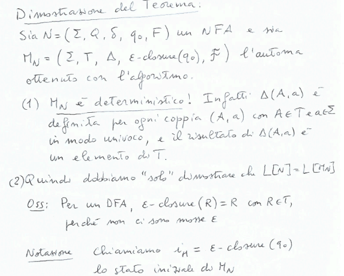
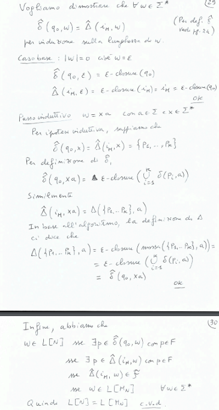

