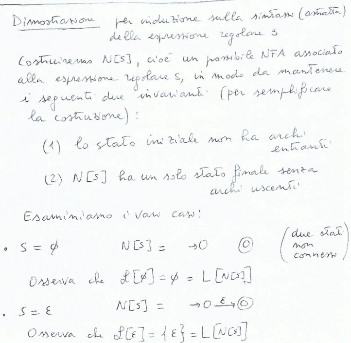
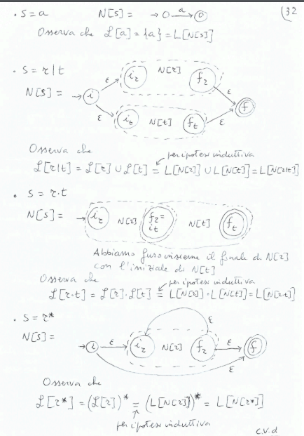
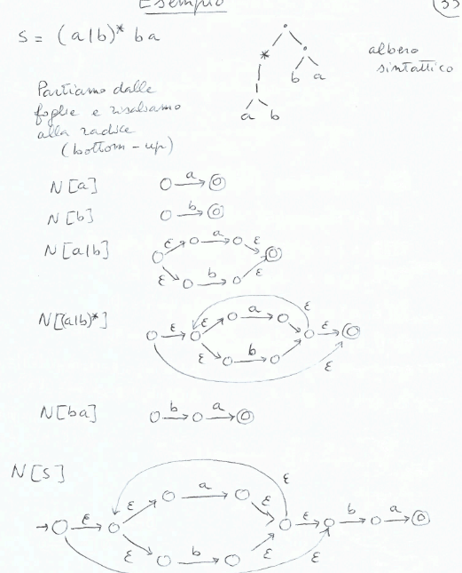
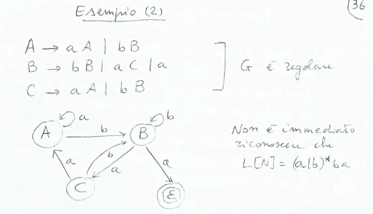
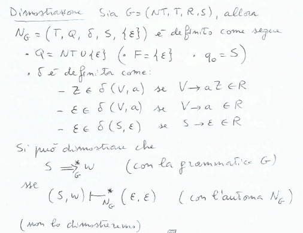
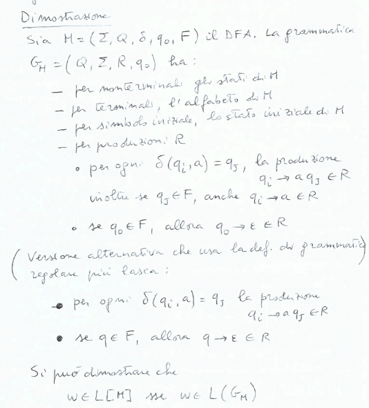
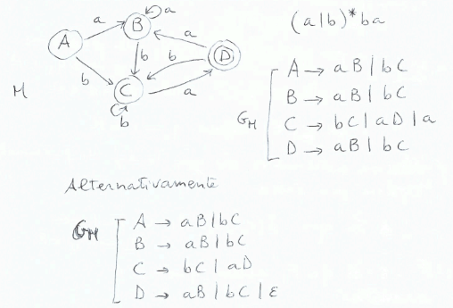
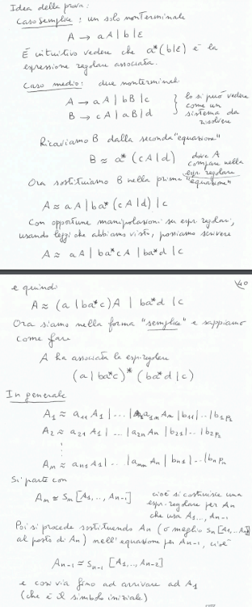
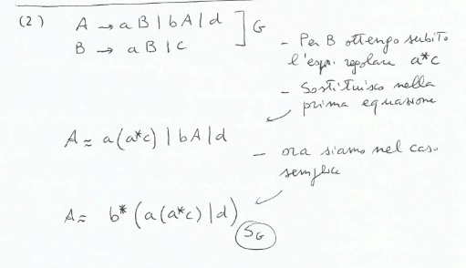

## Da espressioni regolari a NFA equivalenti
**Teorema:**$\\$
Data un'espressione regolare $s$ possiamo costruire un NFA $N_s$ tale che $\mathcal{L}[N_s] = \mathcal{L}[s]$(quindi gli NFA riconoscono tutti i linguaggi regolari e solo quelli).

**Dimostrazione:**$\\$

*Esempio:*$\\$

## Grammatiche regolari
**Definizione:**$\\$
Una grammatica libera è regolare se e solo se ogni produzione è della forma $V \rightarrow aW$ o $V \rightarrow a$ con $V, W \in NT$ e $a \in T$. Per il simbolo iniziale $S$ vale anche $S \rightarrow \epsilon$.

*Esempio:*$\\$

**Teorema:**$\\$
Data una grammatica regolare $G$ si può costruire un NFA $N_G$ equivalente.

**Dimostrazione:**$\\$

## Da DFA a grammatiche regolari
**Teorema:**$\\$
Da un DFA $M$ possiamo definire una gramamtica regolare $G_M$ tale che $\mathcal{L}[G_M] = \mathcal{L}[M]$.

**Dimostrazione:**$\\$

*Esempio:*$\\$

## Grammatiche regolari ed espressioni regolari
**Teorema:**$\\$
Il linguaggio definito da una grammatica regola $G$ è un linguaggio regolare, cioè è possibile costruire una espressione regolare $s_G$ tale che $\mathcal{L}[G] = \mathcal{L}[s_G]$.

**Dimostrazione:**$\\$

*Esempio:*$\\$

*Osservazione:*$\\$
La grammatica regolare con produzione $A \rightarrow aA = G$ definisce il linguaggio vuoto, non $a^*$. Quindi $s_G = \emptyset$.

## Riassumendo
Espressioni regolare $\rightarrow$ NFA $\rightarrow$ DFA $\rightarrow$ grammatica regolare $\rightarrow$ espressioni regolare (è un ciclo)

Tutti i formalismi sono equivalenti, generano(grammatiche regolari)/riconoscono(NFA, DFA)/descrivono(espressioni regolari) la stessa classe di linguaggi, i linguaggi regolari.

Per costruire uno scanner(analizzatore lessicale) si parte dalla specifica dei pattern per le categorie sintattiche del linguaggio, mediante le espressioni regolari, si costruisce un NFA, si costruisce un DFA equivalente minimo.
