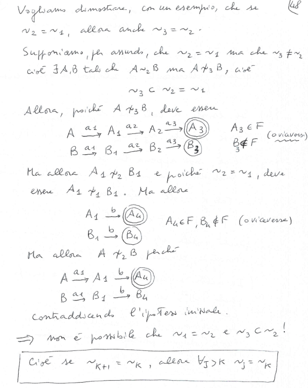
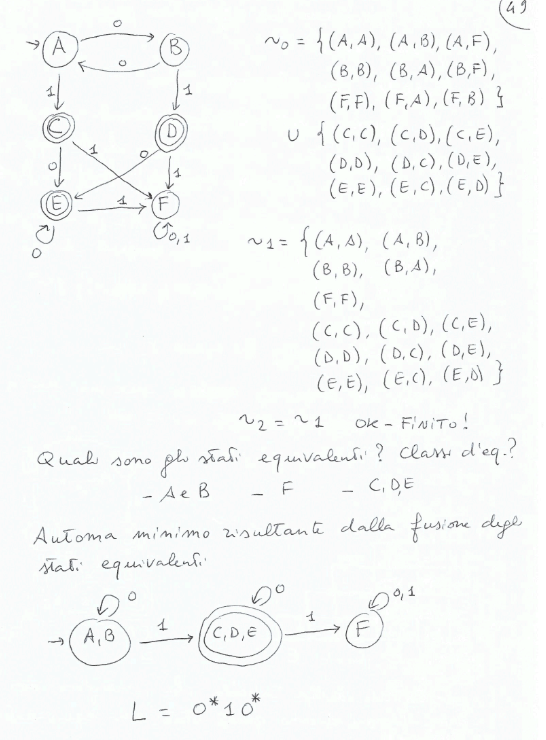
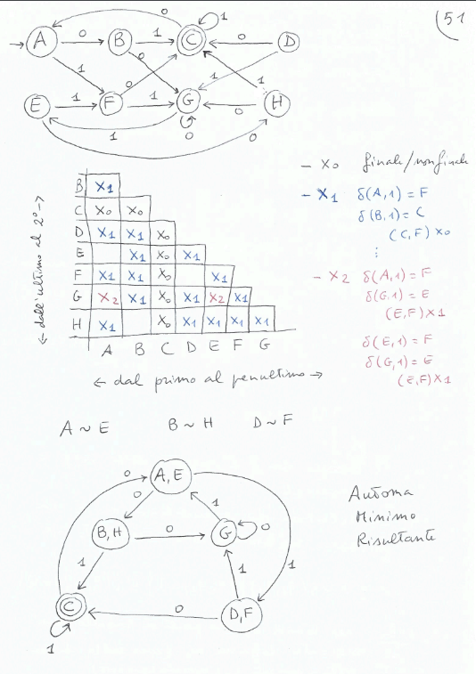
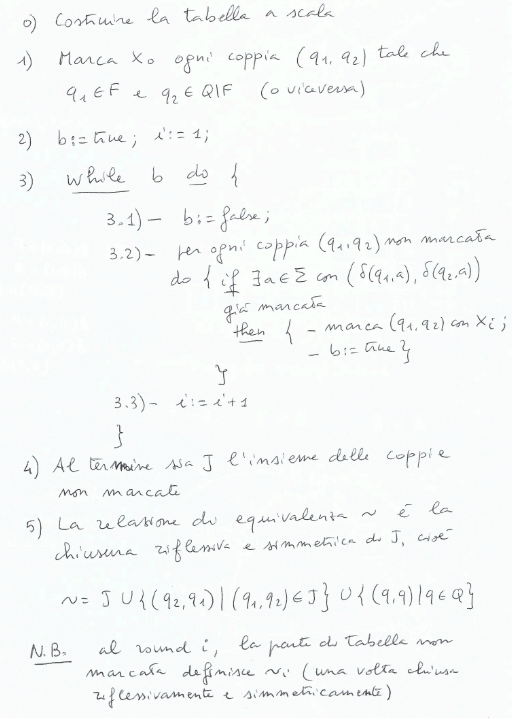
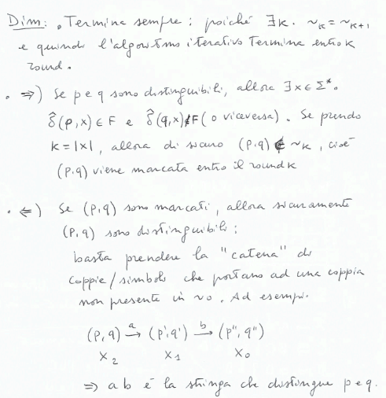
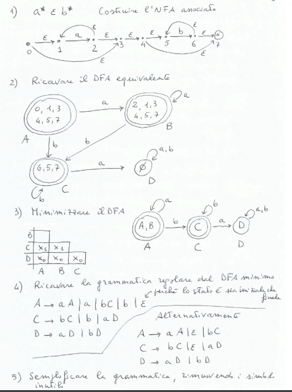
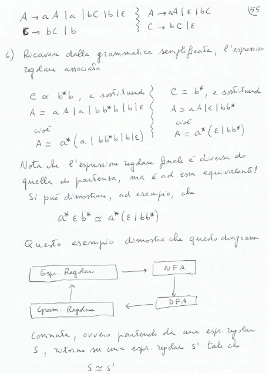
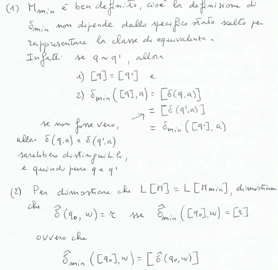
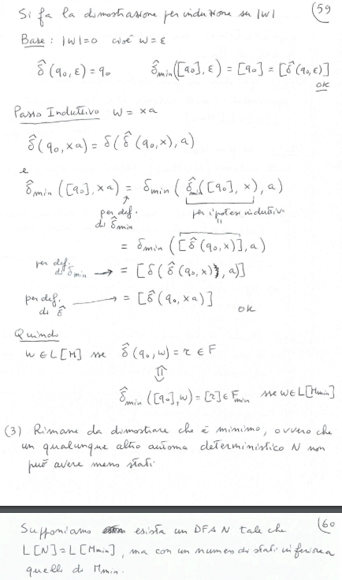
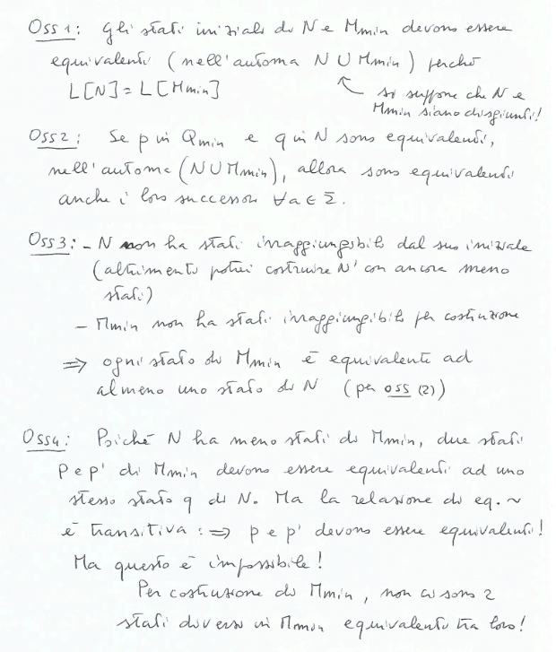

# Minimizzaizone
Introduciamola notazione per un DFA $N = (\Sigma, Q, \delta, q_0, F)$ $\hat{\delta}: Q \times \Sigma^* \rightarrow Q$ è definita come:
- $\hat{\delta}(q, \epsilon) = q$
- $\hat{\delta}(q, xa) = \delta(\hat{\delta}(q, x), a)$

Quindi $w \in \mathcal{L}[N]$ se e solo se $\hat{\delta}(q_0, w) \in F$.

## Equivalenza/Indistinguibilità
**Definizione:**$\\$
Due stati $q_1, q_2$ di un DFA $N$ sono equivalenti(o indistinguibili) se $\forall x \in \Sigma^*. \hat{\delta}(q_1, x) \in F \Leftrightarrow \hat{\delta}(q_2, x) \in F$, cioè se $\mathcal{L}[q_1] = \mathcal{L}[q_2]$.

Dato un DFA $M = (\Sigma, Q, \delta, q_0, F)$ definiamo una famiglia di relazioni $\sim_i \subseteq Q \times Q$ come segue:
- $\sim_0 = F \times F \cup (Q \setminus F) \times (Q \setminus F)$ (stati finali e non finali sono distinti, che non possono essere distinti da $\epsilon$ unica parola id lunghezza 0)
- $q_1 \sim_{i+1} q_2$ se e solo se $\forall a \in \Sigma. \delta(q_1, a) \sim_i \delta(q_2, a)$($q_1$ e $q_2$ sono in relazionese $\forall x \in \Sigma^* con |x| \leq i+1 \rightarrow \hat{\delta}(q_1, x) \in F \Leftrightarrow \hat{\delta}(q_2, x) \in F$)

*Osservazioni:*$\\$
- la relazione $Id = \{(q, q) | q \in Q\}$ è tale che $Id \subseteq \sim_i$ per ogni i(uno stato è sempre equivalente a se stesso)
- $\sim_i$ è una relazione di equivalenza per ogni i:
    - $\sim_0$ ha solo due classi di equivalenza: $F$ e $Q \setminus F$
    - $\sim_1$ ha riflessività e smmetri ovvie, e transitività per definizione $q_1 \sim_i q_2$ e $q_2 \sim_i q_3$ allora $q_1 \sim_i q_3$
- $\sim_{i+1} \subseteq \sim_i$ essendo che ad ogni passo rimuoviamo delle coppie di stati equivalenti
- se esiste $k$ tale che $\sim_k = \sim_{k+1}$ allora $\forall j \geq k. \sim_j = \sim_k$(quindi se non viene modificata in un passo ho trovato la soluzione)
- un tale $k$ ed è minore di $|\sim_0| = |F \times F| + |(Q \setminus F) \times (Q \setminus F)| = |F|^2 + |Q \setminus F|^2$ poichè nel peggiore dei caso rimuoviamo solo una coppia di stati equivalenti ad ogni passo

*Esempio:*$\\$

## Minimizzazione
- tabella con solo coppie di stati non equivalenti
- al round 0 dell'algoritmo metto una marca $x_0$ per segnalare che la coppia è distinta (finale, non finale)
- al round 1 segno le coppie $(q_1, q_2)$ non ancora marcate tali che per qualche $a \in \Sigma$ ha $\delta(q_1, a), \delta(q_2, a)$ marcate con $x_0$
- al round 2 segno le coppie $(q_1, q_2)$ non ancora marcate tali che per qualche $a \in \Sigma$ ha $\delta(q_1, a), \delta(q_2, a)$ marcate con $x_1$

**Algoritmo di minimizzazione:**$\\$

**Teorema:**$\\$
Dato un DFA $M = (\Sigma, Q, \delta, q_0, F)$ l'algoritmo di riempimento della tabella a scala termina. Due stati $p$ e $q$ sono distinguibili se e solo le caselle $(p, q)$ e $(q, p)$ sono marcate.

**Dimostrazione:**$\\$

**Esempio della morte:**$\\$

### Automa minimo
Dato un DFA $M = (\Sigma, Q, \delta, q_0, F)$ l'automa minimo equivalente $M_{min} = (\Sigma, Q_{min}, \delta_{min}, [q_{0}], F_{min})$ è definito come segue:
- $Q_{min} = \{[q] | q \in Q\}$ con $[q] = \{q' \in Q | q \sim q'\}$ (gli stati di $M_{min}$ sono le classi di equivalenza di stati di $M$)
- $\delta_{min}([q], a) = [\delta(q, a)]$ (la funzione di transizione di $M_{min}$ è definita in modo da mantenere l'equivalenza)
- $F_{min} = \{[q] | q \in F\}$

Non esistono due stati distinti in $M_{min}$ che sono equivalenti.

**Teorema:**$\\$
Dato un DFA $M = (\Sigma, Q, \delta, q_0, F)$ l'automa minimo $M_{min}$ riconosce lo stesso linguaggio di $M$, ed ha il minimo numero di stati tra tutti gli automi equivalenti a $M$.

**Dimostrazione:**$\\$

*Osservazioni:*$\\$
