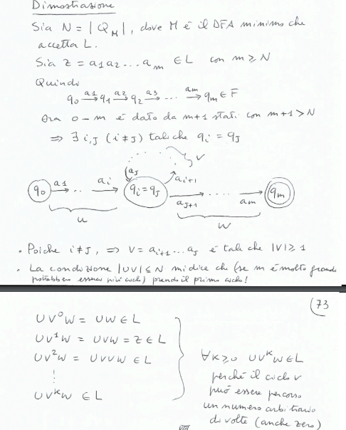
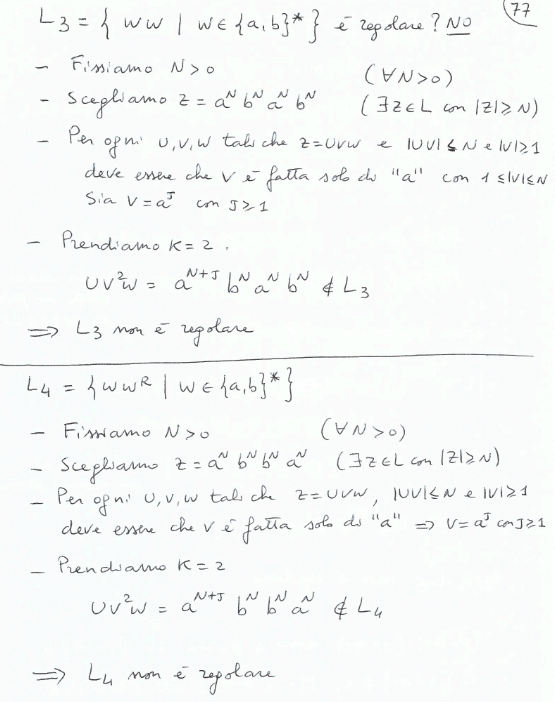
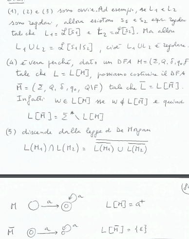
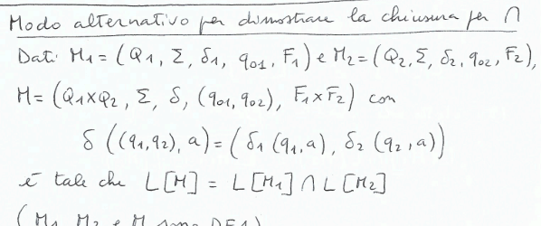
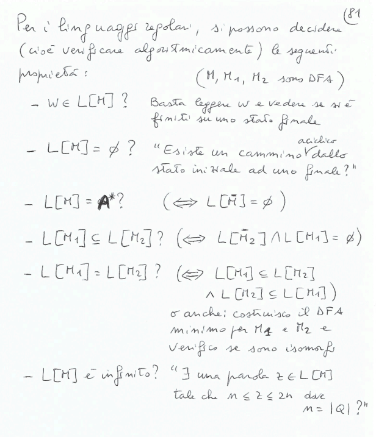

//PRIMA CI SAREBBE LEX E YACC

## Proprietà algoritmiche dei linguaggi regolari
Troveremo una proprietà che i linguaggi regolari hanno e che ci permetterà quindi di riconoscere i linguaggi non regolari.

### Pumping Lemma
Se $L$ è regolare, allora $\exists N > 0$ tale che $\forall z \in L$ con $|z| \geq N$, $\exists u, v, w$ tali che:
- $z = uvw$
- $|uv| \leq N$
- $|v| \geq 1$
- $\forall k \geq 0, uv^kw \in L$

Inoltre $N$ è minore o uguale al numero di stati dell'automa che riconosce $L$.

**Dimostrazione**: $\\$

*Osservazioni*:$\\$
- se $L$ è finito, allora non esiste nessuna $z \in L$ tale che $|z| \geq N$ e quindi l'implicazione è vera essendo una proposizione falsa.
- se $\exists z \in L$ tale che $|z| \geq N$, allora $M$ riconosce un linguaggio infinito.

**Utilizzo del Pumping Lemma**: $\\$
Se $L$ è regolare $\Rightarrow$ $P$(soddisfa il Pumping Lemma)$\\$
Se $\sim P$ $\Rightarrow$ $L$ non è regolare.

**Negazione del Pumping Lemma**: $\\$
*Se* $\\$
[$\forall N > 0$ $\exists z \in L$ tale che $|z| \geq N$, $\forall u, v, w$ se:
- $z = uvw$
- $|uv| \leq N$
- $|v| \geq 1$

allora $\exists k \geq 0$ tale che $uv^kw \notin L$.
] $\\$
*Allora* $\\$ 
$L$ non è regolare.

*Esempio*: $\\$

### Altra proprietà dei linguaggi regolari
La classe dei linguaggi regolari è chiusa per:
1. unione
2. concatenazione
3. stella di Kleene
4. complementazione
5. intersezione

**Dimostrazione**: $\\$

*Osservazioni*: $\\$
La chiusura per intersezione può essere utile per dimostrare che un linguaggio non è regolare: 
- se $L \cap L_{reg} = L_{nonreg}$, allora $L$ non è regolare.

