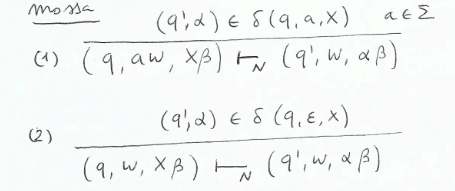
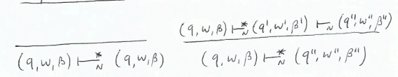
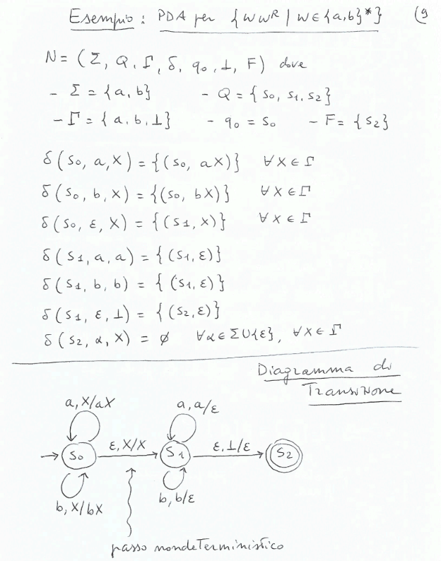
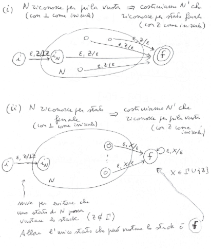
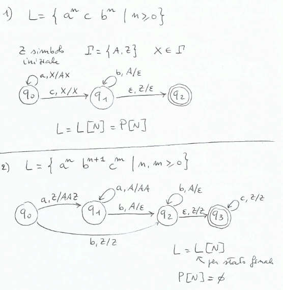
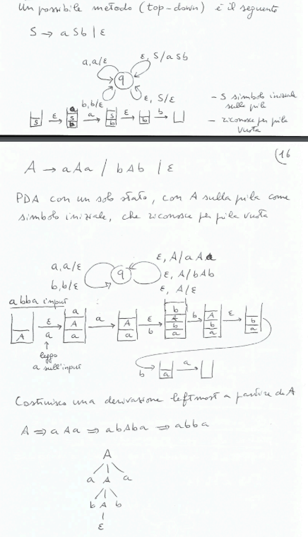
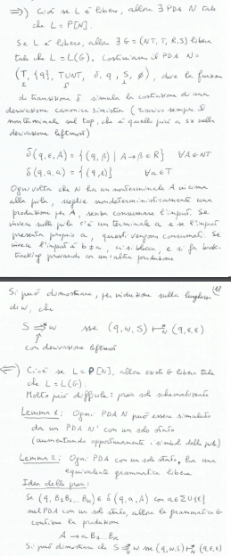

# Capitolo 4
## Analisi Sintattica: Linguaggi Liberi
Le grammatiche libere da contesto($V\rightarrow \alpha$ con $\alpha \in (T \cup NT)^*$) sono più generali di quelle regolari($V\rightarrow \alpha W, V\rightarrow \alpha, S\rightarrow \epsilon$ con $\alpha \in T, V,W \in NT$) 

Automi a pila(PDA) invece di automi a stati finiti. PDA non deterministico utile per i linguaggi liberi, deterministico per costruire compilatori.

### Analisi Sintattica
L'analizzatore lessicale crea una lista di token che viene data in input all'analizzatore sintattico(Parser), prodotto a partire da una grammatica libera da contesto. Il parser costruisce un albero di derivazione che rappresenta la struttura sintattica del programma.

Dobbiamo rinforzare gli automi in modo che possano riconoscere le grammatiche libere da contesto, lo faremo aggiungendo una pila con le seguenti caratteristiche:
- cresce senza limiti
- può essere letto solo l'elemento top della pila
- si può rimuovere solo l'elemento top della pila
- si può aggiungere un elemento in cima alla pila

## Automi a Pila
### Automa a Pila non Deterministico(PDA)
**Definizione:**$\\$
Un automa a pila non deterministico è una 7-upla $(\Sigma, Q, \Gamma, \delta, q_0, \bot, F)$ dove:
- $\Sigma$ è l'alfabeto di input
- $Q$ è l'insieme degli stati
- $\Gamma$ è l'alfabeto di simboli dello stack
- $\delta$ è la funzione di transizione con tipo $\delta: Q\times(\Sigma \cup \{\epsilon\})\times\Gamma \rightarrow \mathcal{P}_{fin}(Q\times\Gamma^*)$(consuma un simbolo di input e uno dallo stack, produce una sequenza di simboli in $\Gamma$)
- $q_0$ è lo stato iniziale
- $\bot \in \Gamma$ è il simbolo iniziale dello stack
- $F \subseteq Q$ è l'insieme degli stati finali

E' non deterministico perché:
- $|\delta(q,\sigma,A)| > 1$ per qualche $q \in Q, \sigma \in \Sigma \cup \{\epsilon\}, A \in \Gamma$ (quindi più di una transizione possibile)
- se richiedessimo che $|\delta(q,\sigma,A)| \leq 1$ ci sarebbe comunque non determinismo a causa della presenza di $\epsilon$-transizioni

**Transizioni:**$\\$
- descrizione istantanea: $(q, w, \beta)$ con $q \in Q$ stato corrente, $w \in \Sigma^*$ input rimanente, $\beta \in \Gamma^*$ stringa nello stack
- mossa:
    
- computazione/cammino: sequenza di mosseù
    

**Linguaggio Accettato:**$\\$
Due modalità di riconoscimento:
- per stato finale: $L[N] = \{w \in \Sigma^* | (q_0, w, \bot) \vdash^* (q, \epsilon, \alpha) con q \in F\}$
- per pila vuota: P[N] = $\{w \in \Sigma^* | (q_0, w, \bot) \vdash^* (q, \epsilon, \epsilon) con q \in Q\}$

*Osservazioni:*
- per un certa PDA $N$, $L[N] \neq P[N]$
- dimostreremo però che se $L = L[N]$ allora esiste un PDA $N'$ tale che $L = P[N']$ e viceversa, non cambia il linguaggio accettato ma cambia il modo di accettarlo

*Esempio:*$\\$

**Teorema:**$\\$
i)  Se $L = P[N]$(per pila vuota) possiamo costuire un PDA $N'$ tale che $L = L[N']$(per stato finale) $\\$
ii) Se $L = L[N]$(per stato finale) possiamo costuire un PDA $N'$ tale che $L = P[N']$(per pila vuota)

*Dimostrazione:*$\\$

*Esercizio:*$\\$

**Al contrario, come ottenere un PDA da una grammatica libera da contesto?**$\\$

**Teorema:**$\\$
Un linguaggio $L$ è libero da contesto se e solo se è accettato da un PDA

**Dimostrazione:**$\\$
