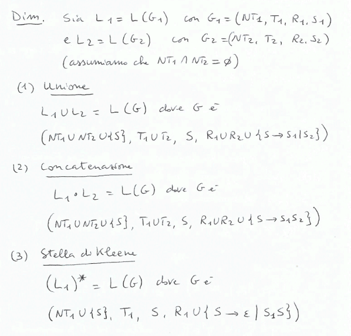
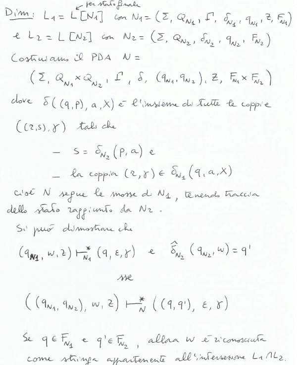
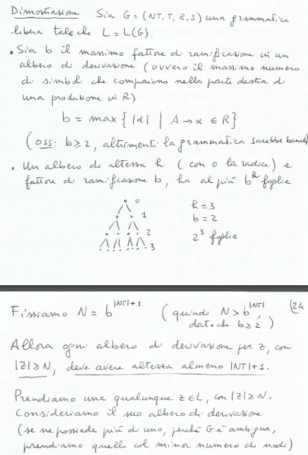
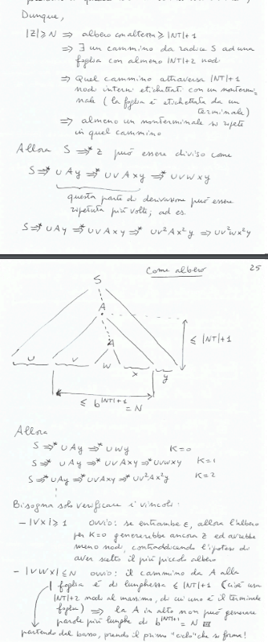
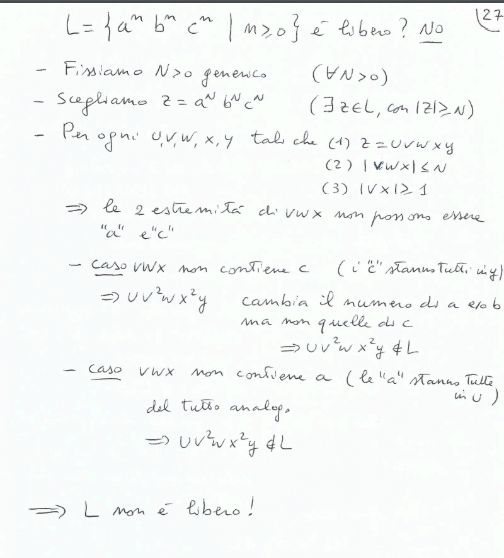
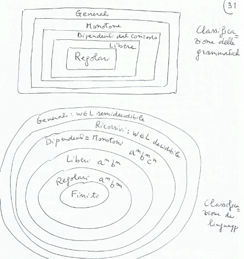
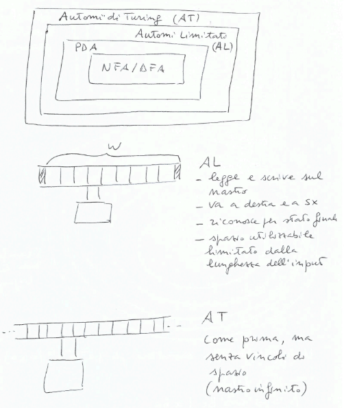

## Proprietà di chiusura
**Teorema:**$\\$
I linguaggi liberi sono chiusi per:
- unione
- concatenazione
- stella di Kleene

**Dimostrazione:**$\\$

**Teorema:**$\\$
L'intersezione $L_1 \cap L_2$ di un linguaggio libero $L_1$ e un linguaggio regolare $L_2$ è un linguaggio libero.

**Dimostrazione:**$\\$

*Osservazione:*$\\$
- si può utilizzare questo teorema per dimostrare che un linguaggio non è libero, basta dimostrare che l'intersezione con un linguaggio regolare non è libera
- se $L_1 \cap L_2$ è non regolare, ma $L_2$ è regolare, allora $L_1$ non è regolare(perchè i linguaggi regolari sono chiusi per intersezione)
- se $L_1 \cap L_2$ è non libero, ma $L_2$ è regolare, allora $L_1$ non è libero(perchè l'intersezione di un linguaggio libero con uno regolare è libero)

### Pumping Theorem
**Teorema:**$\\$
Se $L$ è un linguaggio libero, allora $\exists N > 0$ tale che $\forall z \in L$ con $|z| \geq N$, $\exists u,v,w,x,y \in \Sigma^*$ tali che:
- $z = uvwxy$
- $|vwx| \leq N$
- $|vx| \geq 1$
- $\forall k \geq 0, uv^kwx^ky \in L$

**Dimostrazione:**$\\$

**Utilizzo del Pumping Theorem a rovescio per dimostrare che un linguaggio non è libero:**$\\$
*Pumping Theorem:*$\\$
Se $L$ è libero $\Rightarrow$ P(Pumping Theorem) 

*Pumping Theorem a rovescio:*$\\$
Se $\sim P$ (Pumping Theorem) $\Rightarrow$ $L$ non è libero

*Se* $\\$
$\forall N > 0, \exists z \in L$ con $|z| \geq N$ tale che $\forall u,v,w,x,y$[  $\\$
- se:
    - $z = uvwxy$
    - $|vwx| \leq N$
    - $|vx| \geq 1$
- allora:
    - $\exists k \geq 0$ tale che $uv^kwx^ky \notin L$

*Allora* $\\$
$L$ non è libero

*Esempio:*$\\$

## Oltre i linguaggi liberi
**Classificazione di Chomsky:**$\\$
- *Grammatiche regolari:*$\\$
    - $A \rightarrow aB$
    - $A \rightarrow a$
    - $S \rightarrow \epsilon$
- *Grammatiche libere da contesto:*$\\$
    - $A \rightarrow \gamma$ con $\gamma \in (NT \cup T)^+$
    - $S \rightarrow \epsilon$
- *Grammatiche dipendenti dal contesto:*$\\$
    - $\gamma A \delta \rightarrow \gamma w \delta$ con $\gamma, \delta \in (NT \cup T)^*$ e $w \in (NT \cup T)^+$
    - $S \rightarrow \epsilon$
- *Grammatiche monotone:*$\\$
    - $\gamma \rightarrow \delta$ con $|\gamma| \leq |\delta|$
- *Grammatiche generali:*$\\$
    - $\gamma \rightarrow \delta$

**Teorema:**$\\$
Per ogni $G_1$ monotona esiste una grammatica dipendente dal contesto $G_2$ tale che $L(G_1) = L(G_2)$

**Classificazione**$\\$

**Gerarchia di automi:**$\\$
