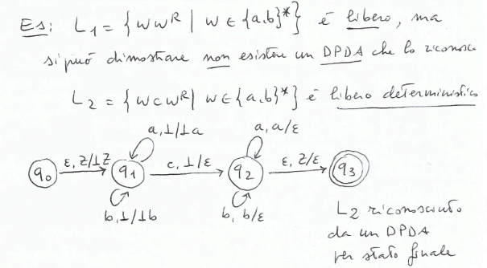
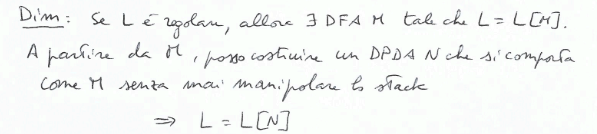
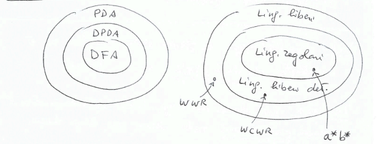
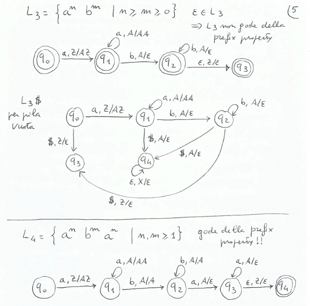
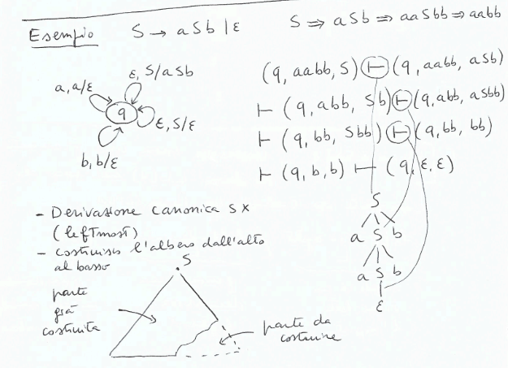
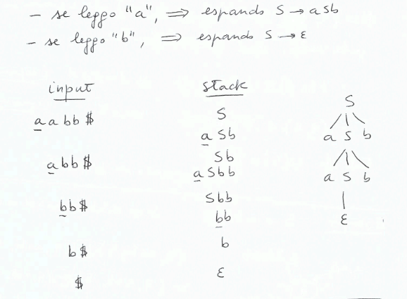
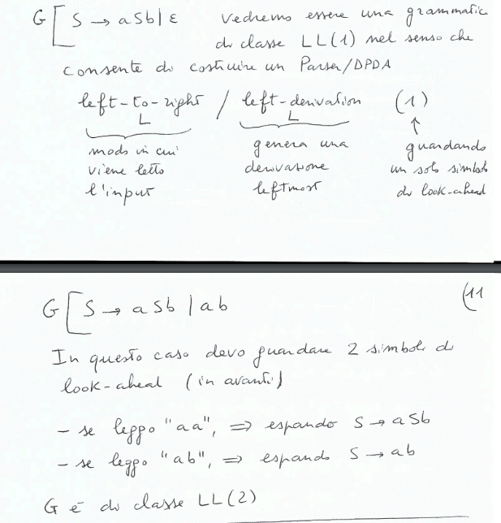
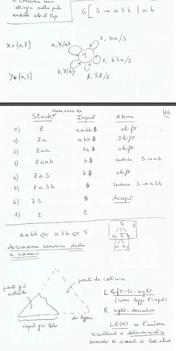
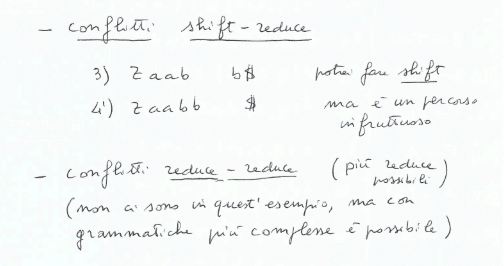

## PDA e linguaggi deterministici
**Definizione:**$\\$
Un PDS $N = (\Sigma, Q, \Gamma, \delta, q_0, \bot, F)$ è deterministico(DPDA) se e solo se:
- $\forall q \in Q, \forall z \in \Gamma$ se $\delta(q, \epsilon, z) \neq \emptyset$ allora $\delta(q, a, z) = \emptyset$ per ogni $a \in \Sigma$(non ci sono transizioni spontanee se ci sono transizioni con input)
- $\forall q \in Q, \forall z \in \Gamma \forall a \in \Sigma \cup \{\epsilon\}$, $|\delta(q, a, z)| \leq 1$(non ci sono scelte)

**Definizione:**$\\$
Un linguaggio è libero deterministico se è accettato *per stato finale* da un DPDA.

**Teorema:**$\\$
La classe dei linguaggi liberi determistici è inclusa propriamente nella classe dei linguaggi liberi.

*Esempio:*$\\$

**Proposizione:**$\\$
Se $L$ è regolare, allora $\exists DPDA N$ tale che $L[N] = L$.(per stato finale)

**Dimostrazione:**$\\$

**Fatto:**$\\$
Un linguaggio libero deterministico $L$ è riconosciuto da un DPDA per pila vuota se e solo se $L$ gode della *prefix property*.

*Prefix property:*$\\$
$\nexists x, y \in L$ tali che $x$ è prefisso di $y$.

*Osservazioni:*$\\$ 
- se $L$ libero deterministico non gode della *prefix property*, allora $L$ non è riconosciuto da un DPDA per pila vuota.
- se $L$ libero deterministico gode della *prefix property*, allora $L$ è riconosciuto da un DPDA per pila vuota.
- se $L$ libero deterministico, allora $L$ \$ $= \{w$ \$ $| w \in L\}$ gode della *prefix property*, quindi $L$ \$ è riconosciuto da un DPDA per pila vuota.

*Esempio:*$\\$

**Proposizione:**$\\$
Se $L$ è libero deterministico(riconosciuto da un DPDA per stato finale), allora $L$ è generabile da una grammatica libera non ambigua.

**Proprieta dei linguaggi liberi deterministici:**$\\$
- chiusi per complementazione: se $\exists DPDA N$ tale che $L[N] = L$, allora $\exists DPDA N'$ tale che $L[N'] = \Sigma^* - L = \overline{L}$.
- non sono chiusi per intersezione
- non sono chiusi per unione(dato che sono chiusi per complemento ma non per intersezione)

## Analizzatori sintattici(Parser)
Si utiliza una gramamtica libera per creare un parser(un DPDA con output). Al parser viene dato in input la lista die token e restituisce l'albero di derivazione.

I parser possono essere:
- non deterministici: se durante la ricerca di derivazione una scelta non porta a riconoscere l'input, fa backtracking e prova un'altra scelta disfando parte della derivazione.
- deterministici: leggono l'input una volta sola
- top-down: ricostruiscono una derivazione leftomost partendo da $S$
- bottom-up: ricostruiscono una derivazione rightmost partendo da $w$, cercando di ottenere $S$

I parser top-down deterministici sono ottenuti a aprtire da grammatiche $LL(K)$.$\\$
I parser bottom-up deterministici sono ottenuti a partire da grammatiche $LR(K)$.

### Top-down parsing
Data $G = (NT, T, S, R)$ libera, costruiamo il PDA $M = (T, \{q\}, NT \cup T, \delta, q, S, \emptyset)$ con $\delta$ definita come segue:
- $(q, \beta) \in \delta(q, \epsilon, A)$ se $A \rightarrow \beta \in R$(espandi)
- $(q, \epsilon) \in \delta(q, a, a)$ per ogni $a \in T$(consuma)

tale che $L[G] = P[M]$.(riconosciuto per pila vuota)

*Esempio:*$\\$

C'è non determinismo, può essere risolto con dei lookahead.$\\$

**LL(1) e LL(2):**$\\$

### Bottom-up parsing
Data $G = (NT, T, S, R)$ libera, costruiamo il PDA $M = (T, \{q\}, NT \cup T \cup \{z\}, \delta, q, z, \emptyset)$ con $\delta$ definita come segue:
- $(q, aX) \in \delta(q, a, X), \forall a \in T, \forall X \in NT \cup T \cup \{z\}$ (shift)
- $(q, A) \in \delta(q, \epsilon, a^R)$ se $A \rightarrow a \in R$(riduci)
- $(q, \epsilon) \in \delta(q, \$, SZ)$ (accetta)

*Esempio:*$\\$

C'è non determinismo.$\\$

**Problema con produzioni $\epsilon$ del tipo $A \rightarrow \epsilon$:**
La riduzione è sempre applicabile. Cercare di non usarle per il bottom-up parsing. Crea conflitti shift-reduce.
