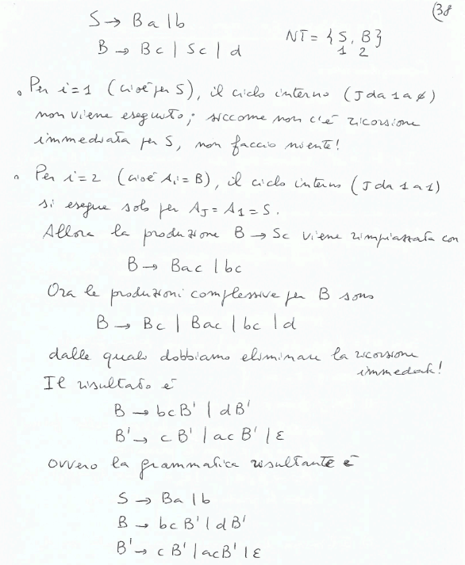
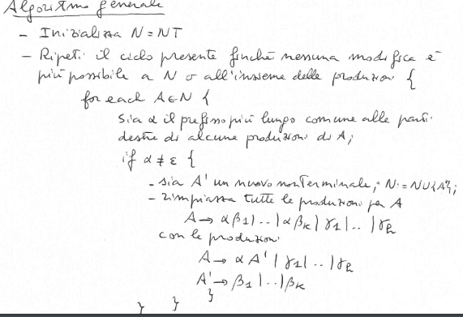
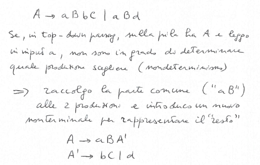

## Semplificazione delle grammatiche
### Eliminare le produzioni $\epsilon$
*Input:* $\\$
Grammatica libera $G$ con produzioni $\epsilon$, del tipo $A \rightarrow \epsilon$. $\\$
*Output:* $\\$
Grammatica libera $G'$ senza produzioni $\epsilon$, tale che $L(G) \setminus \{\epsilon\} = L(G')$.

*Osservazioni:*$\\$
Se $\epsilon \in L(G)$ e vogliamo $G''$ tale che $L(G'') = L(G) $, basta definire $G'' = G' \cup \{S' \rightarrow \epsilon | S\}$.

**Simbolo annullabile:**$\\$
$A \in NT$ è annullabile se $A \Rightarrow^+ \epsilon$.$\\$
$N(G) = \{A \in NT | A \Rightarrow^+ \epsilon\}$ è l'insieme dei simboli annullabili e viene calcolato come segue:
- $N_0(G) = \{A \in NT | A \rightarrow \epsilon \in R\}$
- $N_{i+1}(G) = N_i(G) \cup \{B \in NT | B \rightarrow c_1\ldots c_k \in R \text{ e } c_1\ldots c_k \in N_i(G)\}$(aggiungo le produzioni che arrivano alle produzioni $\epsilon$)

*Osservazione:*$\\$
- $N_i(G) \subseteq N_{i + 1}(G)$ dato che aggiungo qualcosa ogni passo
- $\exists i_c$ tale che $N_i(G) = N_{i + 1}(G)$ perchè $NT$ è finito

**Algoritmo:**
Calcolato $N(G) per $G = (NT, T, S, R)$, costruiamo $G' = (NT, T, S, R')$, dove per ogni produzione $A \rightarrow \alpha \in R$ con $a \neq \epsilon$ in cui occorrono i simboli annullabili $z_1, \ldots, z_k$ mettiamo in $R'$ le produzioni $A \rightarrow \alpha'$, $\alpha'$ ottenuta cancellando i possbili sottoinsiemi di $z_1, \ldots, z_k$ ad eccezione del caso in cui $\\alpha' = \epsilon$

**Proposizione:**$\\$
Data una grammatica libera $G$, la grammatica $G'$ determinata con l'algoritmo non ha produzioni $\epsilon$ e $L(G) \setminus \{\epsilon\} = L(G')$.

*Esempio:*$\\$

### Eliminare le produzioni unitarie
Possono creare dei cicli $A \Rightarrow^+ A$.
- produzioni unitarie: $A \rightarrow B$ con $A, B \in NT$
- coppie unitarie: $(A, B)$ con $A \Rightarrow^* B$ usando solo produzioni unitarie

**Calcolo delle coppie unitarie:**$\\$
- $U_0(G) = \{(A, A) | A \in NT\}$
- $U_{i+1}(G) = U_i(G) \cup \{(A, C) | (A, B) \in U_i(G) \text{ e } B \rightarrow C \in R\}$

*Osservazione:*$\\$
- $U_i(G) \subseteq U_{i + 1}(G)$
- $\exists i_c$ tale che $U_i(G) = U_{i + 1}(G)$ perchè $NT$ è finito

**Algoritmo:**
Data una grammatica libera $G = (NT, T, S, R)$, si definisce $G' = (NT, T, S, R')$ dove, per ogni $(A, B) \in U(G)$, $R'$ contiene tutte le produzioni $A \rightarrow \alpha$ con $B \rightarrow \alpha \in R$ e non è unitaria.

**Teorema:**$\\$
Data una grammatica libera $G$, la grammatica $G'$ determinata con l'algoritmo non ha produzioni unitarie e $L(G) = L(G')$.

*Esempio:*$\\$

### Eliminare i simboli inutili
Terminali e non terminali non raggiungibili/generabili a partire da $S$.

**Definizioni:**$\\$
Un simbolo $X \in NT \cup T$ è:
- un *generatore* se e solo se $\exists w \in T^*$ tale che $X \Rightarrow^* w$
- *raggiungibile* se e solo se $S \Rightarrow^* \alpha X \beta$ per qualche $\alpha, \beta \in (NT \cup T)^*$
- *utile* se e solo se è generatore e raggiungibile

*Esempio:*$\\$

**Calcolare i generatori:**$\\$
- $G_0(G) = T$
- $G_{i+1}(G) = G_i(G) \cup \{B \in NT | B \rightarrow c_1\ldots c_k \in R \text{ e } c_1\ldots c_k \in G_i(G)\}$

*Osservazione:*$\\$
- $G_i(G) \subseteq G_{i + 1}(G)$
- $\exists i_c$ tale che $G_i(G) = G_{i + 1}(G)$ perchè $NT$ è finito

**Calcolare i raggiungibili:**$\\$
- $R_0(G) = \{S\}$
- $R_{i+1}(G) = R_i(G) \cup \bigcup_{B \in R_i(G), B \rightarrow x_1\ldots x_k \in R} \{x_1, \ldots, x_k\}$

*Osservazione:*$\\$
- $R_i(G) \subseteq R_{i + 1}(G)$
- $\exists i_c$ tale che $R_i(G) = R_{i + 1}(G)$ perchè $NT$ è finito

**Algoritmo:**
Elimino prima tutti i non-generatori e poi tutti i non raggiungibili.

**Teorema:**$\\$
Data una grammatica libera $G$ tale che $L(G) \neq \emptyset$.
- sia $G_1$ la grammatica libera ottenuta da $G$ eliminando i simboli che non appartengono a $G(G)$ e tutte le produzioni che contengono simboli eliminati
- sia $G_2$ la grammatica libera ottenuta da $G_1$ eliminando i simboli che non appartengono a $R(G_1)$ e tutte le produzioni che contengono simboli eliminati

Allora $L(G) = L(G_2)$ e $G_2$ non ha simboli inutili.

**Dimostrazione:**$\\$

L'ORDINE DEGLI ALGORITMI È IMPORTANTE ALTRIMENTI NON SI ELIMINANO TUTTI I SIMBOLI INUTILI.

*Esempio:*$\\$

### Esempio riassuntivo delle prime tre semplificazioni
E' importante l'ordine delle semplificazioni.

### Forme normali
**Forma normale di Chomsky:**$\\$
Tutte le produzioni sono della forma:
- $A \rightarrow BC$ con $A, B, C \in NT$
- $A \rightarrow a$ con $A \in NT$ e $a \in T$

*Osservazione:*$\\$
- se $G$ è una grammatica libera in forma normale di Chomsky allora non ha produzioni $\epsilon$ e non ha produzioni unitarie
- ogni grammatica libera $G$ può essere trasformata in una grammatica libera $G'$ in forma normale di Chomsky tale che $L(G) = L(G')$

**Forma normale di Greibach:**$\\$
Tutte le produzioni sono della forma:
- $A \rightarrow aBC$ con $A, B, C \in NT$ e $a \in T$
- $A \rightarrow aB$ con $A, B \in NT$ e $a \in T$
- $A \rightarrow a$ con $A \in NT$ e $a \in T$

*Osservazione:*$\\$
- ogni grammatica libera $G$ può essere trasformata in una grammatica libera $G'$ in forma normale di Greibach tale che $L(G) = L(G')$
- non ha produzioni $\epsilon$ e non ha produzioni unitarie, non è ricorsiva a sinistra, allunga le produzioni per avere meno non determinismo

### Eliminare la ricorsione a sinistra
**Definizioni:**$\\$
- produzioni di ricorsione a sinistra: $A \rightarrow A\alpha \in R$
- $G$ è ricorsiva a sinistra: $A \Rightarrow^+ A\alpha$ per qualche $\alpha \in (NT \cup T)^*$

**Algoritmo:**$\\$
$A \rightarrow A\alpha_1 | \ldots | A\alpha_n | \beta_1 | \ldots | \beta_m$ $\\$
Queste produzioni vengono sostituite con $A \rightarrow \beta_1A' | \ldots | \beta_mA'$ e $A' \rightarrow \alpha_1A' | \ldots | \alpha_nA' | \epsilon$

*Esempio:*$\\$

*Osservazione:*$\\$
Se $G = [ A \rightarrow A\alpha$ non si può applicare l'algoritmo.

**Ricorsione non immediata:**$\\$
*Algoritmo:*$\\$

*Esempio:*$\\$

### Fattorizzazione
Serve per ottenere meno non determinismo.

*Algoritmo:*$\\$

*Esempio:*$\\$

