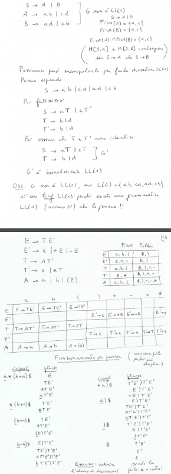

## Parser Top-down
**Parser(non deterministico) a discesa ricorsiva, algoritmo**$\\$

*Esempio*: $\\$

Questo metodo è molto inefficiente, in quanto non è deterministico, ci mette un tempo $O(b^{|w|})$ con $b$ numero massimo di produzioni per un non terminale e $|w|$ lunghezza della stringa da parsare. $\\$

Quindi vogliamo introdurre del lookahead per rendere il parser deterministico. $\\$

### First e Follow
D'ora in poi utilizzeremo il simbolo \$ per indicare identificare la fine della stringa. Perchè il top-down parser è essenzialmente un DPDA per pila vuota, quindi ci serve che $L$ goda della *prefix property*($L \cdot \$$ gode di questa proprietà). $\\$

Questa cosa è vera perchè per esempio $'a'$ sarebbe prefisso di $'ab'$, ma se aggiungo un simbolo alla fine, $'a\$$ non è prefisso di $'ab\$$.

**First**$\\$
Data una grammatica libera $G$ e $\alpha \in (NT \cup T)^*$, definiamo $First(\alpha)$ come l'insieme dei *terminali* che possono stare in prima posizione in una stringa derivata da $\alpha$. $\\$
- per $a \in T$, $a \in First(\alpha)$ se e solo se $\alpha \Rightarrow^* a\beta$ per $\beta \in (NT \cup T)^*$
- inoltre se $\alpha \Rightarrow^* \epsilon$, allora $\epsilon \in First(\alpha)$

Se avendo $A \rightarrow \alpha_1 | \alpha_2$, $First(\alpha_1) \cap First(\alpha_2) = \emptyset$, allora la scelta è deterministica. $\\$

*Esempio*: $\\$

**Follow**$\\$
Data una grammatica libera $G$ e $A \in NT$, definiamo $Follow(A)$ come l'insieme dei *terminali* che possono comparire subito a destra di $A$ in una derivazione. $\\$
- per $a \in T$, $a \in Follow(A)$ se e solo se $S \Rightarrow^* \alpha A a \beta$ per $\alpha, \beta \in (NT \cup T)^*$
- $\$ \in Follow(A)$ se $S \Rightarrow^* \alpha A$ 
- $\$ \in Follow(S)$ poichè $S \Rightarrow^* S$

*Esempio*: $\\$

**Come calcolare First**$\\$
Sia $N(G) \subseteq NT$ l'insieme dei simboli annulabili. $\\$

*Alogritmo*: $\\$

First può essere esteso a $\alpha \in (NT \cup T)^*$ come segue: $\\$
- $First(\epsilon) = \{\epsilon\}$
- $First(X\beta) = First(X)$ se $X \notin N(G)$
- $First(X\beta) = (First(X) \setminus \{\epsilon\}) \cup First(\beta)$ se $X \in N(G)$

*Esempio*: $\\$

**Come calcolare Follow**$\\$
*Alogritmo*: $\\$

In pratica bisogna cercare tutte le produzioni in cui $Y \in NT$ appare e applicare la 1 o la 2.

*Esempio*: $\\$

### Tabella di Parsing LL(1)
- L: input left-to-right
- L: output leftmost derivation
- 1: un simbolo di lookahead

**Matrice bidimensionale**$\\$
- righe: non terminali
- colonne: terminali + $\$$
- cella $[A, a]$ contiene le produzioni che possono essere scelte dal parser mentre espande $A$ e legge $a$

Se ogni cella contiene al più una produzione, il parser è deterministico. $\\$

*Riempimento della tabella*: $\\$
Per ogni produzione $A \rightarrow \alpha$:
- per ogni $a \in T$ e $a \in First(\alpha)$, inserire $A \rightarrow \alpha$ in $M[A, a]$
- se $\epsilon \in First(\alpha)$, inserire $A \rightarrow \alpha$ in tutte le caselle $M[A, x]$ per $x \in Follow(A)$

**Definizione**: $\\$
Una grammatica è LL(1) se ogni cella della tabella di parsing LL(1) contiene al più un elemento. $\\$

Se una grammatica è LL(1), allora il parser top-down deterministico predice quale produzione applicare in base al simbolo di lookahead, si chiama *Parser predittivo deterministico*.

**Teorema:**
$G$ è LL(1) se e solo se per ogni coppia di produzioni distinte con la stessa testa $A \rightarrow \alpha | \beta$:
- $First(\alpha) \cap First(\beta) = \emptyset$
- se $\epsilon \in First(\alpha)$, allora $First(\beta) \cap Follow(A) = \emptyset$
- se $\epsilon \in First(\beta)$, allora $First(\alpha) \cap Follow(A) = \emptyset$

**Dimostrazione**: $\\$

*Esempio*: $\\$

### Parser LL(1) non ricorsivo(usando esplicitamente la pila)
*Algoritmo*: $\\$

*Esempio*: $\\$

**Teorema**: $\\$
Ogni linguaggio regolare è generabile da una grammatica LL(1). $\\$

**Dimostrazione**: $\\$

### Grammatiche LL(k)
*Alogritmo*: $\\$

*Esempio*: $\\$

**Teorema**: $\\$
- una grammatica ricorsiva sinistra non è LL(k) per nessun $k$
- una grammatica ambigua non è LL(k) per nessun $k$
- se $G$ è LL(k) per un certo $k$, allora $G$ non è ambigua
- se $G$ è LL(k) per un certo $k$, allora $L(G)$ è libero deterministico
- esiste $L$ libero deterministico tale che non esiste $G$ LL(k) per nessun $k$ tale che $L = L(G)$

*Esempio dell'ultimo punto:* $\\$

*Esempio*: $\\$

**Definizione**: $\\$
Un linguaggio $L$ è LL(k) se esiste una grammatica $G$ LL(k) tale che $L = L(G)$.

**Proposizione**: $\\$
Per ogni $k \geq 0$, la classe dei linguaggi LL(k + 1) contiene la classe dei linguaggi LL(k).

Spesso si usa solo LL(1) perchè è più semplice da implementare.
