## Parser Bottom-Up(Shift-Reduce)
### Parser shift-reduce non deterministico
- Input: una gramamtica $G$ e una stringa $w$
- Output: se $w \in L(G)$, allora restituisce una derivazione rightmost a rovescio

*Algoritmo*:$\\$
1. Inizializza lo stack con il simbolo speciale $\$$ 
2. Inizializza l'input buffer con la stringa $w\$$
3. Usiamo il PDA $M = (T, \{q\}, \Gamma( = T \cup NT \cup \{\$\}), \delta, \$, \emptyset)$ per trovare la derivazione di $w$ , dove:
    - (q, aX) \in \delta(q, a, X)$, $\forall a \in T, X \in \Gamma$(SHIFT)
    - $(q, A) \in \delta(q, \epsilon, \alpha^R)$, se $A \rightarrow \alpha \in R$(REDUCE)
    - $(q, \epsilon) \in \delta(q, \$, S\$$) (ACCEPT)

Ogni volta che facciamo una REDUCE, forniamo in output la produzione usata.

*Esempio*:$\\$
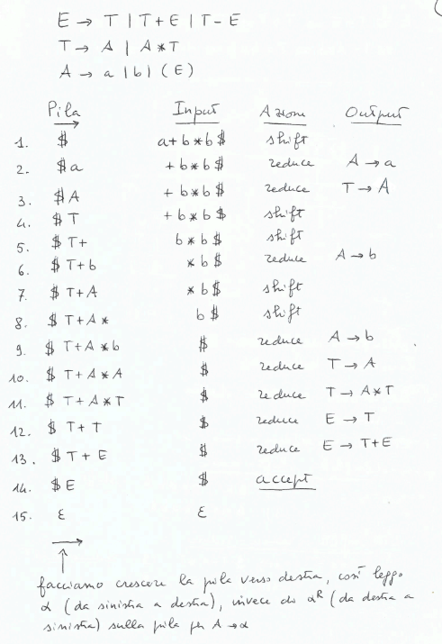

Per evitare i conflitti dobbimao scegliere l'azione giusta in modo che sulla pila ci sia un *prefisso viabile*.

**Prefisso viabile**: $\\$
E' una sequenza $\in (T \cup NT)^*$ che può apparire sulla pila per una compiutazione che accetta $w$. Quindi la parte top dev'essere un prefisso di una parte destra di una produzione.

Utilizzeremo una tabella di parsing

### Parser LR
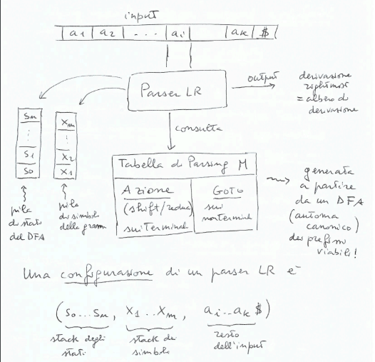

**Mosse del parser LR**:$\\$
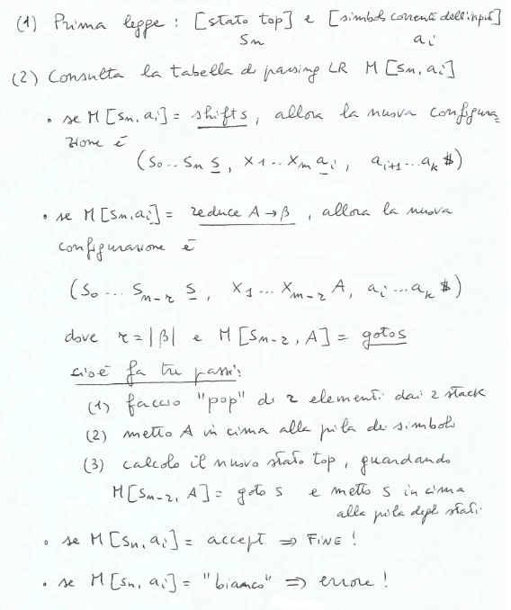

**Esempio**:$\\$
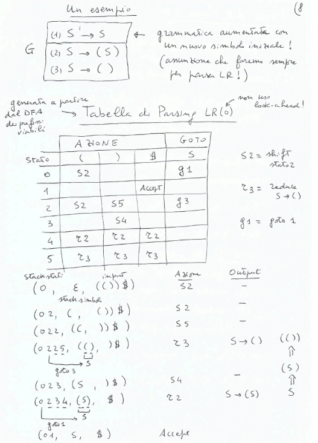

**DFA prefissi viabili/Automa canonico LR(0)**:$\\$
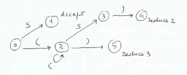

Da questo DFA si ricava la tabella di parsing LR(0)

**Prefisso viabile**: $\\$
Su una grammatica $G$ libera una stringa $\gamma \in (T \cup NT)^*$ è un prefisso viabile se e solo se esiste una derivazione rightmost $S \Rightarrow^* \delta Ay \Rightarrow \delta \alpha \beta y = \gamma \beta y$ per qualche $y \in T^*, \delta \in (T \cup NT)^*$ e per una produzione $A \rightarrow \alpha \beta$.
$S$ è un prefisso viabile per definizione.

Se $\beta = \epsilon$ allora $\alpha$ è un prefisso viabile completo, detto maniglia(handle) per $\gamma y$.
(ovvero in cima alla pila trovo $\alpha^R$ e posso fare uan reduce).

**Teorema**: $\\$
Data una grammatica $G$ libera, i prefissi viabili di $G$ costituiscono un linguaggio regolare e può essere descritto con un DFA.

Questo implica che:
- il parser(PDA) può consultare il DFS dei prefissi viabili(la tabella di parsing) per decidere cosa fare:
    - se la pila contiene un prefisso viabile completo, fare una REDUCE
    - altrimenti fare una SHIFT
    - se non contiene nessun prefisso viabile, errore

Ogni prefisso di un prefisso viabile è un prefisso viabile.

La pila viene modificata in due modi:
- SHIFT: la pila passa da $\$ \gamma$ a $\$ \gamma x$. In tal caso il DFA si trova nello stato $S$ dopo aver letto $\$ \gamma$, quindi basta far ripartire il DFA dallo stato $S$ con input $x$.
- REDUCE $A \rightarrow \alpha$: la pila passa da $\$ \gamma \alpha$ a $\$ \gamma A$. In tal caso il DFA si trova nello stato $S$ dopo aver letto $\$ \gamma \alpha$, quindi basta far ripartire il DFA dallo stato prima di elaborare il primo simbolo di $\alpha$ e fornirgli in input $A$.

Quindi mi serve uno stack degli stati del DFA.

Uno stato del DFA dei prefissi viabili è costituito da un insieme di *item LR(0)*.

**Item LR(0)**: $\\$
produzione con indicata, con un punto, una posizioen della sua parte destra.

*Esempio*: $\\$
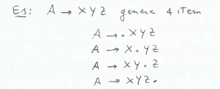

- se $A \rightarrow \alpha . \beta$ è nello stato del DFA in cima alla pila, allora vuol dire che $\alpha$ è sulla pila dei simboli e che ci si aspetta di trovare $\beta$.
- se $A \rightarrow \alpha . $ è nello stato del DFA in cima alla pila, allora vuol dire che sulla pila dei simboli c'è la maniglia $\alpha$ e faccio una REDUCE.

**NFA dei prefissi viabili**: $\\$
Data una grammatica $G$ libera, prendiamo la grammatica aumentata con $S' \rightarrow S$ e costruiamo l'NFA dei prefissi viabili.
- $[S' \rightarrow .S]$ è lo stato iniziale
- dallo stato $[A \rightarrow \alpha . X \beta]$ c'è una transizione con $X \in T \cup NT$ allo stato $[A \rightarrow \alpha X . \beta]$
- dallo stato $[A \rightarrow \alpha . X \beta]$, per $X \in NT$ e $X \rightarrow \gamma$, c'è una $\epsilon$-transizione allo stato $[X \rightarrow . \gamma]$

*Esempio*: $\\$
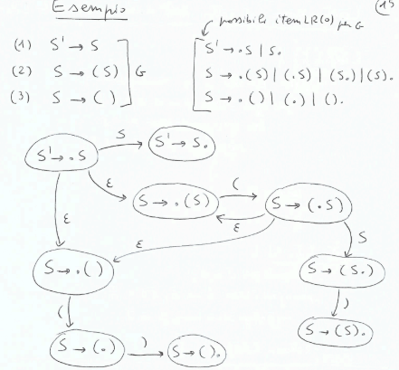

**Automa canonico LR(0)**: $\\$
Dall'NFA dei prefissi viabili si costruisce l'automa canonico LR(0) che è un DFA mediante la costruzione per sottoinsiemi oppure usando le funzioni $Clos(I)$ e $Goto(I, X)$(dove $I$ è un insieme di item e $X \in T \cup NT$).

**Funzioni $Clos(I)$ e $Goto(I, X)$**: $\\$
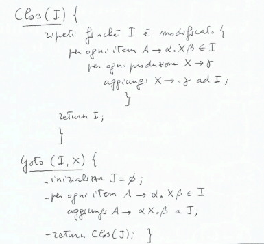

*Algoritmo di costruzione dell'automa canonico LR(0)*: $\\$
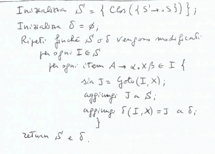

*Esempio*: $\\$
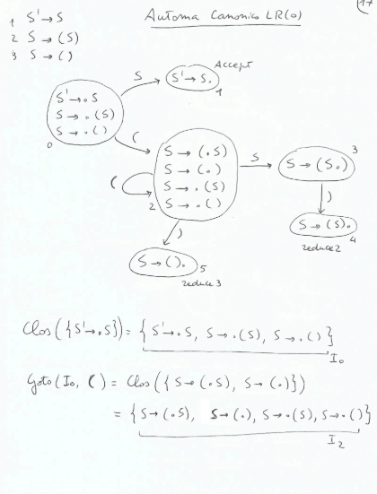
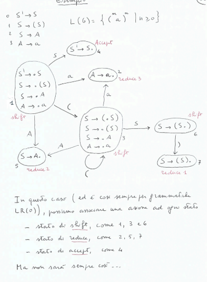

**Tabella di parsing LR**: $\\$
*Matrice bidimensionale*:
- righe: stati dell'automa canonico LR(0)
- colonne: $T \cup \{\$\}$(azione) e $NT$(goto)
- cella $M[s, X]$: azione da fare nello stato $s$ se leggo $X$

Se $M[s, X]$ è vuoto, allora c'è un errore.$\\$
Se $M[s, X]$ contiene più di un'azione, allora c'è un conflitto.

**Caso LR(0)**: $\\$
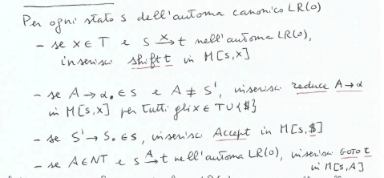

**Definizione:**$\\$
Una grammatica $G$ è LR(0) se la tabella di parsing LR(0) per $G$ non contiene conflitti.

*Esempio*: $\\$
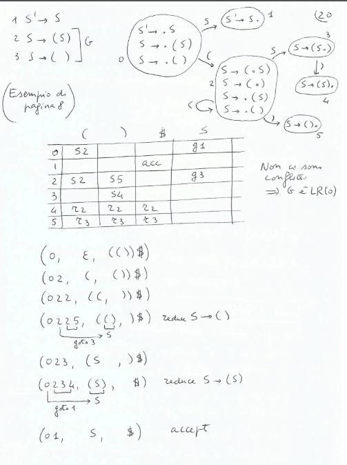
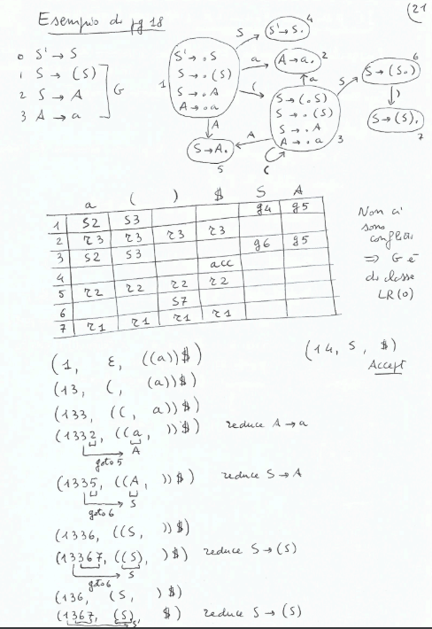

**Parser LR generico**: $\\$
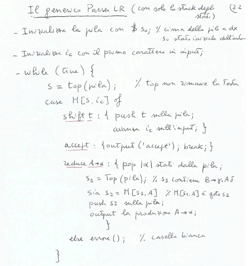