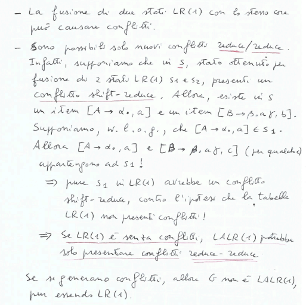

Non sempre le grammatiche sono LR(0), ci pososno essere dei conflitti. Per risolverli si può usare la tecnica del *lookahead*.

*Osservazioni*:$\\$
- se $G$ ha produzioni $\epsilon$, spesso non è LR(0)
- se $L$ è libero deterministico e gode della prefix property, allora è LR(0)(Quindi se è libero deterministico e non è LR(0) allora non gode della prefix property)
- se $L$ è LR(0) e finito, allora gode della prefix property(Quindi se L è finito e non gode della prefix property allora non è LR(0))
- se $L$ è LR(0) ma è infinito può non godere della prefix property

*Esempio*:$\\$

**Tabella di parsing SLR(1)**:$\\$
(SLR(1) = Simple LR(1))
- colonne: $T \cup \{\$\}$(azione) e $NT$(goto)
- righe: stati dell'automa canonico LR(0)

Come si riempie la tabella?$\\$

Una grammatica libera non è sempre SLR(1), $\\$

Da questo esempio capiamo che bisogna ridurre i casi in cui applicare una REDUCE. Per farlo si può usare la tecnica del *lookahead*.

**Item LR(1)**:$\\$
Coppia formata da:
- un item LR(0)
- un lookahead $\in T \cup \{\$\}$

*Esempio*:$\\$

*Intuizione*:$\\$
Se l'automa LR(1) è in uno stato che continete l'item LR(1) $[A \rightarrow \alpha . \beta, x]$, allora:
- sta cercando di riconoscere la maniglia $\alpha \beta$ 
- $\alpha$ è sulla pila
- si aspetta una stringa derivabile da $\beta x$

Se ho $[A \rightarrow \alpha ., x]$ faccio una REDUCE se leggo $x$.

**NFA LR(1)**:$\\$
- stati: insiemi di item LR(1)
- $[S' \rightarrow .S, \$]$ è lo stato iniziale
- da $[A \rightarrow \alpha . X \beta, a]$ c'è una transizione con $X \in T \cup NT$ allo stato $[A \rightarrow \alpha X . \beta, a]$
- da $[A \rightarrow \alpha . X \beta, a]$ per $X \in NT$ e $X \rightarrow \gamma$, c'è una $\epsilon$-transizione allo stato $[X \rightarrow . \gamma, b]$ per ogni $b \in FIRST(\beta a)$($FIRST(\beta a) \subseteq T \cup \{\$\}$)

**Automa canonico LR(1)**:$\\$
Due modi per costruirlo:
- costruzione per sottoinsiemi
- funzioni $Clos(I)$ e $Goto(I, X)$

*Funzioni $Clos(I)$ e $Goto(I, X)$*:$\\$

*Osservazione*:$\\$
$Goto(I, X)$ non considera il lookahead. Agisce solo sugli item LR(0) dentro gli item LR(1).

*Esempio*:$\\$

**Tabella di parsing LR(1)**:$\\$
*Come si riempie la tabella*:$\\$

**Definizione**:$\\$
Una grammatica $G$ libera è di classe LR(1) se la tabella di parsing LR(1) per $G$ non contiene conflitti.

*Esempio da LR(0) a LR(1)*:$\\$

## Parser LALR(1)
*Come si costruisce il parser LALR(1)*:$\\$

*Esempio*:$\\$

S

**Passaggio da LR(1) a LALR(1)**:$\\$

*Esempio*:$\\$

**Ricapitolando**:$\\$
