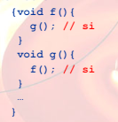
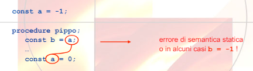

## Nomi
Nome: sequenza di caratteri alfanumerici usata per denotare qualcosa, nei linguaggi possono essere identificatori o operatori.
L'uso di essi serve a indicare l'oggetto denotato.

Gli oggetti denotabilii possono essere:
- definiti dall'utente
- definiti dal linguaggio(tipi o operazioni primitive)

**Binding time:**$\\$
Il binding è il legame tra nome e oggetto.

- *Statico:* 
    - progettazione del linguaggio(tipi e operazioni primitive)
    - scrittura del linguaggio(definizione di nomi)
    - compilazione(associazione tra nomi e oggetti)
- *Dinamico:*
    - esecuzione(associazione di tutti i nomi non ancora legati)

**Notazione:**
- binding = legame = associazione
- environment = ambiente
- scope = portata, estensione
- lifetime = vita

**Ambiente:**$\\$
Inisieme di associazioni tra nomi e oggetti eistenti a run-time in uno specifico punto del programma e in uno specifico momento dell'esecuzione

*Dichiarazione:* meccanismo per la creazione di associazione ad ambiente

Lo stesso nome può denotare oggetti distinti

*Aliasing:* due nomi denotano lo stesso oggetto

Viene determinato tramite:
- regole di scope
- regole specifiche(visibilità)
    - esempio: 
        - visibilità di una variabie a partire dalla dichiarazione, fino a fine blocco

        
        - sempre visibile(dichiarazione di metodi)(questa si chiama mutua ricorsione)
        
        
- regole per il passaggio dei parametri
- regole di binding(shallow o deep)

**Blocchi:**$\\$
Porzioni di codice delimitate da un segnale di inizio e uno di fine, può contenere dichiarazioni locali a quella regione

Vengono utilizzati per chiarezza e per limitare la visibilità di un nome.

Inoltre ottimizzazione l'occupazione in memoria e permettono la ricorsione.

I blocchi possono essere sovrapposti solo se *annidati*.

*Regola di visibilità:* una dichiarazione locale ad un blocco è visibile solo nel blocco o in quelli ad esso annidati, a meno di sovrascrizione.

- ambiente locale: associazioni create all'ingresso nel blocco(variabili locali e parametri formali)
- ambiente non locale: associazioni ereditate da altri blocchi
- ambiente globale: ambiente non locale comune tra tutti i blocchi

**Operazioni sull'ambiente:**$\\$
- creazione(naming): associazione nome-oggetto denotato(locale)
- riferimento(referencing): uso del nome
- disattivazione: una dichiarazione maschera un nome
- riattivazione: uscita da un blocco con dichiarazione che maschera
- distruzione(unnaming): uscita da blocco con dichiarazione locale

**Operazioni su oggetti:**
- creazione
- accesso
- modifica
- distruzione

Creazione distruzione di un oggetto non coicidono con creazione e distruzione dei legami per esso.

La lifetime di un oggetto:
1. creazione di un oggetto
2. creazione di un legame per l'oggetto(inizio vita di associazione)
3. riferimento all'oggetto
4. disattivazione di un legame
5. riattivazione di un legame
6. distruzione di un legame(fine vita di associazione)
7. distruzione dell'oggetto

Vita dell'oggetto più lunga di quella del legame:$\\$

Vita dell'oggetto più corta di quella del legame:$\\$

### Scope
**Regole di scope:**$\\$
la regola di visibilità viene interpretata in presenza di procedure(blocchi eseguiti in posizioni diverse dalla loro definzione) e in presenza di ambiente non locale

**Scope statico:**$\\$
Un nome non locale è risolto nel blocco che testualmente lo racchiude

*Esempio:*$\\$

Stampa 0 perchè $pippo()$ modifica la $x$ del suo blocco

- informazione completa dle testo del programma
- le associazioni sono note a tempo di compilazione
- principi di indipendenza
    - dalla posizione(guardare i colori)
    
    - dai nomi locali
    
- più complesso ma più efficiente
- algol, pascal, c, java

Infatti ci sono problemi perchè lo scope di una dichiarazione è l'intero blocco dove esso appare, quindi ogni identificatore deve essere dichiarato prima di essere usato

*Esempio:*$\\$

**Scope dinamico:**$\\$
Un nome non locale è risolto nel blocco attivato più di recente e non ancora disattivato

*Esempio:*$\\$

- informazione derivata dall'esecuzione
- programmi meno leggibili
- meno efficiente
- lisp, perl

**C:**$\\$
La semantica di define corrisponde ad una chiamata in scoping dinamico e lascia all'implementazione come realizzarla

In C ogni cosa fatta non in locale, viene fatta in globale, non esiste in non locale.

