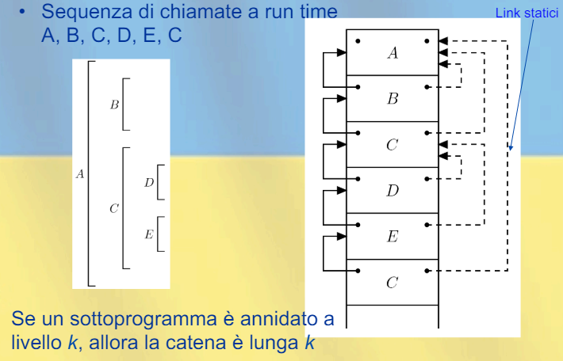

## Getione della memoria
3 meccanismi di allocazione della memoria:
- **allocazione statica**: la memoria viene allocata in fase di compilazione
- **allocazione dinamica**: memoria allocata a tempo di esecuzione
    - pila: allocazione FIFO
    - heap: oggetti allocati o deallocati in qualsiasi momento(puntatori)

### Allocazione statica
Un oggetto ha un indirizzo assoluto mantenut per tutta l'esecuzione dle programma.

Tipi di dati allocati staticamente:
- variabili globali
- variabili locali di sottoprogrammi(non ammette ricorsione)

- costanti a tempo di compilazione
- tabelle per supporto a runtime

### Allocazione dinamica(pila)
Non basta l'allocazione dinamica per la ricorsione, a runtime devono esistere più istanze della stezza variabile locale.

Ogni istanza di una variabile locale(e ogni blocco) a runtime ha una memoria contente le informazioni relative all'istanza(indirizzo di ritorno), si chiama *Record di attivazione*(o *Frame*).

La pila gestisce i record di attivazione perchè le chiamate e i blocchi sono annidati.

*Record di attivazione per blocchi anonimi*: 

**Gestione della pila**:$\\$
- sequenza di chiamata: codice eseguito dal chiamante prima della chiamata
- prologo: codice eseguito all'inizio del blocco
- epilogo: codice eseguito alla fine del blocco
- sequenza di ritorno: codice eseguito dal chiamante dopo la chiamata

L'indirizzo di un RdA non è noto a compile-time.

Il puntatore RdA(o SP) punta al RdA del blocco attivo, le informazione del RdA sono accessibili tramite offset(info-indirizzo = contenuto(SP) + offset, questa istruzione è meccanica e l'offset è statibilito staticamente dal compilatore).

*Record di attivazione per blocchi in-line*:

- link dinamico(control link): puntatore al precedente RdA
- push(ingresso nel blocco):
    - link dinamico del nuovo RdA = SP
    - SP aggiornato a nuovo RdA
- pop(uscita dal blocco):
    - elimina RdA puntato da SP
    - SP = link dinamico del RdA eliminato

*Esempio:*$\\$

*Record di attivazione per procedure:*$\\$

Gli RdA non hanno tutti la stessa dimensione e possono anche esserci dati di dimensione variabile a runtime.

Come fare pop? Conosco l'indirizzo del RdA del blocco chiamante, così da poter tornare nella posizione giusta della pila.

Come ottenere offset per le variabili locali? l'offset usando il puntatore a RdA rimane costante durante tutta l'esecuzione, a differenza di se usassimo il top della pila.

*Esempio:*$\\$

*Chiamata di funzione:*$\\$

*Ritorno da funzione:*$\\$

**Gestione della pila: ingresso nel blocco**:$\\$
Sequenza di chiamata e prologo si dividono:
- modifica del contatore del programma
- allocazione RdA sulla pila
- modifica puntatore RdA
- passaggio parametri
- salvataggio registri
- inizializzazioni
- trasferimento del controllo

**Gestione della pila: uscita dal blocco**:$\\$
Epilogo e sequenza di ritorno si dividono:
- resistuzione dei valori del chiamato al chiamante
- ripristino registri(in particolare il vecchio valore dle puntatore a RdA)
- finalizzazione
- deallocazione spazio sulla pila
- ripristino valore dle contatore

### Allocazione dinamica(heap)
Nella heap i blocchi sono allocati e deallocati in qualsiasi momento.

Utile se il linguaggio permette:
- allocazione di memoria a runtime
- oggetti di dimensione variabile
- oggetti con vita indipendente dalla funzione(non LIFO)

**Heap con blocchi di dimensione fissa:**$\\$
Tutti i blocchi sono collegati alla *lista libera*.

- allocazione: si allocano uno o più blocchi contigui
- deallocazione: si deallocano si restituiscono alla lista libera.

**Heap con blocchi di dimensione variabile:**$\\$
Inizialmente c'è un blocco unico nella heap.

- allocazione: determinazione di un blocco libero di dimensione opportuna
- deallocazione: restituzione del blocco alla heap

Bisogna evitare lo spreco di memoria(frammentazione esterna e interna).

**Frammentazione:**$\\$ 
- interna: 
    - lo spazio richiesto è $X$
    - viene allocato un blocco di dimensione $Y > X$
    - lo spazio spreco è $Y - X$
- esterna:
    - lo spazio richiesto è $X$
    - non c'è un blocco libero di dimensione $X$
    - ci sono solo blocchi troppo piccoli, quindi inusabili
    - ci sarebbe però abbastanza memoria per conternerlo

**Gestione della lista libera:**$\\$
*Unica lista:*$\\$
- inizialmente contiene un blocco unico grande quanto la heap
- allocazione: si cerca un blocco libero di dimensione opportuna
    - first-fit: si prende il primo blocco che soddisfa i requisiti(più veloce, ma frammentazione esterna)
    - best-fit: si prende il blocco più piccolo che soddisfa i requisiti(meno frammentazione esterna, ma più lento)
- se il blocco scelto è molto grande, si divide in 2 e la parte inutilizzata viene aggiunta alla lista libera
- deallocazione: si restituisce il blocco alla lista libera(se due blocchi adiacenti sono liberi, si fondono)

*Liste libere multiple:*$\\$
- una lista per ogni dimensione di blocco
- la ripartizione dei blocchi tra le liste può essere statica o dinamica
    - Buddy System: 
        - k liste di blocchi di dimensione $2^k$
        - se allocazione di un blocco di dimensione $2^k$ e non è disponibile, si divide un blocco di dimensione $2^{k+1}$ in due blocchi di dimensione $2^k$
        - se deallocazione di un blocco di dimensione $2^k$, si riunisce alla sua metà(buddy)
    - Fibonacci System:
        - uguale ma usa numeri di Fibonacci al posto di potenze di 2

### Regole di Scope
- scope statico:
    - catena statica
    - display
- scope dinamico:
    - A-list
    - Tabella centrale dell'ambiente(CRT)

**Record di Attivazione per scoping statico:**$\\$
- determinare prima il corretto RdA dove trovare $x$
- aceddere a $x$ tramite l'offset relativo a RdA(e non SP)

- link dinamico: puntatore al RdA del blocco chiamante
- link statico: puntatore al RdA del blocco dichiarante(che contiene il codice in esecuzione)

**Catena Statica:**$\\$

- i dati della catena statica sono: $A ; (B, 0) ; (C, 1) ; (D, 0) ; (E, 1) ; (C, 2)$ dove il seconod numero è $k$ passi fuori dal blocco chiamante

- è il chiamante a determinare il link statico del chiamato, perchè conosce l'annidamento statico dei blocchi e il proprio RdA
- il chiamante conosce l'annidamento dei blocchi:
    - $(k = 0)$ se il blocco dichiarante è il blocco chiamante, quindi il chiamante passa al chiamato SP
    - $k$ passi fuori dal chiamante, quindi il chiamante passa al chiamato SP + k

*Ripartizione dei compiti:*$\\$
- compilatore:
    - associa $k$ ad ogni chiamata
    - associa $h$ ad ogni nome($h = 0$: nome locale, altrimenti definito $h$ blocchi sopra)
- sequenza chiamata/prologo: 
    - risale la catena statica
    - inizializza il puntatore di catena statica
- i costi sono:
    - per ogni chiamata $k$ passi di catena statica
    - per oogni accesso a variabile $h$ passi di catena statica

Per ridurre i costi usiamo il display

**Display:**$\\$
Possiamo ridurre $h$ ad una costante, il display è un array di puntatori ai blocchi dichiaranti.

la catena statica viene rappresentata mediante un array:
- l'$i$-esimo elemento dell'array è un puntatore a RdA del sottoprogramma di livello di annidamento $i$
- $Display[1] = RdA$ di una procedura $P$ di top level
- $Display[2] = RdA$ di una procedura $Q$ dichiarat in $P$

Quindi un oggetto che è il scope esterno di $h$ livello viene trovato guardando l'RdA del display alla posizione $j = i - h$

- è il chiamato a maneggiare il display, nel momento in cui il chiamante chiama il chiamato a livello di annidamento $j$, il chiamato salva $Display[j]$ nel proprio RdA e vi mette una copia del proprio puntatore a RdA
- il chiamante conosce l'annidamento dei blocchi:
    - $(k = 0)$ se il blocco dichiarante è il blocco chiamante, il chiamante e il chiamato condividono il $Display$ fino a livello corrente($j - 1$), mettendo il nuovo puntatire a RdA in $Display[j]$ il livello corrente viene esteso di 1
    - se $k$ passi fuori dal chiamante, il chiamante e il chiamato condividono il $Display$ fino a livello $j - 1$, $Display[j]$ viene modificato con il puntatore a RdA del chiamato

Il display è comunque meno usato perhè più efficiente a profondità alta.

**Scope dinamico:**$\\%
L'associazione nome-oggetto dipende da:
- flusso di controllo a runtime
- ordine di chiamata die sottoprogrammi

In generale l'associazione corrente è quella determinata per l'ultima esecuzione

**A-list:**$\\$
Le associazioni sono memorizzate in una struttura apposita, manipolata come una pila

Accesso lineare, possiamo ridurre però il tempo di accesso medio, aumentando tempo di uscita/ingresso nel blocco

**Tabella centrale dei riferimenti:**$\\$
- una tabella mantiene tutti i nomi distinti del programma(accesso statico o tramite hash)
- ad ogni nome è associata la lista delle associazioni per quel nome(la più recente è la prima)

*CRT con pila nascosta:*$\\$

Meno occupazione in memoria(nomi noti staticamente) aumento di costo in ingresso e uscita. Temo di accesso costante.
