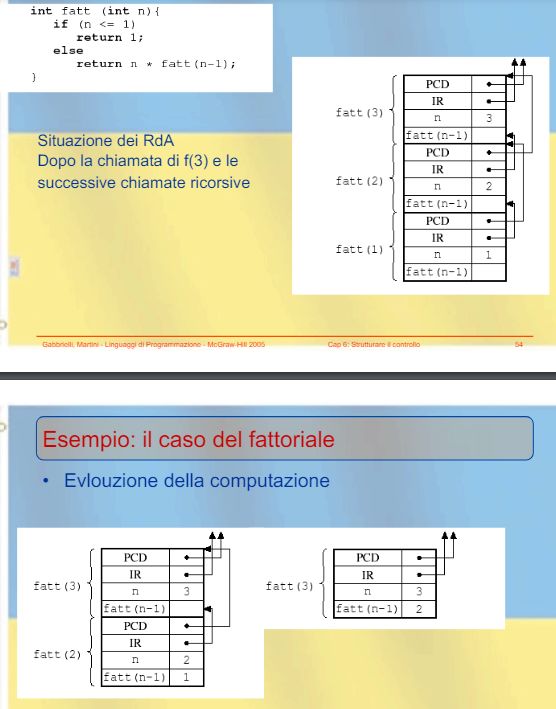

## Strutture di controllo
**Espressioni:**$\\$
- notazioni 
- valutazione
- problemi

**Comandi:**$\\$
- assegnamento
- sequenziale
- condizionale

**Comandi iterativi:**$\\$

**Ricorsione:**$\\$

### Espressioni
Entità sintattica la cui valutazione produce un valore o non termina.

- infissa: $a+b$ 
    - precedenza tra gli operatori
    - associatività
    - necessità di parentesi
- prefissa: $+ab$
    - valutazione usando una pila
- postfissa: $ab+$
    - valutazione usando una pila:
        - leggo il primo simbolo e lo metto in cima alla pila
        - se è un operatore:
            - applico a operandi precedenti
            - memorizzo i risultato in R
            - elimino operatori e operandi dalla pila
            - metto R in cima alla pila
        - se la squenza non è vuota torno al primo passo
    
Le espressioni sono rappresentate da alberi e la lettura di essi cambia la notazione usata:
- simmetrica -> infissa
- anticipata -> prefissa
- differita -> postfissa

Ci possono essere:
- effetti collaterali(espressioni che lette in un ordine diverso danno risultati diversi)
- espressioni con operandi non definiti(in C si ha una valutazione *lazy* che valuta solo se necessario per esempio in un `if`)
- valutazione corto-circuito(le valutazioni si fermano se il risultato è già noto, ma dà errori possibili in caso di valutazioni *eager*)

### Comandi
Entità sintattica che non produce per forza un valore, ma può avere effetti collaterali.

*Effetto collaterale:*$\\$
Modifica dello stato della computazione senza restituzione di un valore.

**Variabili:**$\\$
E' un contenitore di valori che ha un nome, il valore del contenitore può essere modificato mediante assegnamento.

**Assegnamento:**$\\$
La valutazione di un assegnamento non produce un valore, ma un effetto collaterale.
Nei linguaggi imperativi la computazione avviene mediante effetti collaterali.$\\$
$X = X + 1$ la prima occorrenza di X denota una locazione di memoria, la seconda un valore dentro la locazione.

- linguaggi funzionali: una variabile denota un valore e non è modificabile
- linguaggi logici: si può modificare il valore associato alla variabile

*Modello a riferimento:*$\\$
Una varibaile è un riferimento ad un valore(un puntatore).

**Espressioni e comandi:**$\\$
- algol 68: non c'è nozione separata, ogni procedura resituisce un valore
- pascal: comandi separati da espressioni e non pososno stare dove è richiesta l'altra
- C: espressioni e comandi sono separati, ma possono comparire in entrambi i contesti

**Ambiente e Memoria:**$\\$
Nei linguaggi imperiti ci sono 3 domini semantici:
- valori denotabili: ci si può dare un nome
- valori memorizzabili: si possono memorizzare
- valori esprimibili: risultato della valutazione di un'espressione

Ambiente: nomi -> valori denotabili
Memoria: locazioni -> valori memorizzabili

I linguaggi funzionali usano solo l'ambiente

**Comandi per il controllo sequenza:**$\\$
- espliciti:
    - C1 ; C2 (il valore di un comando composto è quello dell'ultimo comando)
    - blocchi: {C1; C2}
    - goto: salto incondizionato(uscita da un loop, ritorna da sottoprogramma, gestione eccezioni), considerato dannoso
- programmazione strutturata, migliore come principi: con un solo punto di ingresso e un solo punto di uscite
    - condizionali:
        - if: 
            - esistono regole di associazione per if then else annidati(in pascal e java quello più vicino, in algol e fortran si guarda una parola chiave).
            - ottimizzata dal compilatore: short-circuit
            
        - case: 
            - discende dal goto
            - if o case? il case offre maggiore liggibilità e maggior efficienza di codice prodotto e compilato in modo astuto
            
    - iterativi:
        - while:
            - indeterminata: cicli controllati logicamente
            - iterazioni non note a priori
            - permette il potere espressivo di una Turing Machine
        - for
            - determinata: cicli controllati numericamente
            - determinato il numero di iterazioni
            - potere espressivo minore in quanto non si possono esprimere computazioni che non terminano
            - in C però si può usare 
            - passo positivo: se I > fine allora termina l'esecuzione
            - passo negativo: $\frac{ \text{fine - inizio + passo } }{ passo}$
            - i linguaggi differiscono in:
                - modifica degli indici
                - numero di iterazioni
                - incremento negativo
                - valore al temrine ciclo
                - possibilità di salto da esterno a interno
            - nei linguaggi moderni:
                - non possibili cambaimenti all'interno del ciclo
                - valori valutati solo prima di inzio ciclo
                - devono essere dichiarati nel blocco più vicino
            - Valore indice in un ciclo:
                - è l'ultimo assegnato, quindi primo ad eccedere il valore fine
                - variabile locale al loop

### Ricorsione
Alternativa all'iterazione. Una funzione è ricorsiva se definita in termini di se stessa.$\\$
Corrisponde alla definizione induttiva: il valore di F su un argomento è definito in termini dei valori di F su argomenti più piccoli.

- ogni programma iterativo può essere tradotto in ricorsivo e viceversa
- ricorsione più naturale con linguaggi funzionali e logici
- iterazione più naturale con linguaggi iterativi

**Ricorsione in coda(Tail recursion):**$\\$
Una chiamata di $g$ in $f$ si dice *chiamata in coda* se $f$ restituisce il valore restituito da $g$ senza ulteriore computazione.

Non serve allocazione dinamica in memoria, basta un unico RdA.

*Esempio:*$\\$

        
