## Astrazione sul controllo: sottoprogrammi ed eccezioni
### Astrazione
Identificare le proprietà rilevanti e ignorare quelle irrilevanti.

I linguaggi di programmazione sono essi stessi astrazioni del calcolatore.

**Astrazione sul controllo:**$\\$
- sottoprogrammi, blocchi, parametri
- specifica P, scrivi P, usa P

Le interazioni sono limitate al componente esterno. Si comunica attraverso parametri o ambiente globale.

**Astrazione sui dati:**$\\$
- i tipi di dato astraggono valori e operazioni
- l'implementazione dei dati e delle operazioni è nascosta

### Parametri
- *parametri formali:* dichiarati nella definizione del sottoprogramma(int f(int x))
- *parametri attuali:* passati nella chiamata del sottoprogramma(f(3))

La pragmatica è il flusso di informazioni tra il chiamante e il chiamato.
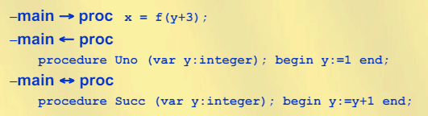

Una funzione comunica col chiamante attraverso il valore di ritorno, i parametri di output e l'ambiente globale.

**Passaggio dei parametri:**$\\$
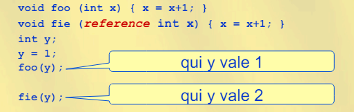

- *per valore:* 
    - il valore dell'attuale è assegnato al formale, che si comporta come variabile locale
    - pragmatica: main -> proc
    - modifiche al formale non influenzano l'attuale
- *per riferimento:*
    - si passa l'indirizzo dell'attuale, i riferimenti al formale sono riferimenti all'attuale(aliasing)
    - pragmatica: main <-> proc
    - modifiche al formale influenzano l'attuale

**Passaggio per valore:**$\\$
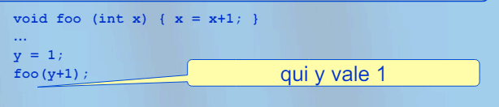
- il formale $x$ è una variabile locale
- alla chiamata, l'attuale $y + 1$ è valutato ed il valore è assegnato al formale $x$
- nessuno legame tra $x$ nel corpo di $foo$ e $y$ nel chiamante
- non si trasmette informazione da $foo$ al chiamante mediante parametro

**Passaggio per riferimento:**$\\$
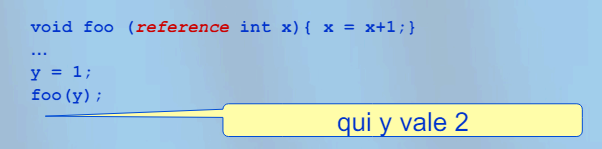
- viene passato per riferimento
- il formale $x$ è un alias dell'attuale $y$
- al ritorno da $foo$, viene distrutto solo il legame tra $x$ e l'indirizzo di $y$
- trasmissione bidirezionale ra chiamante e chiamato

**Passaggio per costante(read-only):**$\\$
- nella procedura non è permessa la modifca del formale
- controllo statico del compilatore
- no aliasing
- non passato per riferimento ad altre procedure

**Passaggio per risultato:**$\\$
main <- proc(duale del passaggio per valore)
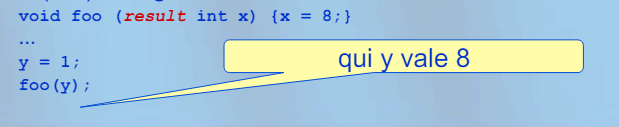
- il formale $x$ è una variabile locale
- al ritorno da $foo$, il valore di $x$ è assegnato all'attuale $y$
- al ritorno da $foo$, $x$ è distrutto
- non è possibile trasmettere informazione dal chiamante a $foo$ mediante parametro

**Passaggio per valore-risultato:**$\\$
main <-> proc
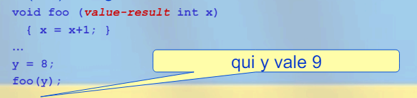
- il formale $x$ è una variabile locale
- alla chiamata, il valore dell'attuale è asseganto al formale
- al ritorno, il valore del formale è assegnato all'attuale
- nessun legame tra $x$ nel copro di $foo$ e $y$ nel chiamante
- al ritorno da $foo$, $x$ è distrutto

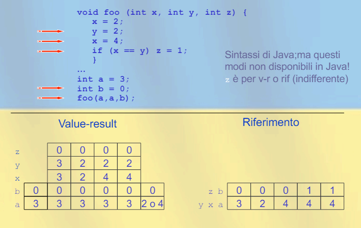

Il comitato algol:
- la chiamata di una procedura dev'essere vista come la riscrizione della procedura chiamata
- nell'esecuzione del corpo i parametri attuali sono sinatatticamente sostituiti ai parametri formali

**Passaggio per nome:**$\\$
*Regola di copia:*$\\$
Una chiamata alla procedura $P$ è la stessa cosa che eseguire il corpo di $P$ dopo aver sostituito i parametri attuali al posto dei parametri formali.
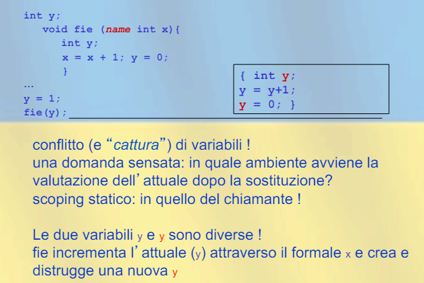

- viene passata la coppia (espressione, ambiente):
    - espressione: parametro attuale
    - ambiente: ambiente di valutazione
- la coppia viene passata tramite un puntatore al testo dell'espresione e un puntatore di catena statica al RdA del blocco di chiamata(chiusura: dato che elimina le varibaili libere legandole nell'ambiente del chiamante)

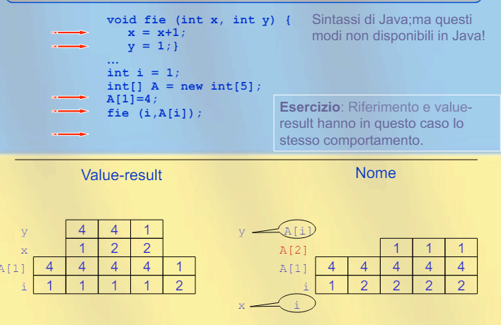
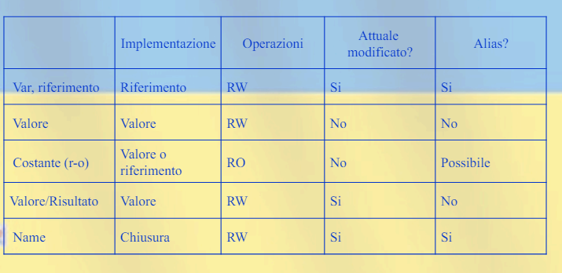

### Funzioni di ordine superiore
Alcuni linguaggi permettono di passare funzioni come parametri(viene passata una chiusura, puntatore a RdA nella pila) o di restituire funzioni come risultato(bisogna mantenere il RdA della funzione restituita). 

**Funzioni come parametri:**$\\$
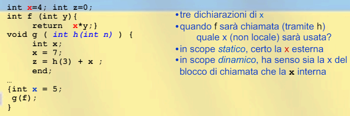

*Downward funarg problem:*$\\$
Quando una procedura viene passata come parametro, si crea un riferimento tra un nome(parametro formale) e una procedura(parametro attuale).

- ambiente al momento della creazione del legame: *deep binding*
- ambiente al momento della chiamata: *shallow binding*

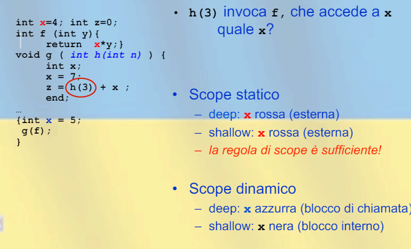
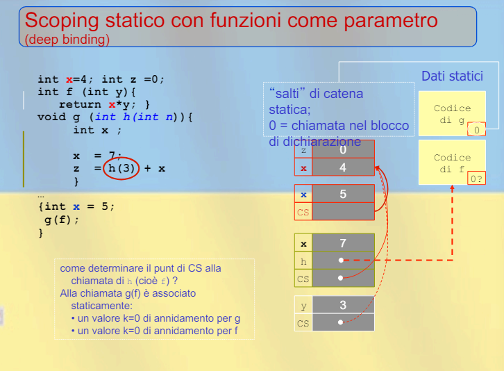

Si possono usare le chiusure per passare sia il legame che l'ambiente.
Alla chiamata della procedura si alloca il RdA e si prende il puntatore di catena statica dlela chiusura.
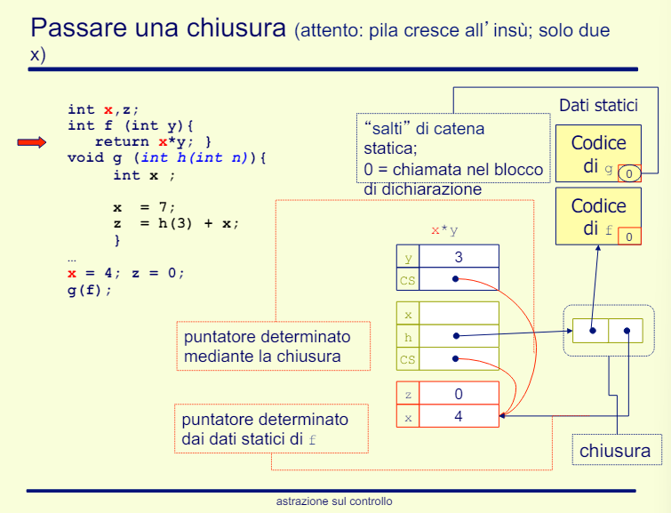

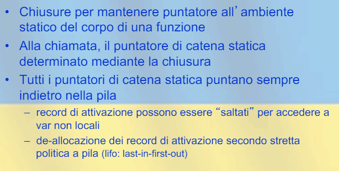

**Scope dinamico:**$\\$
- shallow binding:
    - per accedere a $x$ riasli la pila
    - uso di strutture dati 
- deep binding:
    - usa qualche forma di chiusura per congelare uno scope da riattivare in un secondo momento

**Scope statico:**$\\$
- deep binding:
    - implementato con chiusure
- shallow binding:
    - problemi con la ricorsione perchè ci possono essere più istanze del blocco che dichiama il nome non locale

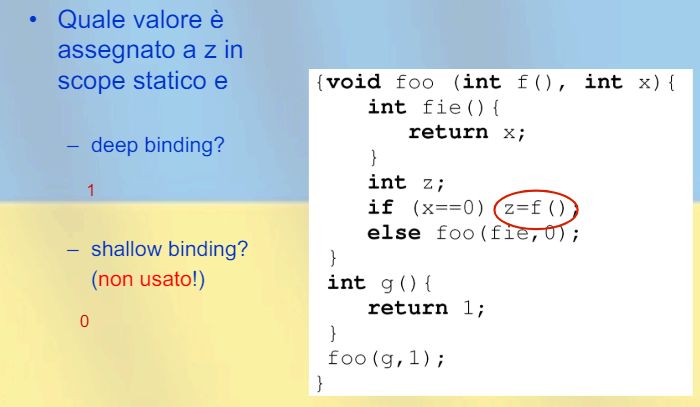

*Deep binding:*$\\$
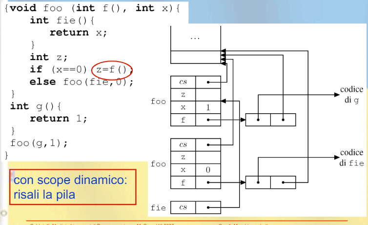

**Funzioni come risultato:**$\\$
*Upward funarg problem:*$\\$
Se la funzione ha variabili locali queste devono sopravvivere.

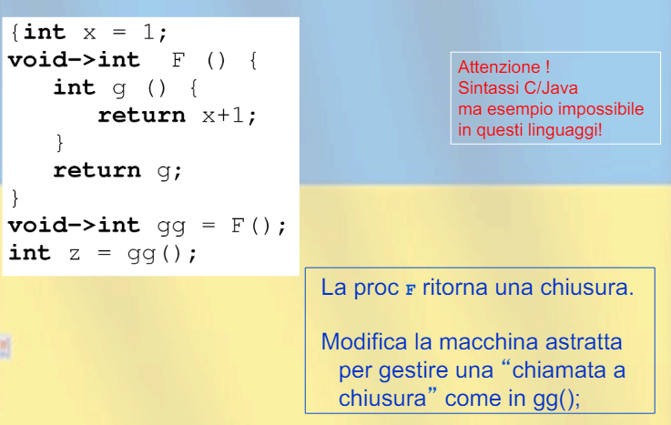
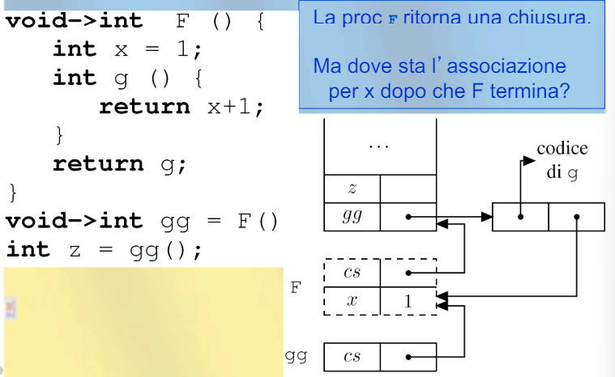

- si usano el chiusure, ma
- i RdA persistono indefinitamente, però perdo le proprietà della pila(lifo)
- la pila dev'essere implementata in modo diverso:
    - non deallocare
    - RdA sulla heap
    - catena statica e dinamica collegano i record
    - invoca il garbage collector

### Eccezioni: uscita strutturata
- terminare una computazione:
    - saltar fuori dal costrutto passando dati
    - ritornare il controllo al punto di gestione più vicino
    - RdA non più necessari sono deallocati
- due tipologie:
    - dichiarazione del gestore
    - comando per sollevare l'eccezione

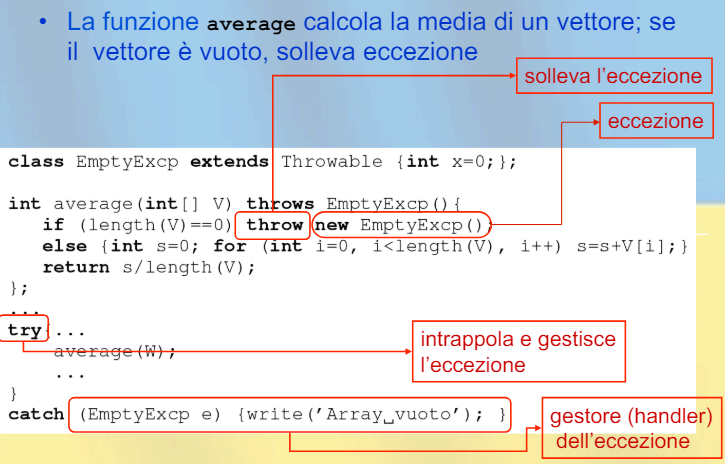

Il gestore è legato in modo statico al blocco di codice protetto. L'esecuzione del gestore rimpiazza il blocco che doveva ancora essere eseguito.

**Propagazione delle eccezioni:**$\\$
Se un eccezione non è gestita nella routine corrente:
- si temrina la routina
- l'eccezione è propagata al chiamante
- se non è gestita dal chiamaante, si propaga sulla *catena dinamica*
- finchè non trova un gestore o arriva al gestore di default
- i vari frame vengono tolti dalla stack, per ogni frame tolto si ripristinano i registri
- ogni routine ha un gestore nascosto che propaga l'eccezione al chiamante

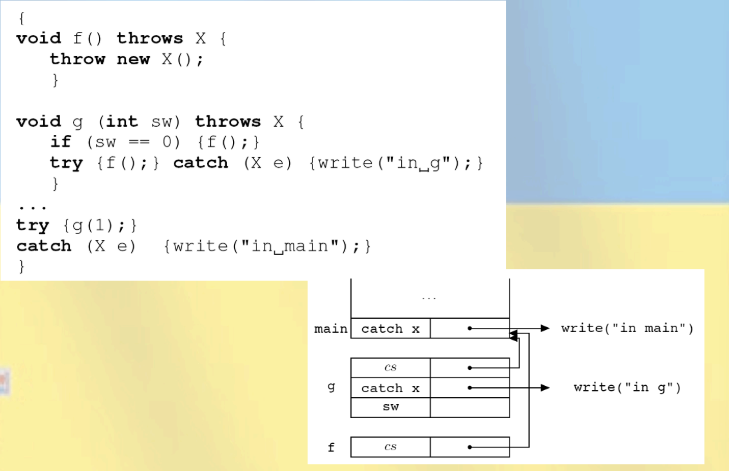

**Implementazione delle eccezioni:**$\\$
- implementazione semplice:
    - *try*:
        - all'inzio del blocco protetto
        - carica il gestore sulla pila
    - quando è sollevata:
        - togli il primo gestore dalla pila e vedi se è quello giusto
        - se non è quello giusto, solleva di nuovo l'eccezione e ripeti
- implementazione complessa:
    - il compilatore genere una tabella con coppie (gestore, blocco protetto)
    - la tabella è ordinata sul primo elemento staticamente
    - al sollevamente di un'eccezione, ricerca binaria sulla tabella del PC e trasferimento del controllo al gestore
    - se il gestore risolleva l'eccezione, ripeti
    - se il gesotre è nascosto la ricerca deve avvenire non col PC ma con l'indirizzo di ritorno della routine

