## Tipi di Base e Algebra dei Tipi
**Sistema di tipi:**$\\$
Informazioni e regole che governano i tipi e i loro valori(abitanti del tipo).$\\$
Comprende:
- insieme di tipi di base
- meccanismi per definire nuovi tipi
- meccanismi di computazione sui tipi:
    - regole di equivalenza
    - regole di compatibilità(quando si può usare un tipo al posto di un altro)
    - regole di inferenza(come assegna un tipo ad un'espressione)
- controllo dei vincoli di tipo statico o dinamico

### Tipi di base
Il valore e i loro tipi non hanno la stessa definizione in tutti i linguaggi.$\\$

**Tipo Unit vs Tipo Void:**$\\$
- *Unit:* l'unico abitante è il singoletto $()$, associato ad operazioni dove il tipo di ritorno non è utilizzabile, da qualunque input a un solo output.
- *Void:* non ha abitanti. L'unità può essere passata come parametro, mentre il void no. Molto spesso ha un abitante di tipo null.

**Tipo Booleano:**$\\$
- valori: $true$ e $false$
- operazioni: $and$, $or$, $not$, ecc.

I suoi valori sono denotabili, esprimibili e memorizzabili.$\\$

**Tipo Carattere:**$\\$
- valori: insieme di caratteri
- operazioni: confronto, concatenazione, ecc.

I valori sono denotabili, esprimibili e memorizzabili.$\\$

**Tipo Intero:**$\\$
- valori: sottoinsieme finito di numeri interi fissato al momento della definizione dle linguaggio
- operazioni: somma, sottrazione, moltiplicazione, divisione, confronto, ecc.

I valori sono denotabili, esprimibili e memorizzabili.$\\$

**Tipo Reale:**$\\$
- valori: sottoinsieme finito di numeri reali fissato al momento della definizione dle linguaggio, memorizzati tramite una rappresentazione a virgola fissa(bit specifici per la parte intera e per la parte decimale) o a virgola mobile(bit per la mantissa, per l'esponente e per il segno)
- operazioni: somma, sottrazione, moltiplicazione, divisione, confronto, ecc.

I valori sono denotabili, esprimibili e memorizzabili.$\\$

**Tipo Enumerazione:**$\\$
- valori: insieme finito di costanti, caratterizzate da un nome e un valore.
- operazioni: confronto, meccanismi per ottenere il valore associato al nome, ecc.

Da un punto di vista pragramtico permettono:
- di rendere più leggibile il codice
- una verifica che un enum prenda solo valori validi

**Tipi Estensionali vs Intensionali:**$\\$
- *Estensionali:* si elenca l'insieme dei possibili valori del tipo(enumerazioni, ecc.)
- *Intensionali:* si dispone già di un insieme di valori e si definisce l'appartenenza ad esso tramite una proprietà(interi, float, ecc.)

**Tipi composti:**$\\$
Insiemi di più tipi base.$\\$
- array
- insiemi
- puntatori

**Tipo Array:**$\\$
Denota un insieme di elementi di un certo tipo, ciascuno indicizzato da una *chiave identificativa*.$\\$
Di solito la chiave è definita dal linguaggio, ma certi linguaggi permettono la creazione di *array associativi* con chiavi definite dall'utente.$\\$
Le possibili operazioni sono:
- selezione di un elemento attraverso la chiave
- asegnazione
- confronto
- operazioni aritmetiche

I linguaggi safe controllato che l'indice sia valido, per evitare, come in certi linguaggi che il controllo avviene solo a tempo di esecuzione, il *buffer overflow*.$\\$

Vengono memorizzati in memoria contigua. Se sono bidimensionali vengono memorizzati per righe(più utilizzata perchè gli algoritmi di ricerca la preferiscono) o per colonne.$\\$

Si possono avere:
- array statici: con dimensione fissata a tempo di compilazione. Viene memorizzato nello stack frame dle blocco in cui è definito, che ci permette di sapere ogni volta la posizione in memoria quindi è facile accedere ai dati.
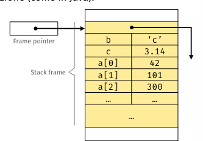
- dinamici/definiti a tempo di elaborazione della dichiarazione(sono un pochetto diversi): con dimensione variabile a tempo di esecuzione. Possiamo allocare l'array nel blocco dov'è definito, ma prima di caricare il frame nello stack si utilizza l'heap e si memorizza un puntatore all'inizio della memoria. Il descrittore di tale array è il *dope vector*.
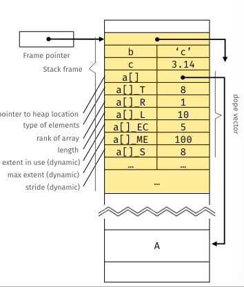

**Tipo Insieme:**$\\$
Denota un insieme di elementi dello stesso tipo, senza ripetizioni e senza ordinamento.$\\$
Le possibili operazioni sono:
- test di inclusione
- unione
- intersezione
- differenza
- complemento

Di solito per memorizzarli si utilizza un array di bit di lunghezza pari alla cardinalità del tipo base, *array caratteristico*.$\\$
Spesso i linguaggi limitano i tipi base ce si possono usare.$\\$

**Tipi riferimento:**$\\$
Accesso indiretto ad un valore.$\\$
Le operazioni sono:
- creazione
- controllo di uguaglianza
- dereferenziazione(accesso al valore puntato)

L'implementazione più comune è il puntatore, che memorizza l'indirizzo di memoria del valore.$\\$
Si può fare riferimento a riferimenti, creando una catena di puntatori.$\\$
I riferimenti possono diventare:
- wild: se non inizializzati, possono causare comportamenti imprevedibili
- dangling: il dato referenziato è stato deallocato

I linguaggi con riferimenti definiscono un puntatore *canonico*, che punta ad un valore nullo, che serve per invalidare un puntatore a runtime.$\\$
Forniscono anche un *operatore di riferimento alle variabili*(\& in C) per creare un riferimento alla posizone in memoria della variabile e un *operatore di dereferenziazione*(* in C).$\\$
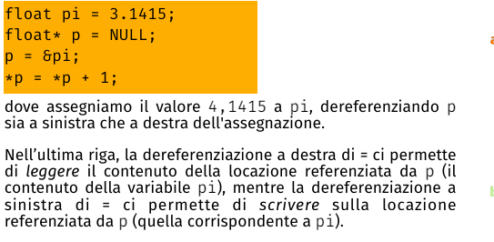

Esiste la *deallocazione implicita*(distruggiamo l'unico puntatore che punta al blocco in memoria) e la *deallocazione esplicita*(operatore come free in C che libera la memoria, non si può chiamare free su un puntatore allo stack).$\\$

**Insiemi Potenza:**$\\$
L'insieme potenza è l'insieme di tutti i sottoinsiemi di un insieme.$\\$
$\mathcal{P}(S)=\{T : T \subseteq S\}$.$\\$

**Tipi Prodotto:**$\\$
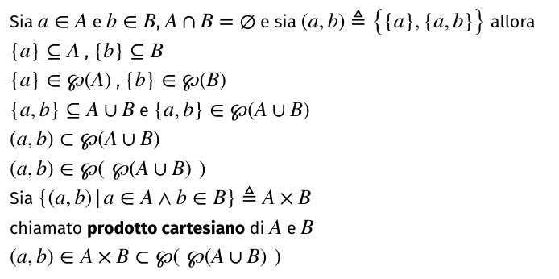

Combinazione di due o più tipo in una struttura fissa.$\\$
I tipi prodotto più comuni sono:
- coppie e tuple:
    - coppia: dati due tipi $A$ e $B$, la coppia  di tipo $A \times B$ è l'insieme di tutte le coppie $(a,b)$ con $a \in A$ e $b \in B$.
    - tuple: coppia generalizzata a $n$ elementi, con $n \geq 2$.
- record: collezione di *campi*(elementi) con *etichette*(nomi) associate(tipo le struct in C).
- pattern matching: costrutti per destrutturare i tipi prodotto. controlla e individua elementi rispetto a un certo schema.
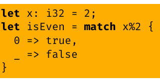
- tipi ricorsivi: utili per definire strutture datic ome alberi e liste.
- unità: prodotto vuoto

**Tipi Somma:**$\\$
Unione disgiunta di due o più tipi.$\\$
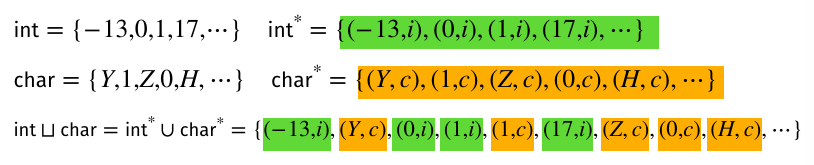
Dichiarare che $x$ è di tipo $int \cup char$ significa che $x$ può essere o un intero o un carattere.$\\$
Un'altro esempio sono i `type address = physicaladdress + virtualaddress`.$\\$

*Sealed Class:*$\\$
Classe che definisce un insieme finito di sottoclassi.$\\$
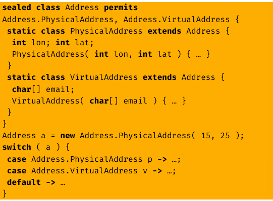

*Union:*$\\$
In C è un modo per far sì che la stessa posizione in memoria contenga tipi diversi.$\\$
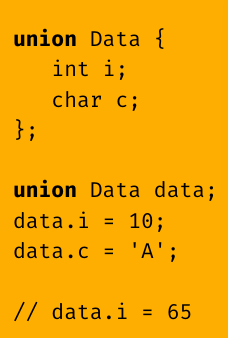

Possiamo per esempio scrivere un intero e leggerlo come char che il compilatore non dà errore, ma il risultato è imprevedibile.$\\$

*Tipi ricorsivi:*$\\$
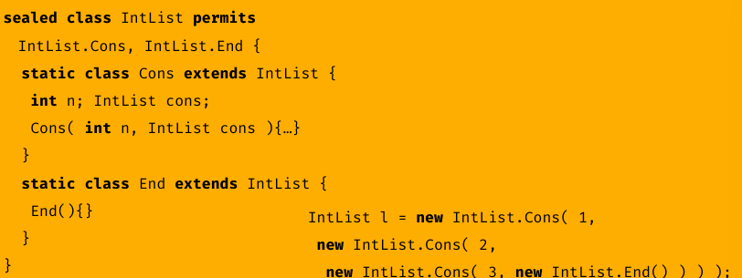

**Tipi Funzioni:**$\\$
L'insieme $\mathbb{R} \subseteq \mathcal{S_1} \times \ldots \times \mathcal{S_n}$ è l'insieme di relazioni.$\\$
Una relazione binaria è $R \subseteq \mathcal{S} \times \mathcal{T}$, dove $\mathcal{S}$ è il dominio e $\mathcal{T}$ è l'immagine.$\\$
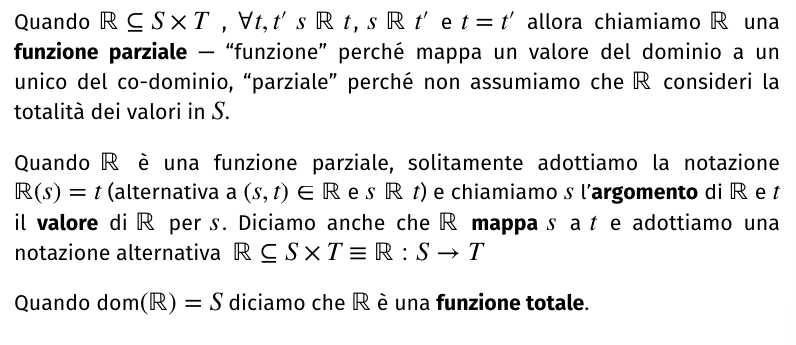
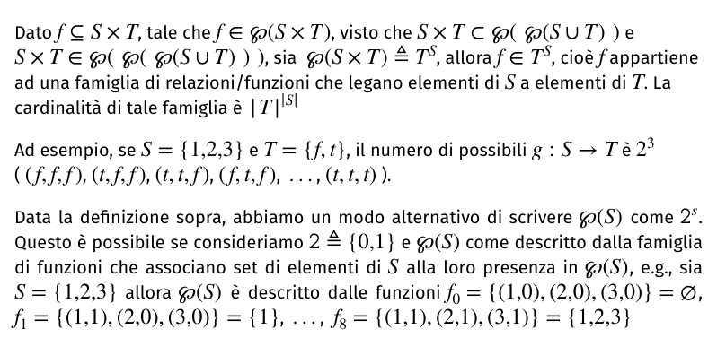

In certi linguaggi si può definire il tipo funzione come $P \rightarrow R$, dove $P$ è il tipo del parametro e $R$ è il tipo del risultato.$\\$

I valori sono denotabili, ma non tutti sono espribili e memorizzabili.$\\$

La principale operazione è l'applicazione, che associa ad una funzione un argomento.$\\$

### Algebra dei Tipi
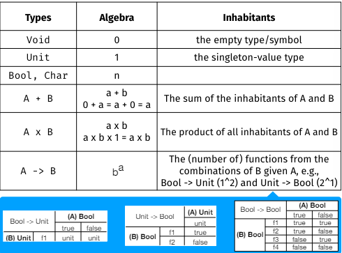

**Equivalenza di tipo:**$\\$
Una funzione potrebbe accettare tutti gli interi, quindi accettare un sottoinsieme di essi. Oppure al contrario accettare solo un sottoinsieme degli interi, quindi non accettare tutti gli interi.$\\$

Dati $\mathcal{R} \subseteq \mathcal{S} \times \mathcal{S}$ e dati due elementi $s_1, s_2 \in \mathcal{S}$:
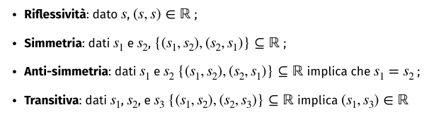

Se $\mathcal{R}$ è riflessiva e transitiva, allora è un *preordine*. Un preordine antisimmetrico è un *ordine parziale*. Un preordine simmetrico è una *relazione di equivalenza*.$\\$

*Equivalenza nominale:*$\\$
Ogni definizione di tipo introduce un nuovo nome di tipo.$\\$
$T_1 \text{ NTE } T_2 \Leftrightarrow \text{ name }(T_1) = \text{ name }(T_2)$.$\\$
Dove $T_1$ e $T_2$ sono due tipi e $NTE$ è l'equivalenza nominale.$\\$

*Duck Typing:*$\\$
Il controllo nominale è eseguito in modo statico, serve un controppo a tempo di esecuzione.$\\$
Il *duck typing* controlla se un dato valore supporta gli operatori previsti dal programma.$\\$
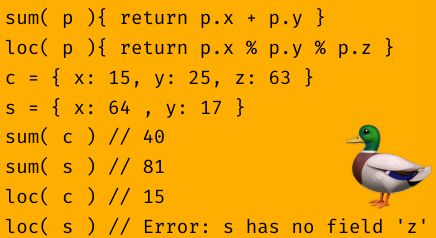

*Equivalenza strutturale:*$\\$
Finchè non si osservano differenze strutturali tra i valori, si possono considerare dello stesso tipo.$\\$
Verificamo l'equivalenza dei tipo confrontando tutte le loro operazioni, strutture e sottoelementi.$\\$
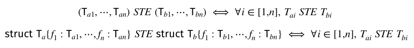

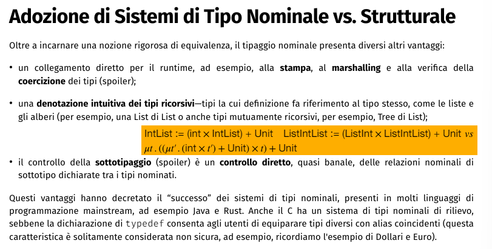

**Compatibilità di tipo:**$\\$
La compatibilità tra due tipi $T$ e $S$ può avere varie interpretazioni:
- i valori di $S$ sono *sottoinsieme* dei valori di $T$
- i valori di $S$ sono *sottoinsieme di valori canonicamente corrispondenti* a quelli di $T$ (es. int e float)
- i valori di $S$ sono *sottoinsieme di valori arbitrari corrispondenti* a quelli di $T$ (esiste qualche trasformazione arbitraria che converte qualsiasi valore di $S$ in un valore di $T$)
- le *operazioni* sui valori di $T$ sono possibili anche sui valori di $S$(nozione di sottotipaggio)

**Coercizione e Casting di tipo:**$\\$
- *Coercizione:* conversione(canonica/arbitraria) implicita di un valore di un tipo in un valore di un altro tipo. la conversione è sintattica quando i tipi condividono la stessa rappresentazione in memoria oppure avvengono tramite conversione canonica/arbitraria chetrasforma la rappresentazione di un valore di un tipo in quella di un altro tipo.
- *Casting:* conversione esplicita di un valore di un tipo in un valore di un altro tipo.

**Inferenza di tipo:**$\\$
Il type checker deduce il tipo di un'espressione dall'albero di parsing, scendendo fino alla radice e calcolando il tipo delle espressioni dalle informazione accumulate lungo il percorso.$\\$
L'inferenza è il processo di attribuzione di tipi a espressioni senza annotazioni esplicite dei tipi.$\\$
Un tipo può essere mantenuto *aperto* fino a quando non si ha abbastanza informazioni per chiuderlo.$\\$
la procedura di controllo sui vincoli si chiama *algoritmo di unificazione*.$\\$

**Algoritmo di unificazione:**$\\$
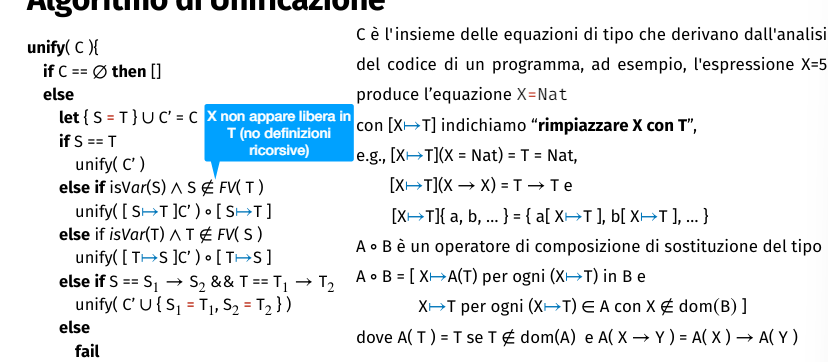
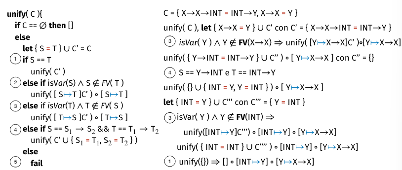
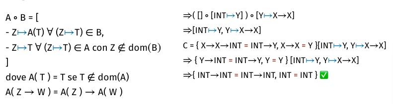