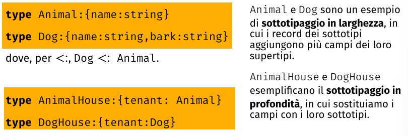

## Tipi Polimorfi
**Tipi monomorfici e polimorfici:**$\\$
Se un sistema di tipi ci dice che alcuni tipi non accettano altri tipi come parametri, allora il sistema di tipi è monomorfico. $\\$
Non possiamo creare funzioni generiche, ma dobbiamo creare funzioni specifiche per ogni tipo. $\\$

### Polimorfismo di Tipo
Un sistema di tipi polimorfi consente di specificare un insieme di operazioni che possono operare su diversi tipi senza preoccuparsi dei dettagli specifici del tipo. $\\$

- polimorfismo ad-hoc: si sovraccarica la definzione di un operazione su diversi tipi.
- di sottotipo: relazioni da astratto a specifico tra i tipi e si può usare un valore di un tipo più specifico dove è richiesto un tipo più generico.
- parametrico: simboli astratti che rappresentano tipi concreti

**Polimorfismo ad-hoc(sovraccarico/overloading):**$\\$
Sfrutta la capacità del compilatore/runtime di distinguere dal contesto di chiamate definizioni alternative di operazioni con lo stesso nome. $\\$
L'overloading è un abbreviazione sintattica che scompare a tempo di esecuzione, è un meccanismo di indirizzamento(dispatch). $\\$
Se avviene staticamente, sostiuiamo il simbolo sovraccaricato con un nome non ambiguo. $\\$
Se avviene dinamicamente, si usa una tabella di ricerca per trovare la definizione corretta. $\\$

**Polimorfismo di Sottotipo(subtyping o di inclusione):**$\\$
Relazione binaria tra tipi $S <: T$ che indica che $S$ è un tipo più specifico di $T$ e possiamo usare $S$ dove è richiesto $T$. E' un preordine, quindi non pissiamo supporre che tutti i valori di animale abbiano l'operazione abbaiare. $\\$

*Sottotipaggio dei record:*$\\$
Relazione tra un tipo Target e un tipo Sostituto che vogliare usare al posto del Target. $\\$

Per i sottotipi in profondità:
- per le letture: usiamo in maniera covariante, possiamo usare Doghouse al posto di AnimalHouse se dal valore leggiamo il tenant.
- per le scritture: usiamo in maniera controvariante, possiamo dare animalhouse al posto di doghouse se nel valore vogliamo scriverci un dog come tenant.

Tipi funzione:
- consumo: controvariante
- produzione: covariante

*Sussunzione:*$\\$
Decidere se $S <: T$. $\\$

**Tipi Parametrici:**$\\$
Per esempio le operazione degli insiemi(tipo parametrico) sono parametriche agli elementi(parametro di tipo) dell'insieme, se dobbiamo verificare l'inclusione di un insieme di interi applicheremo la definizione di equivalenza tra interi. $\\$
Quando si utilizza il polimorfismo parametrico non si possono fare ipotesi sulla forma del tipo, quindi bisogna considerare tutti i tipi di implementazione.$\\$

Ogni tanto si vuole limitare l'universalità del polimorfismo parametrico, mettendo vincoli sul quantificatore universale utilizzando il polimorfismo di sottotipo. $\\$

Se vogliamo esprimere che un tipo accetta parametri: $\\$

I linguaggi con polimorfismo parametrico di sottotipo permettono di definire la direzione della sussunzione. $\\$

PECS: Producer Extends, Consumer Super. $\\$

*Array in C++ e Java:*$\\$

### Tipi Monadici
*Monadi:*$\\$
Astrazione(principalmente utilizzata nella programmazione funzionale) per semplificare la composizione e la risoluzione di catene di funzioni. $\\$

**Tipi Opzione e Maybe:**$\\$
Utilizzato per gestire in maniera strutturata puntatori nulli. $\\$
Mitigano il problema dei puntatori nulli presentando dualità tra puntatori validi e non validi, mescolando tipi parametrici e di somma. $\\$

**Tipi Risultato:**$\\$
Raffinamento dei tipi opzione, dove usiamo tipi polimorfici e somma per distinguere tra il risultato di un calcolo e un'esecuzione errata. $\\$
