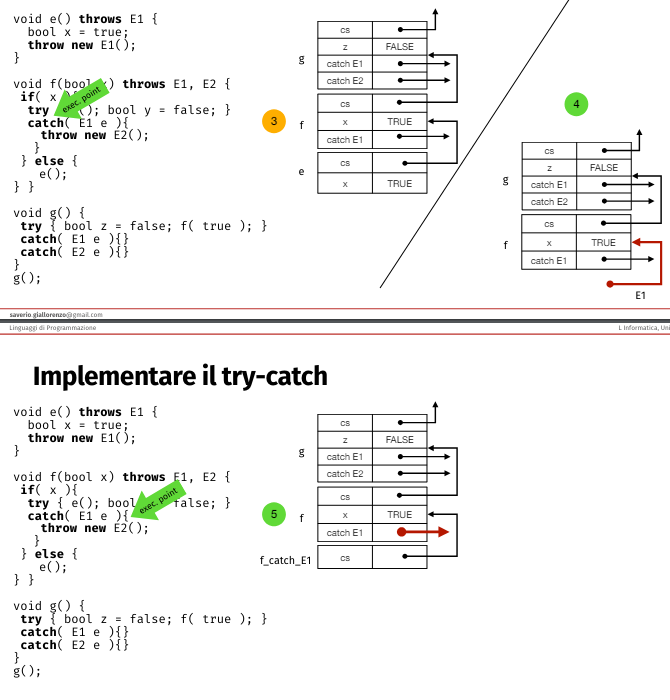

## Eccezioni
Vogliamo poter esprimere e strutturare operazioni che possono fallire. Le operazioni che dipendono dai risultati di operazioni che possono fallire devono essere consapevoli di questa possibilità.$\\$
Abbiamo visto come i tipi Result e Option possano essere utilizzati per rendere espliciti gli errori, ma spesso sono scomodi da usare.$\\$
uno dei metodi può essere utilizzare valori eccezionali per segnalare il fallimento al chiamante, però questo metodo è limitato e confusionario.$\\$
Un'altro modo è l'inversione del controllo tra chiamato e chiamante, uan funzione che potrebbe fallire chiede al chiamante di passare una funzione che verrà chiamata in caso di fallimento. Questo metodo però rende complesso il flusso dei programmi.$\\$

### Eccezioni
Una condizione eccezionale cuasa il trasferimento diretto del controllo a un gestori di eccezioni definito in un qualche punto dello stack di chiamate.$\\$

**Gestione delle eccezioni:**$\\$
alcuni linguaggi tipo Java forniscono costrutti di gestione delle che legano il gestore al blocco di codice che li sostituiscono nel caso di errore.$\\$

*Blocchi try-catch:*$\\$
Il blocco try contiene il codice che potrebbe generare un'eccezione, il blocco catch contiene il codice che gestisce l'eccezione. $\\$
Il blocco catch va a sostituire il blocco try nel caso di errore.$\\$
Il blocco catch accetta un parametro che rappresenta l'eccezione catturata.$\\$

*Sottotipaggio delle eccezioni:*$\\$

Java obbliga esplicitamente lo sviluppatore a gestire i tipi Throwable(Exception), ma non gli Error e i RuntimeException(un tipo speciale di Exception).$\\$
Perchè gli ultimi sono fallimenti irrecuperabili a livello di runtime e di applicazione che dovrebbero interrompere l'esecuzione dle programma, quindi vanno gestiti solo se si sa come recuperarli.$\\$

*Eccezioni esplcite:*$\\$

*Implementazione try-catch:*$\\$

