## Sicurezza della memoria: Garbage Collection e Borrow-checking
### Garbage Collection
**Tombstones**$\\$
Modalità di gestione dei riferimenti dangling.$\\$
A ogni allocazione a cui accede un puntatore si associa una parola(tombstone) che contiene l'indirizzo dell'oggetto a cui punta il puntatore, mentre il puntatore contiene l'indirizzo della tombstone. $\\$
Quindi le deferenziazioni sono a due hop, prima si va alla tombstone e poi all'oggetto. $\\$
Questo tipo di accesso tiene sotto controllo tutte le possibili duplicazioni di puntatori.$\\$
Quando l'oggetto viene deallocato, si segna "morto" nella tombostone e in caso di deferenziazione successiva si solleva un'eccezione. $\\$
Questo metodo è molto costoso in termini di spazio e tempo.$\\$
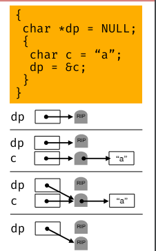

**Locks and keys**$\\$
Alternativa alle tombstone ma solo per i puntatori allo heap.$\\$
Ogni volta che allochiamo un oggetto, lo associamo ad un lock(parola casuale in memoria). Un puntatore contiene l'indirizzo dell'oggetto e un key che è l'indirizzo del lock. $\\$
Ogni volta che si deferenzia un puntatore bisogna controllare che il lock e la key siano uguali, altrimenti si solleva un'eccezione. $\\$
Al momento della deallocazione, cancelliamo l'oggetto e impostiamo il blocco su un valore canonico e invalidiamo ogni deferenziazione successiva sollenvando un'eccezione. $\\$
Questo metodo è molto costoso in termini di tempo e spazio.$\\$

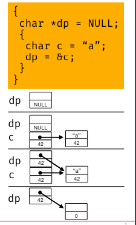

**Garbage Collection**$\\$
Meccanismo per gestire automaticamente la deallocazione degli oggetti non più utilizzati sullo heap.$\\$
- garbage detection: rivelare se gli oggetti(garbage) in memoria non sono più in uso.
- garbage collection: rilasciare la memoria occupata dagli oggetti non più in uso.

*Contatori di riferimento*:$\\$
Il modo più semplice per identificar eil garbage è trovare oggetti senza puntatori che li referenziano. Viene utilizzata nei *contatori di riferimento*.$\\$
Quando si alloca un oggetto sulla heap, il runtime inizializza un contatore di riferimenti che conta quanti puntatori referenziano l'oggetto. $\\$
Quando diventa zero, l'oggetto è garbage e può essere deallocato. Si guarda se quell'oggetto punta ad altri oggetti, si decrementa il contatore di riferimenti di quegli oggetti e si ripete il processo.$\\$
Non riesce a gestire per bene strutture ricorsive.$\\$

*Mark and Sweep*:$\\$
Il runtime lo invoca quando la heap sta esaurendo lo spazio.$\\$
E' un esempio di *stop-the-world* perchè sospende l'esecuzione del programma, in modo che nessun oggetto venga allocato o deallocato durante la fase di garbage collection.$\\$
E' più efficiente dei contatori di riferimento ma ha effetto negativo sulla reattività del programma e senza politica che contrastano la frammentazione della heap, le prestazioni dipendono dalla dimensione della heap e dello stack.$\\$
La marcatura ha bisogno di spazio nella stack almeno grande quanto la heap. Potrebbe non esserci ababstanza spazio per lo stack di esplorazione, per ridurre la memoria richiesta possiamo codificare lo stack nei campi già esistenti dello heap, utilizzano l'*inversione dei puntatori*.$\\$
Richiede 2 puntatori curr e prev. Quando il collector passa da un oggetto all'altro cambia il puntatore curr in prev e quando torna indietro ripristina il puntatore prev.$\\$
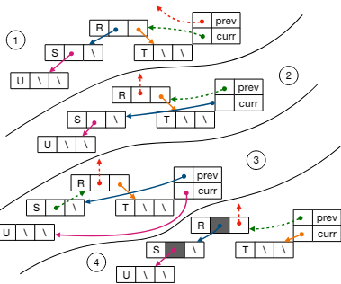

*Stop and Copy*:$\\$
La heap viene divisa in due parti, una parte è occupata dagli oggetti e l'altra è libera. $\\$
Quando la metà corrente è quasi piena, il garbage collector la esplora e copia ogni oggetto raggiungibile nella parte libera. Scambiando i puntatori. $\\$
Il tempo richiesto è proporzionale al numero di oggetti raggiungibili, non alla dimensione della heap. $\\$
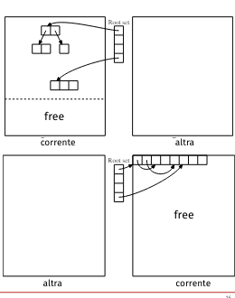

### Borrow-checking
Tecnica che cerca di trovare quilibrio tra garbage collection e gestione manuale della memoria.$\\$
Litima il modo di utilizzare i puntatori per evitare i riferimenti dangling e altri errori.$\\$
Si basa su una proprietà di *ownership*, dove il programma ha un unico proprietario(una variabile) che ne determina la durata(*lifetime*) in memoria. $\\$
*Allocazione in memoria in Rust*:$\\$
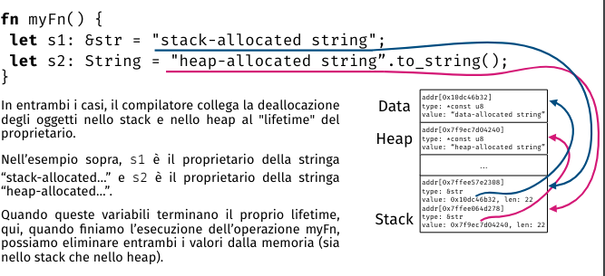

*Catene di ownership*:$\\$
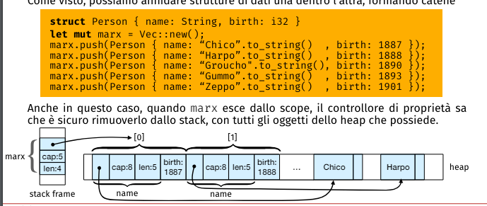

*Estendere la ownership*:$\\$
Il concetto di ownership che abbiamo visto din'ora è un albero con una radice, deallocandola si dealloca tutto l'albero. $\\$
Non ci è permesso di costruire grafi circolari ma
- possiamo passare la ownership da un proprietario ad un altro(radice)
- possiamo dare maggiori libertà a tipi semplici
- possiamo fornire tipi speciali di puntatori dcon conteggio dei riferimenti che consentono ai valori di avere più proprietari.
- possiamo permettere ai proprietari di prendere in prestito un valore

**Passare la proprietà(move)**$\\$
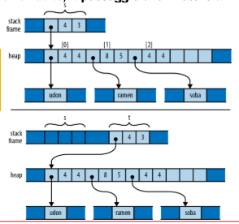
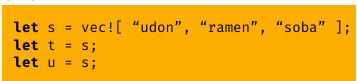
Rust passa la proprietà di un valore quando si assegna un valore ad un'altra variabile, quindi questo programma non viene compilato, perchè $s$ alla fine è una variabile non inizializzata.$\\$
In generale se è possibile che una variabile abbia spostato la proprietà del proprio valore(anche solo condizionalmente, con un if) consideriamo la variabile come non inizializzata.

**Tipi copia:**$\\$
Al posto del passaggio di proprietà ogni tanto è più facile passare i valore, come valori, quindi copiandoli.$\\$
Certi tipi(in Rust) sono efficienti da copiare, quindi non c'è bisogno di passare la proprietà.$\\$
Un controesempio sono le stringhe che posseggono un array allocato nella heao, quindi copiare una stringa significherebbe copiare l'array, quindi è più efficiente passare la proprietà.

**Rc e Arc: proprietà condivisa:**$\\$
Si utilizzano quando si vuole condividere la proprietà di un valore tra un insieme proprietari.$\\$
Rust utilizza i tipi $Rc$(puntatore con conteggio di riferimenti) e $Arc$(puntatore atomico con conteggio di riferimenti, hanno limiti in più per gestire la concorrenza) per gestire la proprietà condivisa.$\\$
Il problema dei puntatori con conteggio di riferimenti erano le chiamate ricorsive che quindi richiedono che almeno il valore più vecchio sia mutabile(non so perchè), Rust mantiene i referenti immutabili e crea delle reference cells per consentire ai valori refernziati di cambiare.$\\$
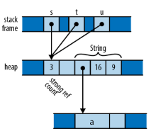

**Borrowing:**$\\$
Al contrario die puntatori visti fin'ora che erano proprietari, Rust ha dei puntatori non proprietari chiamate riferimenti. Al contrario die proprietari, che alla fine dealloca tutto l'albero, i riferimenti dipendono dai valori riferiti(altrimenti rimarrebbe dangling).$\\$
Quindi la creazione di un riferimento si chiama borrowing, perchè prendi in prestito un valore, può essere di due tipi:
- condiviso: leggere ma non modificare il valore. Quindi permette di avere tanti riferimenti.
- mutabile: leggere e modificare il valore. Permette un solo riferimento a quel valore attivo alla volta.

**Lifetime:**$\\$
Il compilatore convalida i prestiti guardando la lifetime della variabili, non deve sopravvivere una variabile alla "morte" del proprietario.$\\$
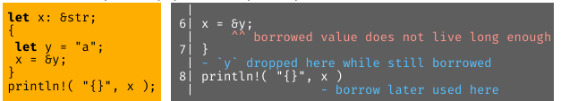

I prestiti non modificano la lifetime, ma impongono vincoli tra la lifetime e il compilatore che le deve controllare.$\\$

Ogni tanto vanno date annotazioni per chiarire al compilatore la lifetime delle variabili.$\\$
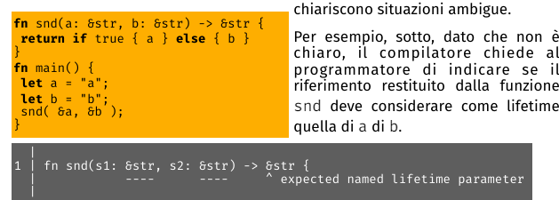
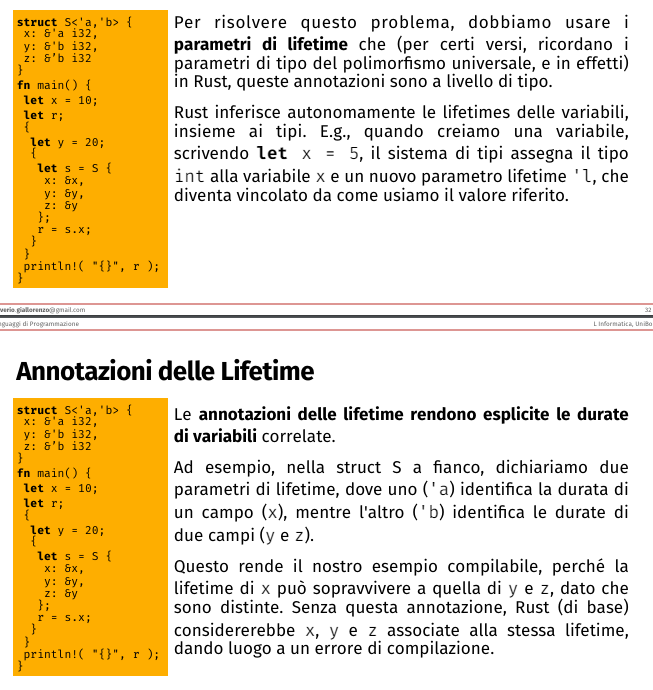
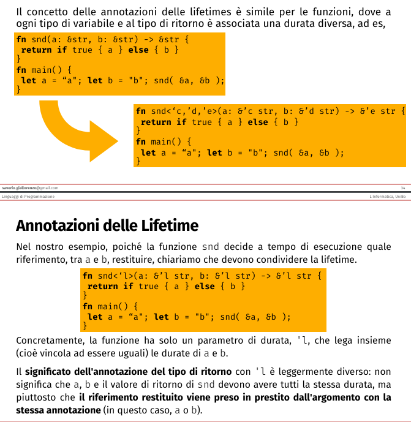

**Riferimenti Mutabili:**$\\$
Un valore con un riferimento mutabile può essere acceduto solo tramite quel riferimento. Gli unici riferimenti la cui lifetime può sovrapporsi a un riferimento mutabile sono quelli presi in prestito dal riferimento mutabile stesso.$\\$
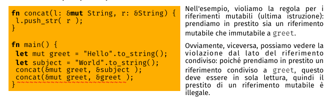

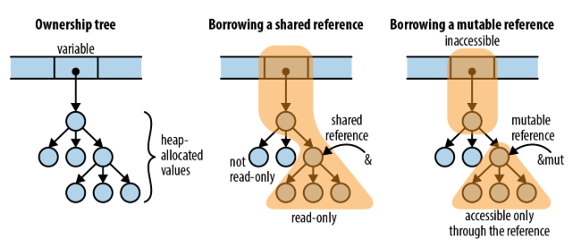