## Tipi di dato astratto e Object Orientation
Al posto di ragionare coi bit, abbiamo inventato i tipi per agire come *capsula* per i dati. Nei linguaggi type-safe il programmatore non può interagire coi i valori ma può solo agire tramite mediazione della capsula. Questo tipo di dato ADT(Abstract Data Type) è u tipo che definisce i possibili valori e le possibili operazioni su di essi.$\\$

Un dato astratto è composto da:
- il nome dle tipo astratto A
- il tipo di rappresentazione concreta T
- operazione per creazione, interrogazione e manipolazione dei valori di tipo A
- confine di astrazione ch eracchiude T e lo rende accessibile solo attraverso A

Quindi gli utenti possono creare nuovi tipi A, ma non possono accedere direttamente ai valori di tipo T.$\\$

*Information Hiding:*$\\$
Astrazione implementata tramite interfacce, nascondendo i dettagli di implementazione.$\\$
Le interfacce implementano la visita pubblica.$\\$

*Indipendenza dalla rappresentazione:*$\\$
Proprietà dei type-safe ADT, secondo la quale implementazioni corrette diverse dello stesso ADT sono indistinguibili dall'esterno.$\\$

*ADT in Rust:*$\\$
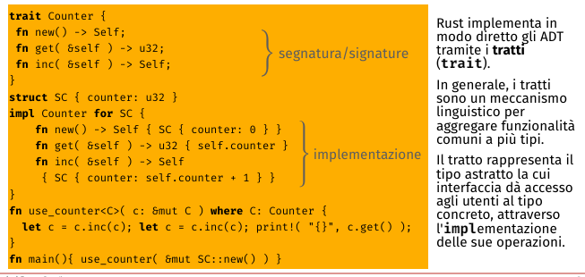

*Modulo:*$\\$
Può essere utile avere un raggruppamento di funzioni e tipi(ADT) in un unico blocco, quindi si utilizzano i moduli.$\\$
Una proprietà comune dei moduli è la visibilità, che determina quali parti del modulo sono accessibili dall'esterno.$\\$
Concettualmente ADT e moduli sono simili, ma i moduli sono più flessibili e permettono di raggruppare più ADT.$\\$
I moduli permettono la visibilità dei dati invece gli ADT no.$\\$
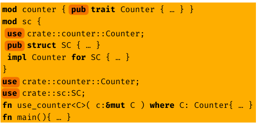

### Abstract Data Type e Tipi esistenziali:
Un tipo esistenziale è un tipo che nasconde il tipo concreto di un valore, finchè abbiamo un abitante di quel tipo possiamo fare operazioni su di esso.$\\$
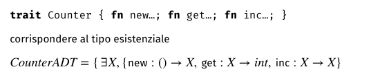
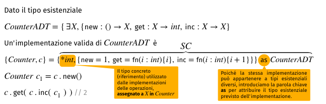

Dopo aver creato l'esistenziale il nome del tipo è vincolato, quindi possiamo avere solo una implementazione. Gli ADT ci permettono di sostituire questa implementazione con un'altra confrme senza violare la type-safety.$\\$

**Oggetti esistenziali:**$\\$
I tipi esistenziali catturano in generale l'information hiding e l'indipendenza dalla rappresentazione.$\\$
Se usati per rappresnetare gli ADT nasconde il tipo concreto e vincola l'implementazione rendendo possibile avere più implementazioni interoperanti dello stesso tipo di dato astratto(quetsa è una proprietà degli ADT).$\\$
Gli oggetti esistenziali forniscono una visione alternativa degli ADT, permttendo a più implementazioni di interagire. Questo vuole che quindi gli oggetti vivano nel programma e non come negli ADT dove l'esistenziale è assegnato ad una implementazione e sparisce.$\\$

Quindi gli oggetti sono dei tipi concreti che mantengono la loro implementazione interna e portano con se l'associazione con i loro tipo esistenziale.$\\$
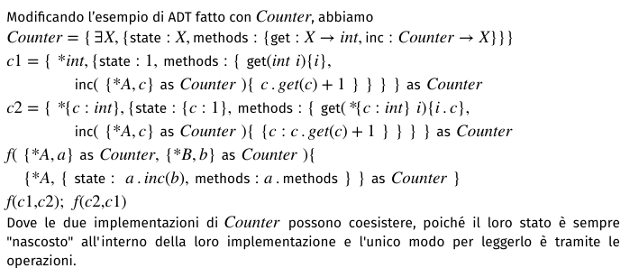

*Oggetti vs ADT:*$\\$
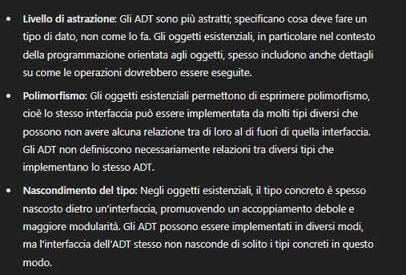
- ADT: 
    - adottano una visione aperta die tipi esistenziali
    - quando importiamo un'implementazione la apriamo prima di usarla
    - i valori manipolati sono quelli dell'implementazione sottostante
    - un'unica implementazione interna per tipo 
- Oggetti:
    - un oggetto è chiuso
    - utilizziamo i metodi per accedere al suo interno
    - ci possono essere diverse implementazioni interne per tipo
    - essendoci più implementazioni interne con le proprie operazioni, un programma può mescolare implementazioni diverse dello stesso tipo esistenziale
    - questo ci permette di implementare ereditarietà, poichè le classi raffinate condividono lo stesso tipo esistenziale

Un oggetto è una capusla che contiene dati e operazioni, che fornisce un'interfaccia per accedere ai dati e manipolarli.$\\$
Le operazioni sono chiamate metodi e possono accedere ai campi. Per fare ciò si utilizzano invocazioni di provedura e passaggio per riferimento.$\\$
Esiste il concetto di visibilità, che determina quali parti dell'oggetto sono accessibili dall'esterno.$\\$

**Oggetti e classi:**$\\$
Diventa troppo dispendioso il fatto che ogni oggetto specifichi la propria implementazione. Potrei aver bisogno, inoltre, di avere la stessa implementazione per istanze diverse, quindi si utilizzano le classi.$\\$
Una classe è un modello di implementazione di riferimento che contiene le variabili e i metodi comune ad una classe di oggetti.$\\$
Attraverso l'operazione new si crea un oggetto, che è un'istanza di una classe.$\\$
Una classe è un modello per un insieme di oggetti, stabilisce i nomi dei dati, la visibilità, l'implementazione dei metodi.$\\$
In generale le classi memorizzano l'implementazione degli oggetti e quando invochiamo un metodo su un oggetto, il metodo viene invocato sull'implementazione dell'oggetto legata alla classe. Ovviamente il metodo viene eseguito sullo stato dell'oggetto.$\\$
In pratica i metodi ricevono un parametro in più, che è l'oggetto su cui operare.$\\$
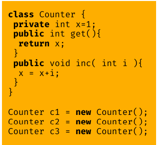
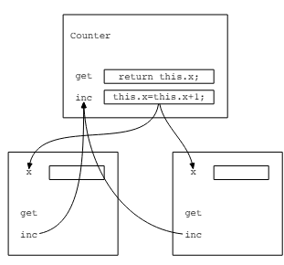

Di solito gli oggetti sono allocati dinamicamente, quindi si utilizza una heap per allocare gli oggetti.$\\$

*Classi vs Prototipi:*$\\$
I prototipi si possono chiamare anche delegazioni, poichè si basano sulla possibilità di delegare parte dell'implementazione di un oggetto ad un altro oggetto.$\\$
Due modi per creare nuovi oggetti in un linguaggio con prototipi:
- ex-nihilo: non assegna nessun prototipo all'oggetto creato
- clonazione: crea un oggetto facendo la copia di uno esistente(prototipo)

A differenza delle classi i prototipi sono oggetti. $\\$
un oggetto basato su prototipi può cambaire il suo delegato a tempo di esecuzione(cambiando la sua implementazione). Cosa che ovviamente non si può fare con le classi.$\\$
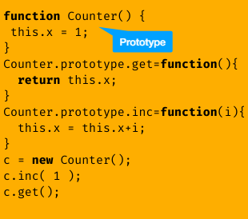

**Sottotipi:**$\\$
Si può dire che le classi sono i *tipi* degli oggetti.$\\$

*Principio di sostituzione di Liskov:*$\\$
In pratica dice che che ci può accedere ai campi ed invocare i metodi di $S$ disponibili in $T$.$\\$

I linguaggi basati sulle classi adottano uno stile nominale, dove la relazione di sottotipo è esplicitamente dichiarata in modo che il linguaggio possa verificare la correttezza.$\\$

*Classi, interfacce, tipi e sottotipi:*$\\$
I tipi parlano di struttura e operazioni, le classi introducono vincoli sulla visibilità, mantengono lo stato e trasportano codice eseguibile.$\\$
Le interfacce fanno da ponte tra le due. le classi quindi definiscono implicitament eun interfaccia di vista pubblica.$\\$
Quindi l'interfaccia descrive il contratto che i nostri oggetti promettono di soddisfare, senza fornire l'implementazione. Principio di astrazione.$\\$
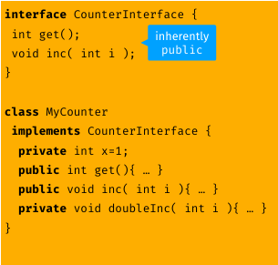
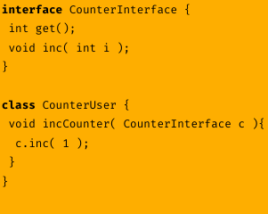

**Sottotipaggio e ereditarietà:**$\\$
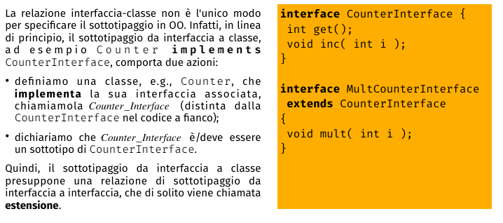

Se vogialimo far eun sottotipaggio da classe a classe applichiamo l'idea di estensione da interfaccia a interfaccia per coprire anche lo stato, i vincoli di incapsulamenteo e l'implementazione dei metodi delle classi, Questa si chiama ereditarietà.$\\$
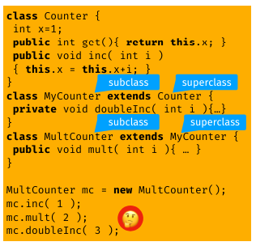

*Shadowing e Overriding:*$\\$
Una sottoclasse può mascherare un campo della superclasse definendo un campo con lo stesso nome, dato che lo scoping vale per blocco.$\\$
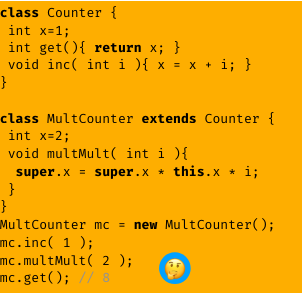

L'overriding è la possibilità di ridefinire un metodo della superclasse nella sottoclasse.$\\$
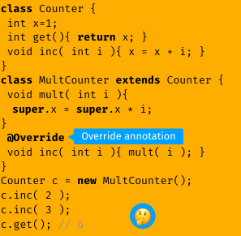

La differenza tra i due è che il primo è risolto staticamente, mentre il secondo è risolto dinamicamente.$\\$

Oltre a private e public, vogliamo implementare metodi per cui la sottoclasse può accedere ma non l'utente.$\\$
- package: estende la visibilità a tutti i membri dello stesso package o modulo
- protected: estende la visibilità a tutti i membri della stessa classe e delle sottoclassi

*Riassumendo:*$\\$
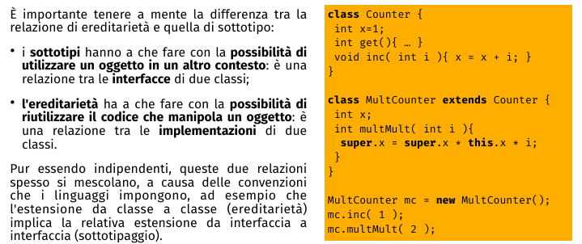

**Classi astratte:**$\\$
