## Domande
1. Giallo: facile

**Risposta:** Una macchina astratta è un insieme di strutture dati e algoritmi per memorizzare e eseguire programmi scritti in un determinato linguaggio. Una macchina fisica è un particolare tipoo di macchina astratta le quali strutture dati e algoritmi sono circuiti elettronici. 

2. Rosso: facile

**Risposta:** $\\$
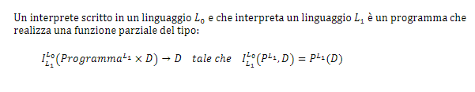

Il ciclo FDE è il ciclo che fa l'interprete. Preleva, decodifica ed esegue l'istruzione. 

3. medio

**Risposta:** Il linguaggio macchina è il linguaggio che la macchina fisica è in grado di eseguire. Data una macchina astratta, il linguaggio macchina è il linguaggio compreso dal suo interprete.

4. facile

**Risposta:** Possono esistere macchine diverse con lo stesso linguaggio macchina, in quanto dipende dal modo in cui è implementato l'interprete.

5. medio

**Risposta:** Una macchina astratta si può creare in modo: Hardware, l'esecuzione del programma risulta veloce, ma poco flessibile; Software, l'esecuzione del programma risulta lenta, ma molto flessibile; Firmware, l'esecuzione del programma risulta veloce e flessibile, scritta attraverso microprogrammi di basso livello.

6. Rosso: facile

**Risposta:** $\\$
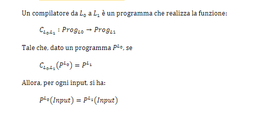

7. Giallo: medio

**Risposta:** La tecnica di implementazione interpretativa pura consiste nel avere un interprete scritto nel linguaggio della macchina fisica che traduce tutto il linguaggio sorgente in istruzioni della macchina fisica. L'implementazione compilativa pura consiste nel tradurre tutto il linguaggio sorgente in linguaggio macchina, e poi eseguire il programma. 

8. Rosso: medio

**Risposta:** Un compilatore o un interprete si dicono corretti quando rispettano la semantica del linguaggio sorgente. In generale possiamo considerare la Turing-completezza come un requisito per la correttezza di un compilatore o di un interprete.

9. medio

**Risposta:** Se si utilizza un'implementazione interpretativa si ha poca velocità e molta flessibilità. Se si utilizza un'implementazione compilativa si ha molta velocità e poca flessibilità.

10. Giallo: medio

**Risposta:** la macchina astratta viene fatta utilizzando un compilatore che compila il codice sorgente in un linguaggio intermedio, che poi viene tradotto dall'interprete in istruzioni della macchina fisica.

11. Giallo: difficile

**Risposta:** Una implementazione è di tipo interpretativo se il linguaggio della macchina intermedia è lontano da quello della macchina fisica(Java). Una implementazione è di tipo compilativo se il linguaggio della macchina intermedia è vicino a quello della macchina fisica(C).

12. facile

**Risposta:** Compilatore e interprete sono sempre realizzabili a patto che il linguaggio sia sufficientemente espressivo, Turing-completo.

13. difficile

**Risposta:** $//$
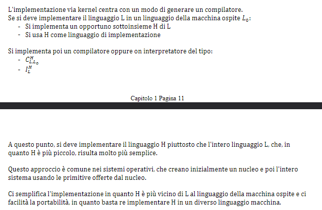

14. difficile

**Risposta:** Fare bootstrapping significa usare compilatori e interpreti per scrivere compilatori e interpreti. Quindi si creano solo pochi strumenti in modo da rendere automatica la creazione di altri strumenti. Il compilatore è scritto nel linguaggio che deve compilare poi viene tradotto usando un compilatore già esistente.

15. Giallo: facile

**Risposta:** Un linguaggio viene descritto attraverso:
- una grammatica: divisa in lessico, ossia sequenze di simboli corretti a costituire i token, e sintassi, ossia regole che definiscono come i token possono essere combinati per formare frasi corrette;
- una semantica: definisce il significato delle frasi corrette.
- una pragmatica: definisce come le frasi corrette possono essere usate.
- una implementazione: definisce come le frasi corrette possono essere eseguite.

16. facile

**Risposta:** Scritta sopra

17. In parte giallo: facile

**Risposta:** Un alfabeto è una collezione di simboli. Una parola o una stringa è una concatenazione di simboli dell'alfabeto. 

18. medio

**Risposta:** La potenza di una stringa è definita come $w^0 = \epsilon, w^{n+1} = w^n \cdot w, \forall n \geq 0$. La definizione di potenza di un linguaggio è $L^0 = \{\epsilon\}, L^{n+1} = L^n \cdot L, \forall n \geq 0$. La definizione di chiusura di Kleene è $L^* = \bigcup_{n \geq 0} L^n$.

19. In parte rosso, in parte giallo: medio

**Risposta:** Una gramamtica libera da contesto è una quadrupla $\{NT, T, R, S\}$ dove $NT$ è l'insieme dei non terminali, $T$ è l'insieme dei terminali, $R$ è l'insieme delle regole di produzione, $S$ è il simbolo iniziale. $\\$
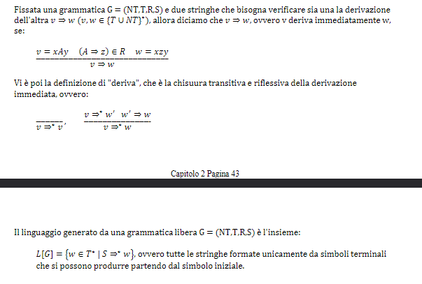

20. In parte giallo: medio

**Risposta:** Un albero di derivazione è un albero dove: i nodi interni sono i non terminali, le foglie sono i terminali, il cammino dalla radice a una foglia è una derivazione, la radice è il simbolo iniziale. Esiste una corrispondenza biunivoca tra alberi di derivazione e derivazioni. Una derivazione sinistra è una derivazione dove si sostituisce il non terminale più a sinistra. Una derivazione destra è una derivazione dove si sostituisce il non terminale più a destra.

21. Giallo: medio

**Risposta:** Una gramamtica ambigua è una grammatica che produce al stessa stringa con due alberi di derivazioni diversi. Esempio: $S \rightarrow aSb | ab | \epsilon$. Un linguaggio è ambiguo se ogni sua gramamtica è ambigua. Esempio: $L = \{a^nb^n | n \geq 0\}$. 

22. facile

**Risposta:** Per rimuovere ambiguità dalle espressioni algebriche basta definire le precedenze degli operatori e le associazioni degli operatori(parentesi).

23. In parte giallo: medio

**Risposta:** Un albero di sintassi astratta è un albero di derivazione che soddisfa i vincoli contestuali del linguaggio dove appaiono solo terminali. La sintassi concreta è una grammatica non ambigua che fa uso di zucchero sintattico. La sintassi astratta è una grammatica intuitiva, ma ambigua. Lo zucchero sintattico sono costrutti che non aggiungono espressività al linguaggio, ma lo rendono più facile da usare.

24. In parte giallo: difficile

**Risposta:** Un vincolo sintattico contestuale può essere per esempio che una variabile deve essere dichiarata prima di essere usata. Non possono essere catturati attraverso grammatiche libere da contesto.

25. Giallo: medio

**Risposta:** La semantica statica è la semantica che può essere dedotta a priori, senza eseguire il programma. La semantica dinamica è la semantica che può essere dedotta solo eseguendo il programma, per esempio una divisione per un input inserito da utente.

26. Rosso: medio

**Risposta:** $\\$
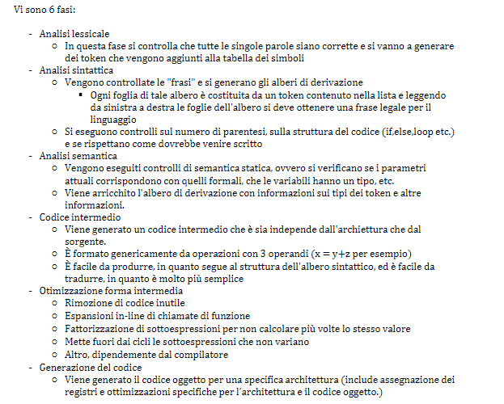

27. difficile

**Risposta:** Definire la semantica di un linguaggio serve al programmatore: analisi del programma, riconoscibilità; al progettista: specifica del linguaggio, turing-completezza; implementatore: correttezza dell'implementazione.

28. medio

**Risposta:** Ci sono due tipi di semantica: operazionale, che descrive come si calcola, creando un automa che simula l'esecuzione del programma; denotazionale, che descrive cosa si calcola, creando una funzione che mappa il programma in un valore.

29. //TODO

**Risposta:** \\TODO

30. facile

**Risposta:** Per pragramatica di un linguaggio si intende l'insieme di regole che guidano l'uso del linguaggio. Per implementazione si intende eseguire una frase corretta rispettandone la semantica, come la creazione di un compilatore o di un interprete.

31. Rosso: facile

**Risposta:** Lo scanner prende in input il codice del programma e restituisce una sequenza di token. 

32. facile

**Risposta:** Un token è composto da un tipo e da un valore. Il tipo è una stringa che identifica il token, il valore è il valore del token.

33. facile

**Risposta:** Un pattern è una descrizione del linguaggio al quale un token appartiene descritta attraverso espressioni regolari. Un lessema è un'istanza di un pattern.

34. Rosso: medio

**Risposta:** $\\$
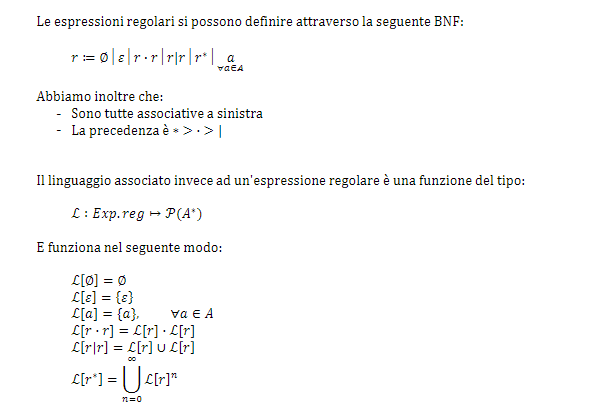

35. In parte giallo: facile

**Risposta:** I linguaggi regolari sono quei linguaggi per cui esiste una espressione regolare associata. I linguaggi finiti sono tutti regolari in quanto basterebbe un or tra tutte el stringhe. Certi linguaggi infiniti sono regolari, e si descrivono con la chiusura di Kleene.

36. facile

**Risposta:** Due espressioni regolari si equivalgono se rappresentano lo stesso linguaggio. Esempio: $(a|a) \equiv a$.

37. difficile

**Risposta:** $\\$
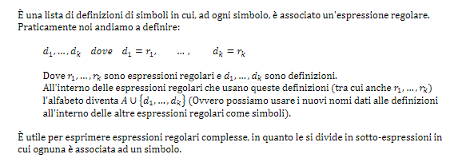

38. In parte rosso: facile

**Risposta:** Un NFA è una quintupla $(\Sigma, Q, \delta, q_0, F)$ con $\delta: Q \times \Sigma \rightarrow \mathcal(P)(Q)$ funzione di transizione. 

39. In parte giallo: difficile

**Risposta:** $\\$
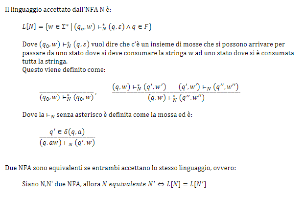

40. In parte rosso: facile

**Risposta:** Un DFA è definito come una quintupla $(\Sigma, Q, \delta, q_0, F)$ con $\delta: Q \times \Sigma \rightarrow Q$ funzione di transizione. Per deterministico si intende che $\delta$ è una funzione totale e per ogni simbolo esiste una sola mossa possibile. I DFA sono un caso speciale degli NFA in quanto differisocno solo nella funzione di transizione, che per gli NFA è $\delta: Q \times \Sigma \rightarrow \mathcal{P}(Q)$.

41. In parte giallo: facile

**Risposta:** Dato un NFA si ricava un DFA equivalente grazie alla costruzione per sottinsiemi che fa uso della epsilon closure.$\\$
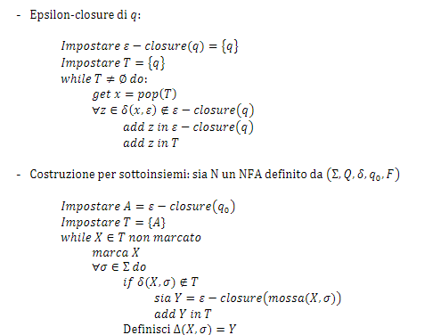

La complessità nel caso pessimo è esponenziale in quanto se un NFA ha n stati, il DFA verrà creato con $2^n$ stati.

42. In parte giallo: facile

**Risposta:** Sia N un NFA e sia M un DFA costruito partendo da N con l costruzione per sottoinsiemi. Allora $L(N) = L(M)$.

43. In parte rosso: difficile

**Risposta:** $\\$
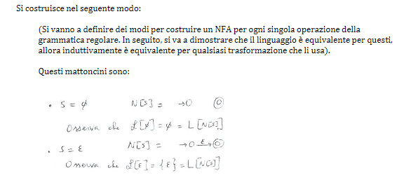
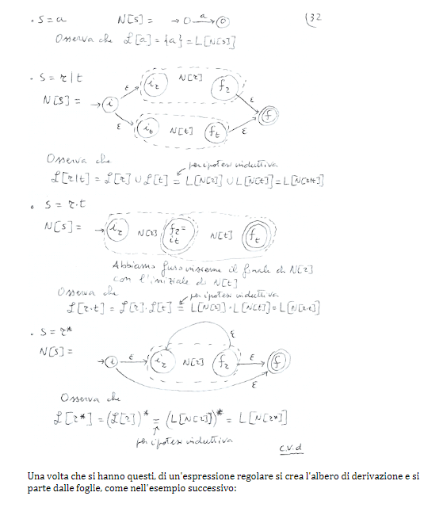
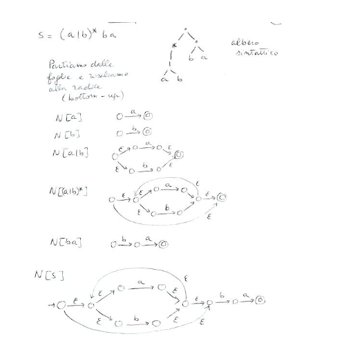

44. Rosso: facile

**Risposta:** $\\$
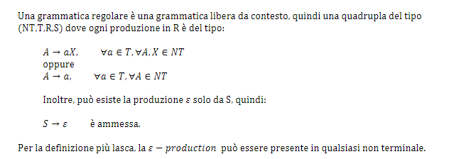

45. medio

**Risposta:** Per costruire un NFA da una grammtica regolare, si trova l'espressione regolare associata alla grammatica e si costruisce un NFA che riconosce l'espressione regolare.

46. Giallo: medio

**Risposta:** $\\$
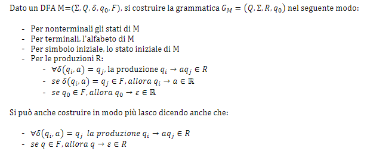

47. Giallo: medio

**Risposta:** Data una grammatica regolare:
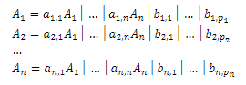 

Posso generare l'espressione regolare nel modo: $A_n = S_n [A_1 \ldots A_{n-1}]$ e la si sostituisce a $A_n$, si fa questo metodo ricorsivamente fino ad arrivare a $A_1$.

48. In parte giallo: facile

**Risposta:** $\\$
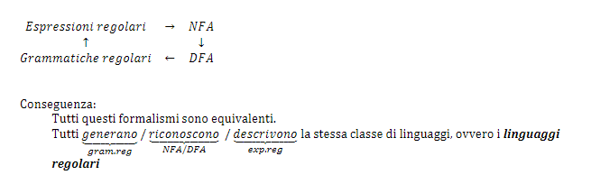

49. In parte giallo: medio

**Risposta:** $\\$
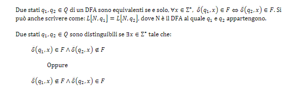

50. Giallo: medio

**Risposta:** $\\$
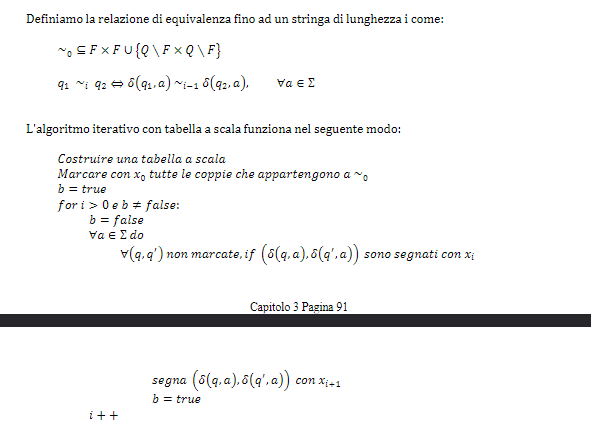

51. In parte giallo: medio

**Risposta:** $\\$
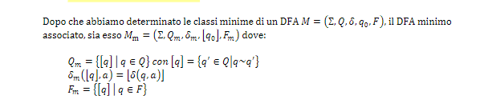

52. Rosso: medio

**Risposta:** Lex è un generatore di scanner. Richiede in input un file .l che è formato da un insieme di definizioni regolari e regole. E l'output è un file .c che contiene il codice sorgente dello scanner. 

53. medio

**Risposta:** $\\$
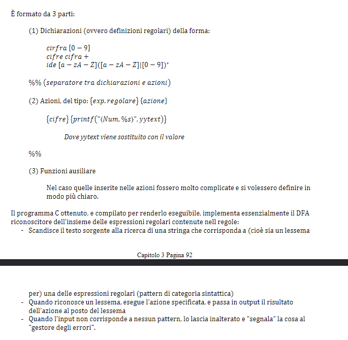

In pratica implementa un DFA che riconsoce le espressioni regolari. Se riconosce un lessema allora ci applica l'azione sopra e passa in output il token.

54. difficile

**Risposta:** Il programma generato da Lex viene chiamato come subroutine da Yacc. Yacc è un generatore di parser. lex.yy.c viene chiamato da Yacc per ottenere i token. yylex() è la funzione che restituisce i token.

55. Rosso: difficile (dimostrazione)

**Risposta:** Il pumping lemma per i linguaggi regolari dice che se un linguaggio è regolare allora $\exists N > 0$ tale che $\forall z \in L$ con $|z| \geq N$ allora $z = uvw$ con $|v| \geq 1$ e $|uv| \leq N$ e $\forall k \geq 0$ si ha che $uv^kw$ appartiene a L. Dimostrazione: $\\$
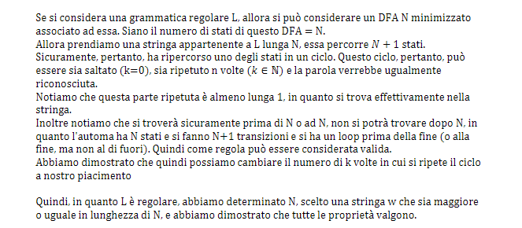

56. Rossso: facile

**Risposta:** $\\$
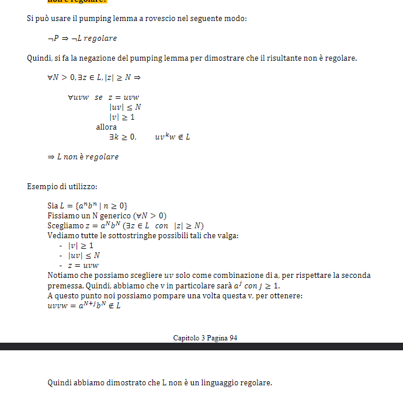

57. In parte giallo: medio

**Risposta:** $\\$
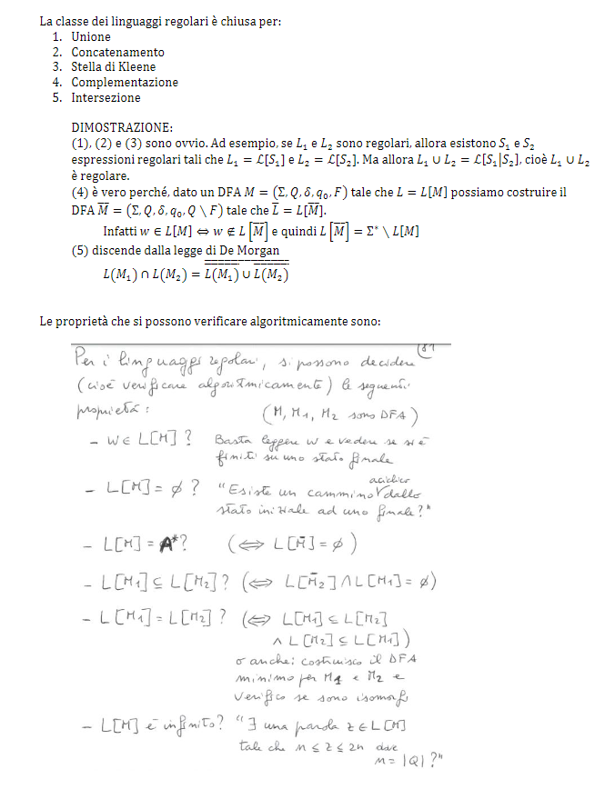

58. In parte rosso: facile

**Risposta:** L'analisi sintattica è la fase di suddivisione del programma in token, fatta dallo scanner. Il parser prende il input i token e costruisce l'albero di parsing(o derivazione). Per realizzare un parser ci occorrono: grammatiche libere da contesto, automi a pila.

59. In parte rosso: facile

**Risposta:** Un PDA è definito come una sestupla $(\Sigma, \Gamma, Q, \delta, q_0, F)$ dove $\delta: Q \times (\Sigma \cup \{\epsilon\}) \times \Gamma \rightarrow \mathcal{P}(Q \times \Gamma^*)$ è la funzione di transizione. La sua sdescrizione istantanea è $(q, \sigma, \gamma)$, dove $q$ è lo stato, $\sigma$ è il simbolo di input, $\gamma$ è il simbolo in cima alla pila.
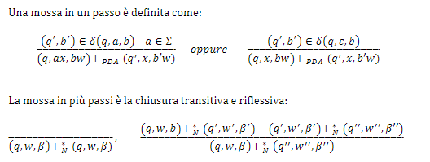

60. facile

**Risposta:** $\\$
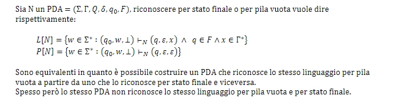

61. difficile (dimostrazione)

**Risposta:** $\\$
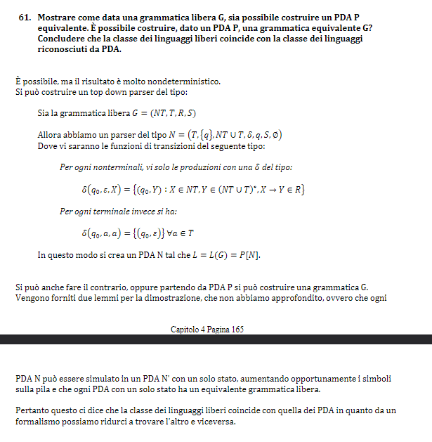

62. facile

**Risposta:** $\\$
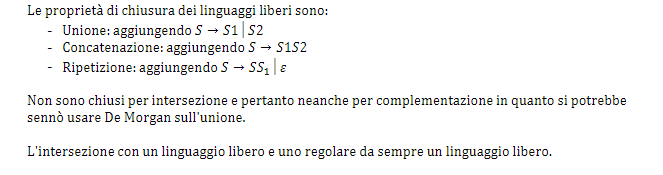

63. In parte rosso, in parte giallo: difficile (dimostrazione)

**Risposta:** Il pumpin theorem dice che se una grammatica è libera allora $\exists N > 0$ tale che $\forall z \in L$ con $|z| \geq N$ allora $z = uvwxy$ con $|vwx| \leq N, |vx| \geq 1$ e $\forall k \geq 0$ si ha che $uv^kwx^ky \in L(G)$. Dimostrazione: \\TODO

64. Rosso: facile

**Risposta:** $\\$
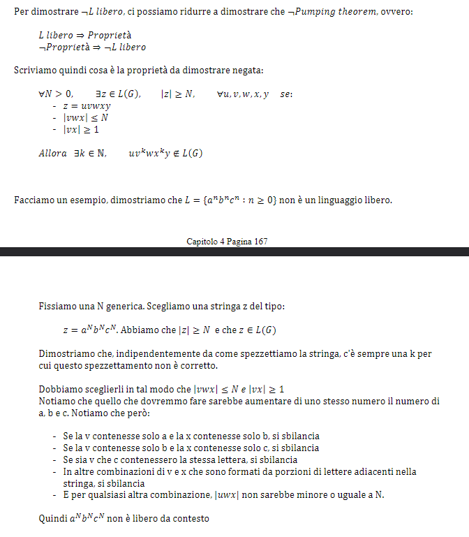

65. In parte giallo: facile

**Risposta:** $\\$
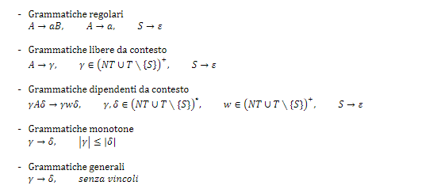
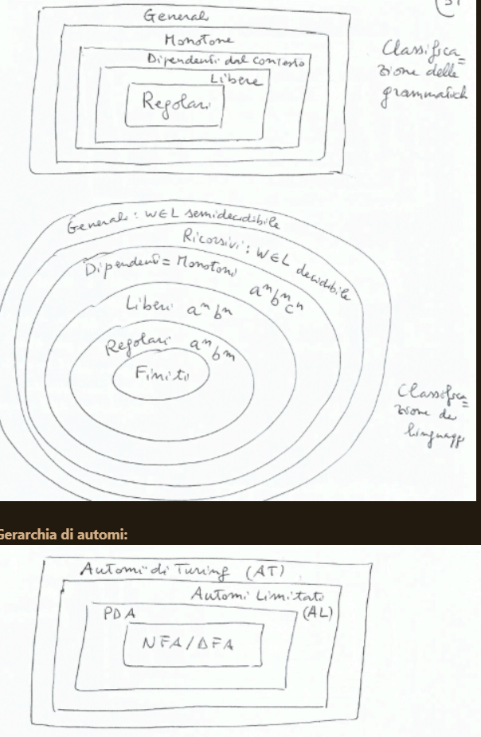

66. Rosso: facile

**Risposta:** $\\$
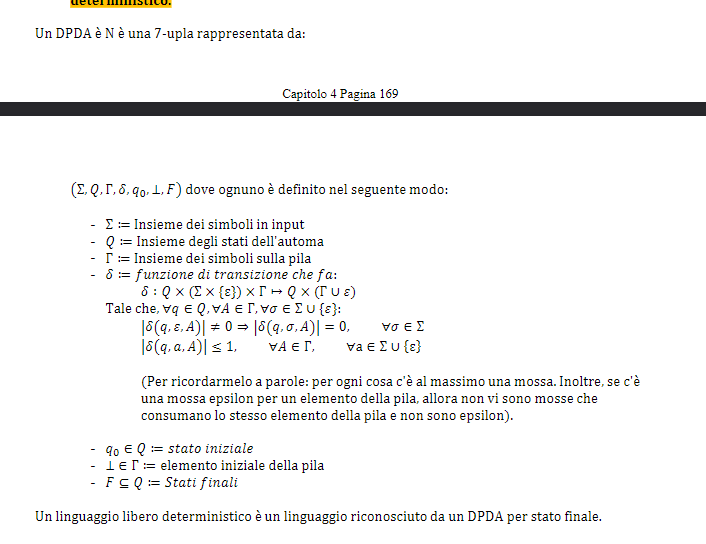

67. facile

**Risposta:** Linguaggio regolari $\subset$ linguaggi liberi deterministici $\subset$ linguaggi liberi. I linguaggi regolari possono essere ricnosciuti da un DPDA senza mai usare la pila. 

68. Giallo: facile

**Risposta:** $\\$
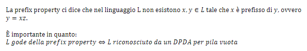

69. facile

**Risposta:** Aggiungendo il dollaro alla fine si può riconoscere un linguaggio che non gode della proprietà di prefisso con un DPDA in quanto quest'aggiunta creerà stringhe uniche.

70. facile

**Risposta:** Un linguaggio libero determiistico non è mai ambiguo, essendo deterministico. 

71. medio

**Risposta:** Il linguaggi liberi deterministici sono chiusi per complementazione ma non per intersezione o unioni. Per dimostrare la prima parte basta aumentare il DPDA con più stati e scambiare gli stati finali con quelli non finali.

72. Rosso: facile

**Risposta:** Per costruire un parser abbiamo bisogno di una grammatica libera che ci servirà per creare un PDA. 

73. Rosso: facile

**Risposta:** Il parser prende in input una lista di token e costruisce l'albero di parsing.

74. facile

**Risposta:** Un parser non deterministico compie scelte casuali e nel caso di errore torna indietro e riprova. Un parser deterministico compie scelte deterministiche e nel caso di errore si blocca.

75. facile

**Risposta:** $\\$
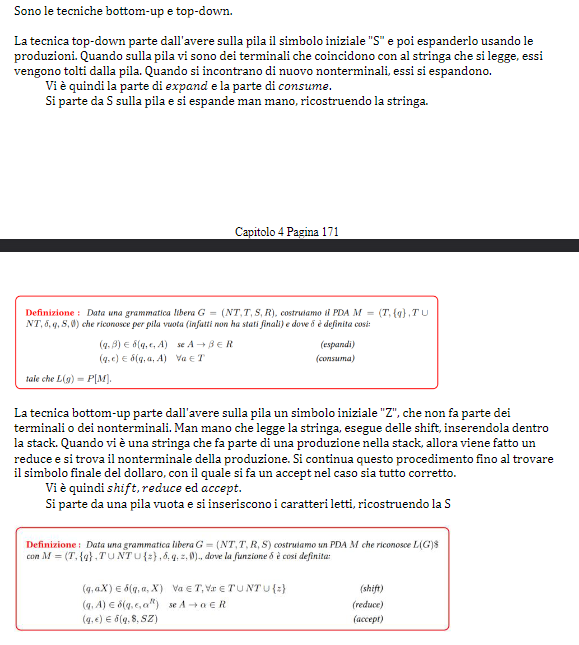

76. Rosso: facile

**Risposta:** La tecnica bottom-up costruisce un albero di derivazione sinistra. La tecnica top-down costruisce un albero di derivazione destra.

77. facile

**Risposta:** Le grammatiche non adatte al top-down sono le grammatiche ricorsive sinistra. Le grammatiche non adatte al bottom-up sono le grammatiche con produzioni epsilon.

78. facile

**Risposta:** $\\$
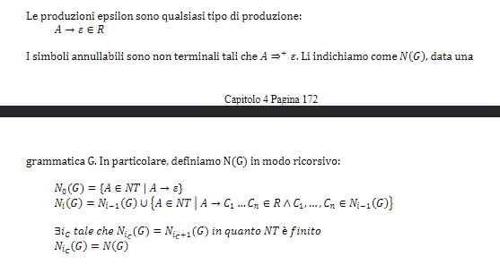

79. Giallo: medio

**Risposta:** Una grammatica che contiene produzioni epsilon si trasforma in una grammatica equivalente senza produzioni epsilon. Si calcola l'insieme $N(G)$ dei non terminali annullabili. 
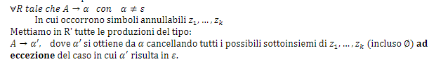

80. facile

**Risposta:** $\\$
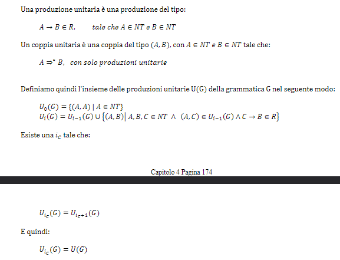

81. Gaillo: medio

**Risposta:** $\\$
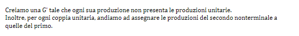

82. facile

**Risposta:** $\\$
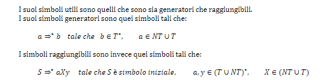

83. facile

**Risposta:** $\\$
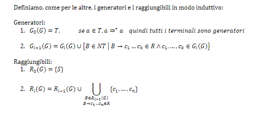

84. Giallo: medio

**Risposta:** $\\$
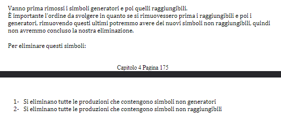

85. Giallo: difficile

**Risposta:** $\\$
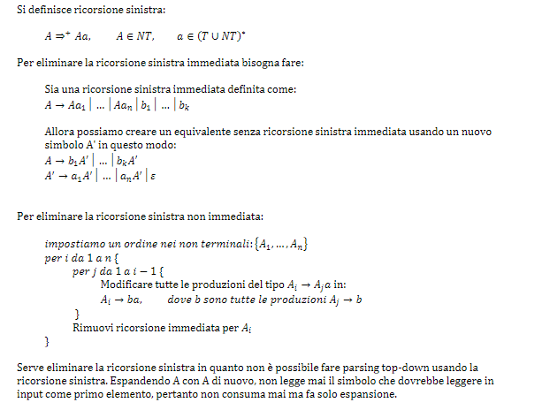

86. Giallo: facile

**Risposta:** Fattorizzare a sinistra una gramamtica vuol dire raggruppare le produzioni che hanno lo stesso simbolo terminale a sinistra, e sostituire il resto della produzione ocn un nuovo non terminale. Questo permette di avere una grammatica più semplice e più facile da analizzare.

87. difficile

**Risposta:** $\\$
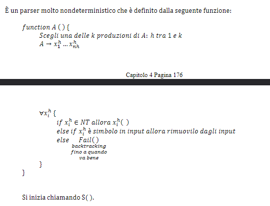

88. Rosso: facile

**Risposta:** $\\$
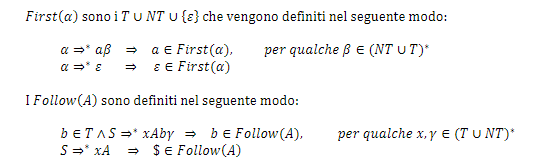

89. Giallo: facile

**Risposta:** $\\$
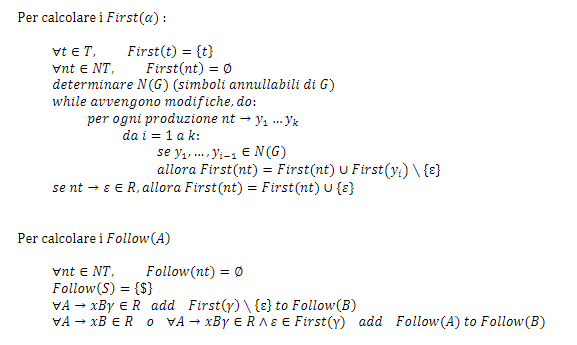

90. Giallo: facile

**Risposta:** La tabella di parsing LL(1) è una tabella che ha come righe i non terminali e come colonne i terminali. $\\$
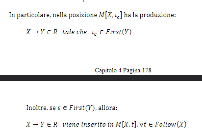

91. Rosso: facile

**Risposta:** Una gramamtica si dice LL(1) se è una grammatica libera da contesto e se la tabella di parsing LL(1) è deterministica. le condizione necessarie e sufficienti affinchè una grammatica sia LL(1) sono: 
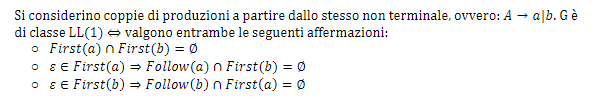

92. Giallo: facile

**Risposta:** Un parser è chiamato LL se legge da sinistra a destra e costruisce l'albero di parsing da sinistra a destra. 

93. facile

**Risposta:** $\\$
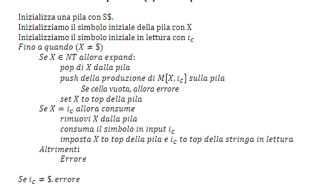

94. Giallo: facile

**Risposta:** Ogni linguaggio regolare è anche LL(1), in quanto si può costruire un DFA da questo dove ogni stato corrisponde a un non terminale e ogni transizione corrisponde a una produzione.

95. medio

**Risposta:** $\\$
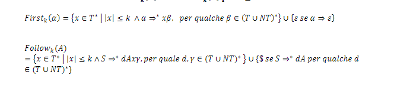

96. facile

**Risposta:** Una grammatica è LL(k) se la tabella di parsing LL(k) è deterministica. Un linguaggio è LL(k) se esiste una grammatica LL(k) che lo genera. Esistono grammatiche LL(k) per cui il linguaggio è LL(x) con $x < k$.

97. facile

**Risposta:** Una grammatica ambigua o ricorsiva sinistra non è LL(k) per nessun k.

98. facile

**Risposta:** Esistono liguagig liberi e liberi deterministici non LL(k), però se G è LL(k) allora L(G) è libero deterministico.

99. Rossa: facile

**Risposta:** $\\$
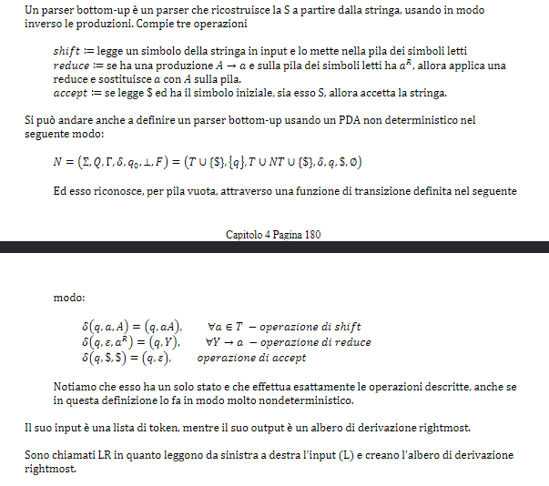

100. facile

**Risposta:** I possibili conflitti di un parser bottom-up sono: shift/reduce, reduce/reduce. 

101. In parte giallo: medio

**Risposta:** $\\$
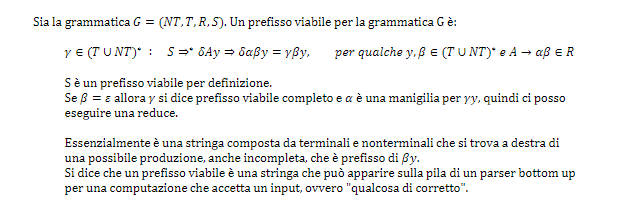

102. In parte rosso: 

**Risposta:** Un item LR(0) è una produzione con un punto che indica la posizione corrente nella produzione. Gli item vengono generati in modo ricorsivo. 

103. In parte giallo: medio

**Risposta:** $\\$
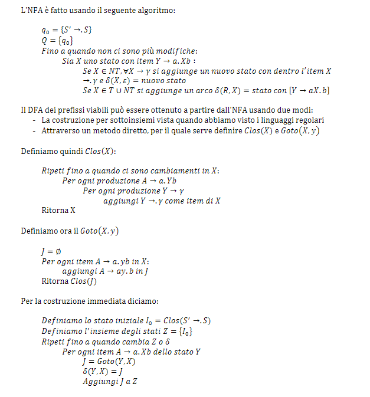

# Da rivedere

104. Giallo: facile

**Risposta:** Una tabella di parsing LR(0) è una tabella che ha come righe gli stati dell'automa a pila e come colonne i terminali e non terminali. Ogni cella contiene un azione fatta dall'automa canonico. Le azioni possibili sono: shift, reduce, acc, goto. La reduce si mette in tutti i terminali. Una grammatica è LR(0) se la tabella di parsing è deterministica.

105. Giallo: medio

**Risposta:** $\\$
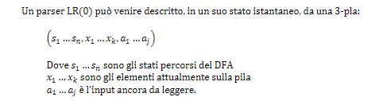
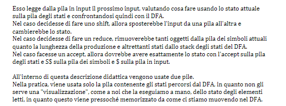

106. facile

**Risposta:** Una gramamtica non LR(0) è per esempio: $S \rightarrow aSb | ab$. Non è LR(0) in quanto la tabella di parsing non è deterministica.

107. In parte giallo: facile

**Risposta:** Una tabella SLR(1) è una tabella di parsing LR(0) dove però i reduce sono messi nei follow del non terminale. La S è per simple.

108. facile

**Risposta:** Una grammatica è SLR(1) se la tabella di parsing SLR(1) è deterministica.

109. Giallo: facile

**Risposta:** Un item LR(1) è un item LR(0) con un lookahead. Un item LR(1) è una produzione con un punto e un lookahead che indica il simbolo che deve seguire la produzione per poterla ridurre.
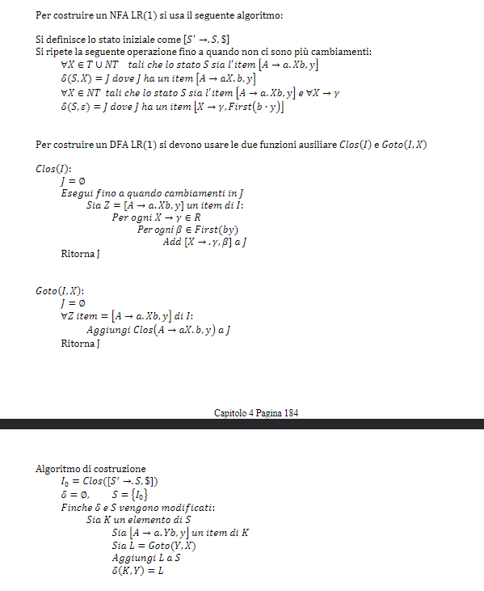

110. Giallo: facile

**Risposta:** Una tabella di parsing LR(1) ha come righe gli stati dell'automa a pila e come colonne i terminali e non terminali. Ogni cella contiene:
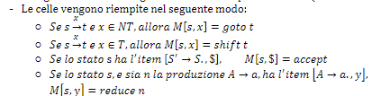

111. In parte giallo: medio

**Risposta:** $\\$
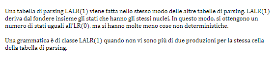

112. medio

**Risposta:** $\\$
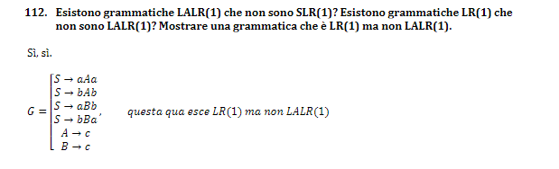

113. medio

**Risposta:** $\\$
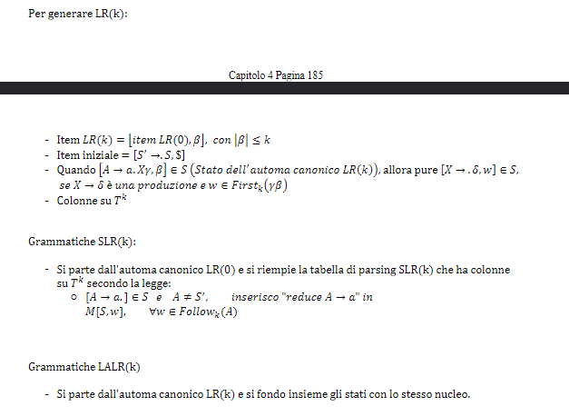

114. Giallo: medio

**Risposta:** SLR(k) $\subset$ LALR(k) $\subset$ LR(k). LL(k) $\subset$ LR(k). LL(k) e LR(k) non sono mai ambigue. Le grammatiche ambigue non sono LR(k) per nessun k.

115. In parte giallo: medio

**Risposta:** I linguaggi LL(k) sono un sottoinsieme dei linguaggi LR(k). Tutti i linguaggi liberi deterministici sono SLR(1), quindi sono anche LR(k). Però esistono dei liberi deterministici che non sono LL(k).

116. In parte giallo: medio

**Risposta:** Il linguaggio $\{a, ac\}$ è regolare ma $\notin$ LR(0). $\\$
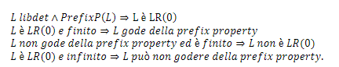

117. Giallo: facile

**Risposta:** La classe dei linguaggi SLR(1) coincide con la classe die linguaggi liberi deterministici.

118. In parte rosso: difficile

**Risposta:** YACC è un generatore di parser. Prende in input un file .y che contiene la grammatica e le regole di traduzione e genera un file .c che contiene il codice sorgente del parser LALR(1). Se dai il file output a un compilatore di C si ottiene un parser. 

119. In parte giallo: difficile

**Risposta:** $\\$
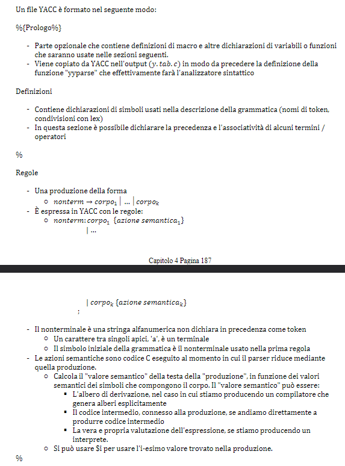
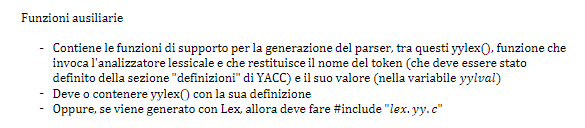

120. difficile

**Risposta:** Si possono risolvere gramamtiche ambigue con YACC specificando nelle definizioni(sezione dopo il prologo) le regole di associatività per esempio. In generale se non indicato risolve shift/reduce a favore di shift e reduce/reduce per la prima regola.

121. medio

**Risposta:** $\\$
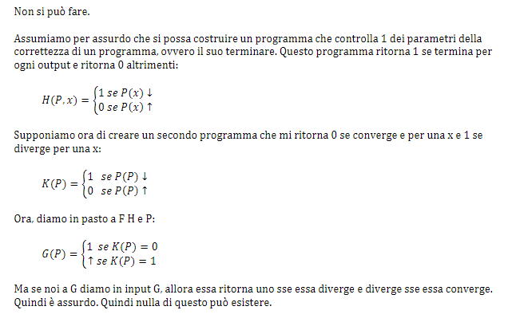

122. In parte giallo: facile

**Risposta:** L'halting problem è il problema di decidere se un programma termina o meno. Si dimostra che non può essere risolto in quanto se esistesse un algoritmo che lo risolvesse, si potrebbe costruire un programma che lo contraddice.

123. facile

**Risposta:**Un problema è decidibile se esiste un algoritmo che da un output sì o no in tempo finito. Un problema è semidecidibile se esiste un algoritmo che da un output sì in tempo finito, ma non si sa se darà un output no in tempo finito.

124. Giallo: facile

**Risposta:** Classici problemi indecidibili sono: haltin problem, problema di equivalenza, problema di divergenza.

125. facile

**Risposta:** Una macchina di Turing è una sestupla $(Q, A, B, q_0, q_f, \delta)$ dove $Q$ è l'insieme degli stati, $A$ è l'alfabeto di input, $B$ è l'alfabeto del nastro, $q_0$ è lo stato iniziale, $q_f$ è lo stato finale, $\delta : Q \times B \rightarrow Q \times B \times \{L, R\}$ è la funzione di transizione.

126. In parte rosso, in parte giallo: facile

**Risposta:** Un linguaggio è Turing-completo se è possibile implementare tutte le funzioni calcolabili da una macchina di Turing. La tesi di Church-Turing afferma che tutte le funzioni calcolabili tramite un algoritmo possono essere calcolate da una macchina di Turing. Non è dimsotrabile in quanto non si sa cosa sia un algoritmo.

127. facile

**Risposta:** I normali linauggi di programmaizone sono TUring completi se si assume che usano memoria sufficiente. Il teorema di Jacopini-Bohm diche se un linguaggioc omprende while/ricorsione, if the else, concatenazione e assegnamento allora è Turing completo.

128. facile

**Risposta:** $\\$
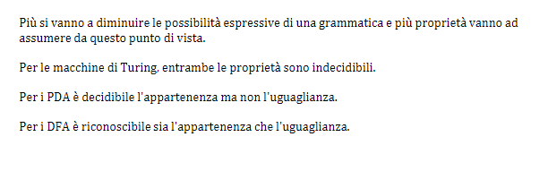