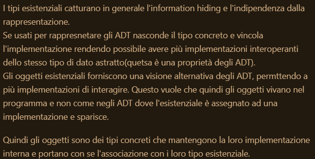
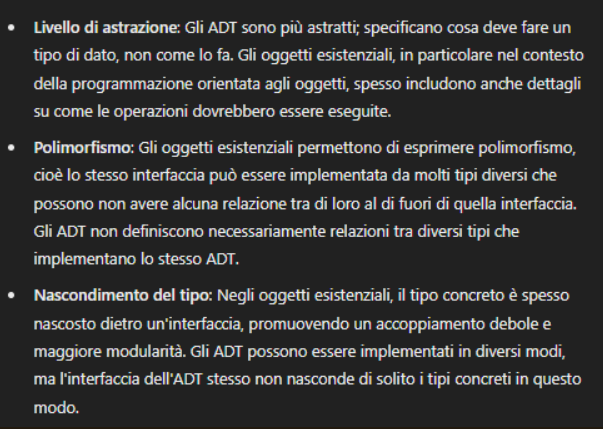

## Domande pacco 21
1. Cos'è la type-safety?

**Risposta:** La type-safety è un concetto che si riferisce alla capacità di un linguaggio di programmazione di prevenire errori di tipo durante la compilazione. Un linguaggio di programmazione è type-safe se il compilatore è in grado di rilevare e prevenire errori di tipo durante la compilazione. 

2. Dynamic Typing vs Static Typing, Inferred Typing vs Manifest Typing: spiega le differenze.

**Risposta:** Il dynamic typing è un meccanismo che permette di determinare il tipo di una variabile a runtime. Il static typing è un meccanismo che permette di determinare il tipo di una variabile a compile-time. L'inferred typing è un meccanismo che permette al compilatore di dedurre il tipo di una variabile risalendo l'albero di parsing. Il manifest typing è un meccanismo che richiede che il tipo di una variabile sia specificato esplicitamente dal programmatore.

## Domande pacco 22
3. Quali sono i tipi base? E perchè si chiamano così?

**Risposta:** I tipi base sono i tipi primitivi che non possono essere scomposti in tipi più semplici. Questi tipi sono i tipi fondamentali su cui si basano tutti gli altri tipi. Gli esempi di tipi base sono: `int`, `float`, `char`, `bool`, `enum`, `void`(tipo vuoto), `unit`(a differenza di void può essere passato come parametro). 

4. Tipi estensionali e tipi intensionali: spiega le differenze.

**Risposta:** I tipi estensionali sono tipi che sono definiti in base ai valori che possono assumere. Un esempio di tipo estensionale è il tipo `enum`, che è definito da un insieme finito di valori. I tipi intensionali sono tipi che sono definiti in base alle proprietà che possiedono. Un esempio di tipo intensionale è il tipo `int`, che è definito da un insieme infinito di valori.

5. Descrivi i tipi Array.

**Risposta:** Denota un insieme di elementi dello stesso tipo identificati da un indice di riferimento. Se il linguaggio è safe controlla la validità dell'indice per evitare buffer overflow. vengono memorizzati in memoria contigua. Gli array possono essere statici, la dimensione è fissata a tempo di compilazione e vengono memorizzati nello stack-frame del blocco chiamante(permette di accedere facilmente ai dati), o dinamici, hanno dimensione variabile a tempo di esecuzione, infatti prima di caricarlo nello stack-frame viene utilizzata la heap e si salva un puntatore all'inizio della memoria, il descrittore di questo tipo di array si chiama dope vector.

6. Descrivi i tipi Insieme.

**Risposta:** Un insieme è una collezione di elementi unici. Gli elementi di un insieme non sono ordinati e non possono essere duplicati.

7. Descrivi i tipi riferimento. Qual è la differenza tra wild e dangling reference?

**Risposta:** I tipi riferimento sono tipi che contengono un riferimento ad un valore. Un riferimento è un puntatore ad un valore. Un wild reference è un riferimento che punta ad un'area di memoria non inizializzata o non valida. Un dangling reference è un riferimento che punta ad un'area di memoria che è stata deallocata. Entrambi i tipi di riferimento possono causare problemi di sicurezza e di stabilità del programma. Di solito esiste un valore canonico che viene assegnato al posto del valore deallocato `null` per evitare dangling reference.

8. Tipi Somma e Tipi Prodotto: spiega le differenze.

**Risposta:** I tipi somma sono un unione disgiunta di tipi. Degli esempi dei tipi somma sono: `sealed class`(classe che definisce un inisieme finito di sottoclassi), `union`(una cella in memoria che può contenere tipi diversi), `funzioni ricorsive`. I tipi prodotto sono una composizione di tipi. Degli esempi di tipi prodotto sono: `tuple`(insieme di valori di tipi diversi), `record`(insieme di valori con nomi), `struct`(insieme di valori con nomi e tipi), `unit`(tipo che ha un solo valore `()`). Per i tipi prodotto esiste il pattern matching, che serve per destrutturare i tipi prodotto.

9. Descrivi i tipi Funzione.

**Risposta:** I tipi funzione sono tipi che rappresentano una funzione. Una funzione è una relazione tra un insieme di input e un insieme di output. I tipi funzione sono composti da un tipo di input e un tipo di output. Un esempio di tipo funzione è `R -> S`, che rappresenta una funzione che prende un valore di tipo `R` e restituisce un valore di tipo `S`. 

10. Descrivi l'equivalenza di tipo. Strutturale vs Nominale.

**Risposta:** L'equivalenza di tipo è un concetto che si riferisce alla relazione tra due tipi. L'equivalenza di tipo strutturale è una relazione tra due tipi che si basa sulla struttura dei tipi. Due tipi sono equivalenti se hanno la stessa struttura. L'equivalenza di tipo nominale è una relazione tra due tipi che si basa sul nome dei tipi. Due tipi sono equivalenti se hanno lo stesso nome. Duck typing è un esempio di equivalenza di tipo strutturale, ossia se un oggetto si comporta come un'anatra, allora è un'anatra.

11. Coercizione e Casting di tipo: spiega.

**Risposta:** La coercizione permette la conversione implicita da un tipo ad un altro. Si dice sintattica quando i due tipi hanno la stessa struttura in memoria. Il casting è la conversione esplicita da un tipo ad un altro.

12. Inferenza di tipo: spiega.

**Risposta:** L'inferenza di tipo è un meccanismo che permette al compilatore tramite il type checker di dedurre il tipo di una variabile risalendo l'albero di parsing. Il tipo rimarrà aperto fino a quando non verrà assegnato un valore. Permette di non avere annotazioni esplicite sui tipi.

13. Algoritmo di unificazione: spiega.

**Risposta:** \\TODO

## Domande pacco 23
14. Tipi polimorfici vs Tipi monomorfici: spiega.

**Risposta:** Se un sistema non accetta più tipi come parametri, è monomorfico. Se accetta più tipi, è polimorfico. Un sistema polimorfico consente di specificare un insieme di operazioni che possono operare su diversi tipi senza preoccuparsi dei dettagli specifici del tipo. Un sistema monomorfico richiede che le operazioni siano specificate per ogni tipo. 

15. Polimorfismo ad-hoc: spiega.

**Risposta:** Sfrutta la capacità dle compilatore di capire il contesto di chiamate e distinguere le definizioni alternative di operazioni con lo stesso nome. L'overloading è un meccanismo di indirizzamento(dispatch). Se avviene staticamente, sostituiamo il simbolo sovraccaricato con un nome non ambiguo. Se avviene dinamicamente, si usa una tabella di ricerca per trovare la definizione corretta.

16. Polimorfismo di Sottotipo: spiega.

**Risposta:** E' una relazione binaria tra tipi $S <: T$ che indica che $S$ è un tipo più specifico di $T$ e possiamo usare $S$ dove è richiesto $T$. E' un preordine, quindi non possiamo supporre che tutti i valori di animale abbiano l'operazione abbaiare.

17. Polimorfismo Parametrico: spiega.

**Risposta:** Il polimorfismo parametrico è un meccanismo che permette di scrivere codice che funziona su più tipi senza dover specificare il tipo. Questo meccanismo è utile per scrivere codice generico che può essere riutilizzato con diversi tipi. Un esempio di polimorfismo parametrico è il tipo `List<T>`, che rappresenta una lista di valori di tipo `T`. Il tipo `List<T>` può essere utilizzato con diversi tipi `T` senza dover scrivere codice specifico per ogni tipo. 

18. Sussunzione e PECS: spiega.

**Risposta:** Sussunzione è il processo di decidere se un tipo $S$ è un sottotipo di un tipo $T$. PECS sta per Producer Extends, Consumer Super. Producer Extends significa che un tipo può produrre valori di un tipo più specifico di quello richiesto. Consumer Super significa che un tipo può consumare valori di un tipo più generico di quello richiesto.

19. Tipi monadici: Opzione, Maybe, Risultato: spiega.

**Risposta:** I tipi monadici sono tipi che rappresentano un valore che può essere presente o assente. Questi tipi sono utili per gestire in maniera strutturata i puntatori nulli. Un esempio di tipo monadico è il tipo `Option/Maybe <T> : Some <T> + None`, che rappresenta un valore di tipo `T` che può essere presente o assente. Il tipo risultato è un tipo monadico che rappresenta il risultato di un'operazione che può avere successo o fallire. Un esempio di tipo risultato è il tipo `Result<T, E> : Ok <T> * Err <E>`. Vengono utilizzati al posto delle eccezioni per gestire gli errori in maniera più strutturata. 

## Domande pacco 24
20. Eccezioni: spiega.

**Risposta:** Vogliamo poter scrivere codice che può fallire in maniera strutturata. Le eccezioni sono un meccanismo che permette di gestire gli errori in maniera strutturata. Una eccezione è un oggetto che rappresenta un errore o una condizione eccezionale che si verifica durante l'esecuzione di un programma, dove il controllo viene trasferito a un gestore di eccezioni definito in un qualche punto dello stack di chiamate. 

21. Gestione delle eccezioni: blocchi try-catch, spiega.

**Risposta:** Il blocco `try` è utilizzato per eseguire un blocco di codice che potrebbe generare un'eccezione. Il blocco `catch` è utilizzato per gestire l'eccezione generata dal blocco `try` e prende come parametro l'eccezione stessa. Il blocco `finally` è utilizzato per eseguire un blocco di codice che deve essere eseguito in ogni caso, indipendentemente dal fatto che sia stata generata un'eccezione o meno. Il blocco `try-catch` è utilizzato per gestire le eccezioni in maniera strutturata e per evitare che il programma si blocchi in caso di errore.

22. Sottotipaggio delle eccezioni: Tipi Throwable, Error, RuntimeException, spiega.

**Risposta:** In Java ci sono due tipologie di eccezioni: quelle automaticamente controllate e quelle non controllate. Tutte le eccezioni sono sottotipi di `Throwable`. Le eccezioni controllate sono quelle che estendono `Exception`, a parte `RuntimeException`. Le eccezioni controllare devono essere gestite esplicitamente(eccezioni esplicite) dal programmatore in blocchi `try-catch` o dichiarate nel metodo con `throws`. Le eccezioni non controllate sono quelle che estendono `RuntimeException` e `Error`. Queste eccezioni sono mirate ad arrestare il funzionamento del programma, quindi non devono essere gestite(anche se possono essere gestite).

## Domande pacco 25
23. Cosa sono le tombstones?

**Risposta:** Le tombstones sono un meccanismo di garbage collection. Ad ogni oggetto viene associata una tombstone, che contiene un puntatore all'oggetto. Quindi si ha una politica a due hop, il puntatore punta alla tombstone e la tombstone punta all'oggetto. Quando si dealloca l'oggetto, si cancella l'oggetto e si assegna un valore canonico alla tombstone, invalidando ogni deferenziazione successiva. 

24. Cosa sono i locks and keys?

**Risposta:** Sono un meccanismo di garbage collection. Ad ogni oggetto viene associato un lock, che contiene una parola casuale in memoria. Un riferimento all'oggetto conterrà un puntatore all'oggetto e un puntatore al lock, una key. Ogni volta che si deferenzia un puntatore, si controlla che il lock e la key siano uguali, altrimenti si solleva un'eccezione. Quando si dealloca l'oggetto, si cancella l'oggetto e si assegna un valore canonico al lock, invalidando ogni deferenziazione successiva. A differenza delle tombstones, i locks and keys vengono utilizzati per allocazioni nello heap.

25. Garbage collection e garbage detection: spiega.

**Risposta:** Il processo di garbage detection rileva e identifica come *garbage* gli oggetti che non sono più raggiungibili in quanto non puntati da nessun riferimento. Il processo di garbage collection è il prcoesso che si occupa di smaltire il garbage, ovvero di deallocare la memoria occupata dagli oggetti rilevati come garbage. Se l'oggetto punta ad altri oggetti, si decrementa il contatore di riferimenti di quegli oggetti e si ripete il processo.

26. Contatori di riferimenti: spiega.

**Risposta:** I contatori di riferimenti sono un meccanismo di garbage collection che tiene traccia del numero di riferimenti a un oggetto. Ogni volta che un riferimento viene creato o distrutto, il contatore di riferimenti dell'oggetto viene aggiornato. Quando il contatore di riferimenti di un oggetto diventa zero, l'oggetto viene deallocato. 

27. Cos'è il mark and Sweep?

**Risposta:** Il mark and sweep è un algoritmo di garbage collection che si divide in due fasi: la fase di *mark* e la fase di *sweep*. Nella fase di *mark*, l'algoritmo attraversa il grafo dei riferimenti partendo da un insieme di oggetti radice e segna tutti gli oggetti raggiungibili. Nella fase di *sweep*, l'algoritmo attraversa l'intero heap e dealloca tutti gli oggetti non segnati. Questo algoritmo è inefficiente in quanto richiede di attraversare l'intero heap due volte e può causare frammentazione della memoria. E' un esempio di `stop-the-world` in quanto sospende l'esecuzione del programma durante la fase di garbage collection rendendo il programma poco interattivo. Vengono utilizzati due puntatori `curr` e `prev`, quando il collector passa da un oggetto all'altro cambia il puntatore `curr` in `prev` e quando torna indietro ripristina il puntatore `prev`.

28. Cos'è lo Stop and Copy?

**Risposta:** Lo stop and copy è un algoritmo di garbage collection che divide l'heap in due parti: una parte occupata dagli oggetti e l'altra libera. Quando la metà corrente è quasi piena, il garbage collector esplora la metà corrente e copia ogni oggetto raggiungibile nella parte libera. Scambiando i puntatori. 

29. Borrow-checking: spiega.

**Risposta:** Il borrow-checking è un meccanismo che cerca di trovare un equilibrio tra la garbage collection e la gestione manuale della memoria. Si basa sulla proprietà di *ownership*, dove il programma ha un unico proprietario che ne determina la durata in memoria. 

30. Ownership: catene, passaggio, estensione, spiega.

**Risposta:** Il concetto di ownership è un meccanismo che permette di determinare il proprietario di un oggetto. Un oggetto ha un unico proprietario che ne determina la durata in memoria. Il concetto di ownership è simile a quello di un albero con una radice, dove la radice è il proprietario dell'oggetto. Quando la radice muore, l'oggetto viene deallocato. Le catene di ownership sono una serie di proprietari che si passano l'oggetto. Il passaggio di ownership è il processo di passare la proprietà di un oggetto da un proprietario ad un altro. L'estensione della ownership è il processo di dare maggiore libertà a tipi semplici.

31. Tipi copia: spiega.

**Risposta:** I tipi copia sono tipi che possono essere copiati senza dover passare la proprietà dell'oggetto. Un controesempio sono le stringhe, che sono degli array allocati nello heap e quindi è più comodo passare la proprietà dell'oggetto.

32. Rc e Arc: spiega.

**Risposta:** `Rc` e `Arc` sono due tipi di puntatori che permettono di avere più proprietari per un oggetto. `Rc` sta per *reference counting* e `Arc` sta per *atomic reference counting*. `Rc` è un puntatore che tiene traccia del numero di proprietari di un oggetto e lo dealloca quando il numero di proprietari diventa zero. `Arc` è una versione thread-safe(utilizzata per gestire la concorrenza) di `Rc` che utilizza operazioni atomiche per incrementare e decrementare il contatore dei proprietari. Entrambi i tipi di puntatori permettono di avere più proprietari per un oggetto e di condividere l'oggetto tra più parti del programma. Il problema erano le chiamate ricorsive che venivano gestite male, in quanto volevano cambiare riferimenti non mutabili. Rust li mantiene non mutabili, ma crea delle reference cell che mantengono il contatore di riferimenti mutabile.

33. Borrowing: spiega.

**Risposta:** Il borrowing è un meccanismo che permette di prendere in prestito un valore senza possederlo. A differenza dei proprietari, che alla loro morte viene deallocato tutto l'albero, i borrowers muoiono quando l'oggetto viene deallocato. Possono essere condivisi, con possibilità di lettura ma non di modificabilità(quindi permettono più borrowers), o mutabili, con possibilità di lettura e scrittura(un borrower alla volta).

34. Lifetime: spiega.

**Risposta:** Il lifetime è il tempo di vita di un riferimento. Non può esistere un valore alla morte del proprietario. Annotazione della lifetime: \\TODO

35. Riferimenti mutabili: spiega.

**Risposta:** I riferimenti mutabili sono riferimenti che permettono di accedere al valore a cui puntano solo attraverso essi. Gli unici riferimenti con lifetime lunga quanto il riferimento mutabile sono i borrowers di tale riferimento. 

## Domande pacco 26
36. ADT: spiega.

**Risposta:** Un *Abstract Data Type* è un tipo di dato che è definito da un insieme di valori e da un insieme di operazioni che possono essere eseguite su questi valori. L'implementazione di un ADT è nascosta all'utente, che può solo utilizzare le operazioni definite per l'ADT. Ha un interfaccia astratta che gli dà il nome/tipo astratto e un'implementazione concreta che è nascosta all'utente.

37. Information hiding e indipendenza dall'implementazione: spiega.

**Risposta:** L'information hiding è un principio di programmazione che consiste nel nascondere i dettagli di implementazione di un oggetto e mostrare solo l'interfaccia pubblica. Questo principio è utile per garantire l'incapsulamento e la modularità del codice. L'indipendenza dall'implementazione è un principio diei type-safe ADT che dice che implementazioni diverse dello stesso ADT devono essere intercambiabili. Questo principio è utile per garantire la compatibilità tra diverse implementazioni dello stesso ADT.

38. Moduli: spiega.

**Risposta:** Un modulo è una collezione di tipi e funzioni che sono raggruppati insieme in un unico blocco. Sono simili agli ADT, ma essi permettono di raggruppare più ADT insieme e definiscono la visibilità dei membri all'interno del modulo. I dati degli ADT sono nascosti, mentre i dati dei moduli possono essere visibili all'esterno. 

39. Oggetti esistenziali: spiega.

**Risposta:** $\\$

 
40. Oggetti vs ADT: spiega.

**Risposta:** $\\$

41. Oggetti vs Classi: spiega.

**Risposta:** Diventa troppo dispensioso il fatto che ogni oggetto possa definire la propria implementazione, quindi si creano le classi che definiscono un insieme di oggetti con la stessa implementazione. I metodi di una classe vengono eseguiti sugli oggetti creati. 

42. Classi vs Prototipi: spiega.

**Risposta:** Un prototipo a differenza di una classe è un oggetto, che può essere clonato per creare nuovi oggetti. Una classe crea oggetti ex-nihilo. I prototipi sono delgazioni, in quanto possono delegare parte della loro implementazione ad altri oggetti.

43. Sottotipi: spiega.

**Risposta:** Un sottotipo è un estensione di un tipo esistente. Un sottotipo eredita le proprietà del tipo padre e può aggiungere nuove proprietà o modificare quelle esistenti. Un sottotipo può essere trattato come il tipo padre, ma non viceversa. Si scrive `S <: T` per indicare che `S` è un sottotipo di `T`.

44. Sottotipaggio vs Ereditarietà: spiega.

**Risposta:** Il sottotipaggio è un concetto più generale dell'ereditarietà. Il sottotipaggio è una relazione binaria tra tipi $S <: T$ che indica che $S$ è un tipo più specifico di $T$ e possiamo usare $S$ dove è richiesto $T$. L'ereditarietà è un meccanismo che permette a una classe di ereditare da un'altra classe. Se vogliamo fare un sottotipaggio da classe a classe, estendiamo da un'interfaccia ad un'altra, che è è ereditarietà.

45. Shadowing e Overriding: spiega

**Risposta:** Lo *shadowing* è un meccanismo che permette di nascondere un membro di una superclasse con un membro di una sottoclasse. Questo meccanismo è utile per evitare ambiguità tra membri con lo stesso nome. L'*overriding* è un meccanismo che permette di ridefinire un metodo di una superclasse in una sottoclasse. Questo meccanismo è utile per implementare il polimorfismo di sottotipo.

46. Package e protected: spiega.

**Risposta:** In Java, i modificatori di accesso `protected` e `package-private` sono utilizzati per controllare l'accesso ai membri di una classe. Il modificatore `protected` permette l'accesso ai membri della classe solo alle sottoclassi della classe stessa. Il modificatore `package-private` permette l'accesso ai membri della classe solo alle classi che si trovano nello stesso package della classe stessa. Questi modificatori di accesso sono utili per garantire l'incapsulamento e la modularità del codice.

47. Classi astratte: spiega.

**Risposta:** Una classe astratta è una classe che non può essere istanziata direttamente, ma può essere utilizzata come superclasse per altre classi. Una classe astratta può contenere metodi astratti, ovvero metodi che devono essere implementati dalle sottoclassi. Una classe astratta può contenere anche metodi concreti, ovvero metodi che hanno un'implementazione di default.  

48. Top: spiega.

**Risposta:** Il tipo `Top` è un tipo che è un supertipo di tutti i tipi. In Java, `Object` è il tipo `Top`. E' stato creato per evitare problemi di dipendenze circolari tra classi, in quanto `Top` è un tipo che non dipende da nessun altro tipo. Permette quindi di creare per esempio un intersezioni tra due tipi senza creare dipendenze circolari.

49. Costruttori: spiega.

**Risposta:** Un costruttore è un metodo speciale di una classe che viene chiamato quando si crea un nuovo oggetto della classe. Il costruttore ha lo stesso nome della classe e non ha un tipo di ritorno. Il costruttore può essere utilizzato per inizializzare i campi dell'oggetto e per eseguire altre operazioni di inizializzazione.

50. Ereditarietà singola vs multipla: spiega.

**Risposta:** L'ereditarietà singola è un meccanismo che permette a una classe di ereditare da una sola superclasse(rappresentata d aun albero). L'ereditarietà multipla è un meccanismo che permette a una classe di ereditare da più di una superclasse(rappresentata da un Directed Acyclic Graph). 

51. Deadly diamond of death: spiega.

**Risposta:** Il *deadly diamond of death* è un problema che si verifica quando si utilizza l'ereditarietà multipla. In questo caso, se una classe `C` eredita da due classi `A` e `B` e queste due classi ereditano da una stessa classe `Object`, allora la classe `C` eredita due volte la classe `Object`. Questo può portare a problemi di ambiguità e confusione.

52. Dispatch dinamico di metodi: spiega.

**Risposta:** Il dispatch dinamico di metodi è un meccanismo che permette di chiamare un metodo di un oggetto in base al tipo dell'oggetto e non al tipo della variabile che lo contiene. Questo meccanismo permette di implementare il polimorfismo di sottotipo. In Java, il dispatch dinamico è implementato tramite l'uso di metodi virtuali. Un metodo virtuale è un metodo che può essere sovrascritto dalle sottoclassi. Quando si chiama un metodo virtuale su un oggetto, il metodo che viene eseguito è quello definito nella sottoclasse dell'oggetto. E' simile al concetto di *overloading*, ma a differenza di quest'ultimo, il metodo da eseguire viene scelto a runtime e non a compile-time.

53. Metodi statici: spiega.

**Risposta:** Metodi statici sono metodi che appartengono alla classe e non all'istanza dell'oggetto. Questi metodi possono essere chiamati senza creare un'istanza dell'oggetto. Possono essere risolti staticamente a compile-time. Possono essere sovraccaricati(quindi avere lo stesso nome ma parametri diversi), ma non sovrascritti. Se viene utilizzato da una sottoclasse, viene utilizato il metodo della superclasse.

54. Implementazione: spiega.

**Risposta:** //TODO

55. Generici: spiega.

**Risposta:** I generici sono un meccanismo che permette di scrivere codice che può lavorare con più tipi senza dover specificare il tipo. I generici sono utili per scrivere codice generico che può essere riutilizzato con diversi tipi. A differenza dei tipi parametrici, i generici sono tipi che possono essere parametrizzati con un tipo esplicitamente.

56. Type erasure: spiega.

**Risposta:** Il type erasure è un meccanismo utilizzato da Java per implementare i generici. In Java, i generici sono implementati tramite il meccanismo di type erasure, che consiste nel rimuovere i tipi generici durante la compilazione e sostituirli con il tipo Object. Dopo non si potrà più utilizzare `new` per creare oggetti di tipo generico, perchè non si sa il tipo. Questo meccanismo è utilizzato per garantire la compatibilità con le versioni precedenti di Java e per ridurre la complessità del sistema di tipi. Si utilizza la *reification* per mantenere i tipi generici a runtime(witness).

57. Wildcard: spiega.

**Risposta:** Il tipo wildcard `?` è un supertipo di tutti i tipi generici. Il tipo wildcard è utile quando si vuole scrivere un metodo che può lavorare con tipi generici, ma non si vuole specificare il tipo. Può essere usato in maniera covariante `List<? extends Animale> animali = new ArrayList<Cane>();`, che vuol dire che la lista può contenere oggetti di tipo `Animale` o sottotipi di `Animale`(consente quindi di utilizzare un tipo più specifico al posto di uno generico), oppure in maniera contravariante `List<? super Cane> animali = new ArrayList<Animale>();`(consente di utilizzare un tipo più generico al posto di uno specifico).

## Domande da rivedere
1. Che cos'è la type-safety?

**Risposta:** La type-safety è la proprietà di un linguaggio che garantisce di trovare errori di tipo a compile-time. 

4. Tipi estensionali e tipi intensionali: spiega le differenze.

**Risposta:** I tipi estensionali sono tipi che sono definiti in base ai valori che possono assumere. Mentre i tipi intensionali sono tipi che sono definiti in base alle proprietà che possiedono.

13. Algoritmo di unificazione: spiega.(compreso di domanda 12)

**Risposta:** L'algoritmo di unificazione è un algoritmo che permette di trovare un'unificazione tra due tipi. Permette attraverso il type checker di dedurre il tipo di una variabile risalendo l'albero di parsing.

15. Polimorfismo ad-hoc: spiega.

**Risposta:** Il polimorfismo ad-hoc è un meccanismo che permette di definire più implementazioni di una stessa operazione con lo stesso nome. Si parla di overloading, se statico cambia il nome del metodo, se dinamico si usa una tabella di ricerca.

18. Sussunzione e PECS: spiega.

**Risposta.** La sussionzione è il processo di decidere se un tipo $S$ è un sottotipo di un tipo $T$. PECS sta per Producer Extends, Consumer Super. Producer Extends significa che un tipo può produrre valori di un tipo più specifico di quello richiesto. Consumer Super significa che un tipo può consumare valori di un tipo più generico di quello richiesto.

19. Tipi monadici: Opzione, Maybe, Risultato: spiega.

**Risposta:** I tipi monadici sono tipi che rappresentano un valore che può essere presente o assente. Maybe è un tipo somma che può essere `Some` o `None`. Il tipo risultato è un tipo prodotto che può essere `Ok` o `Err`.

27. Cos'è il mark and Sweep?

**Risposta:** E' un metodo di garbage collection che si divide in due fasi: la fase di *mark* che segna tutti gli oggetti raggiungibili e la fase di *sweep* che dealloca tutti gli oggetti non segnati.

31. Tipi copia: spiega.

**Risposta:** I tipi copia sono dei tipi che possono essere copiati senza dover passare la proprietà dell'oggetto.

32. Rc e Arc: spiega.

**Risposta:** `Rc` e `Arc` sono due tipi di puntatori che permettono di avere più proprietari per un oggetto. `Rc` è un puntatore che tiene traccia del numero di proprietari di un oggetto e lo dealloca quando il numero di proprietari diventa zero. `Arc` è una versione thread-safe di `Rc` che utilizza operazioni atomiche per incrementare e decrementare il contatore dei proprietari.

35. Riferimenti mutabili: spiega.

**Risposta:** I riferimenti mutabili sono riferimenti che permettono di accedere al valore a cui puntano solo attraverso essi.

36. ADT: spiega.

**Risposta:** Un *Abstract Data Type* è un tipo di dato che è definito da un insieme di valori e da un insieme di operazioni che possono essere eseguite su questi valori. L'implementazione di un ADT è nascosta all'utente, che può solo utilizzare le operazioni definite per l'ADT.

39. Oggetti esistenziali: spiega.

**Risposta:** Gli oggetti esistenziali sono oggetti che esistono solo a runtime e non a compile-time. Sono utili per nascondere i dettagli di implementazione di un oggetto e mostrare solo l'interfaccia pubblica.

40. Oggetti vs ADT: spiega.

**Risposta:** Gli oggetti sono istanze di classi, mentre gli ADT sono tipi astratti che possono essere implementati in diversi modi.

41. Oggetti vs Classi: spiega.  

**Risposta:** Gli oggetti sono istanze di classi, mentre le classi sono dei tipi che definiscono un insieme di oggetti con la stessa implementazione.

42. Classi vs Prototipi: spiega.

**Risposta:** Un prototipo è un oggetto che può essere clonato per creare nuovi oggetti. Una classe crea oggetti ex-nihilo.

44. Sottotipaggio vs Ereditarietà: spiega.

**Risposta:** Il sottotipaggio è un concetto più generale dell'ereditarietà. Il sottotipaggio è una relazione binaria tra tipi $S <: T$ che indica che $S$ è un tipo più specifico di $T$ e possiamo usare $S$ dove è richiesto $T$. L'ereditarietà è un meccanismo che permette a una classe di ereditare da un'altra classe.

47. Classi astratte: spiega.

**Risposta:** Le classi astratte sono a metà tra le interfacce e le classi concrete. Possono contenere metodi astratti, che devono essere implementati dalle sottoclassi, e metodi concreti, che hanno un'implementazione di default.

52. Dispatch dinamico di metodi: spiega.

**Risposta:** Il dispatch dinamico di metodi è un meccanismo che permette di chiamare un metodo di un oggetto in base al tipo dell'oggetto e non al tipo della variabile che lo contiene. Assomiglia all'overloading dinamico.

53. Metodi statici: spiega.

**Risposta:** I metodi statici sono metodi che appartengono alla classe e non all'istanza dell'oggetto. Questi metodi possono essere chiamati senza creare un'istanza dell'oggetto. Possono essere risolti staticamente a compile-time. Possono essere sovraccaricati, ma non sovrascritti.

57. Wildcard: spiega.

**Risposta:** Una wildcard è un supertipo di tutti i tipi generici. Può essere usata in maniera covariante o contravariante.

